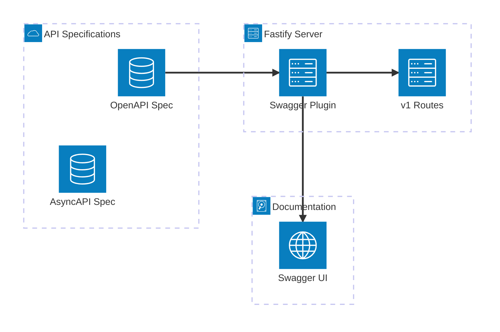

# API Contract Foundation Plan

## Problem Statement

The project enforces Rule 3: "Contracts before implementation. No OpenAPI or AsyncAPI = no code." However, no machine-readable API specs exist. Current state:

- JSON Schema in `src/contracts/schemas/` (request bodies only)
- Prose contracts in `docs/foundation/` (not machine-readable)
- Routes defined without versioning or OpenAPI integration

This creates drift risk between documentation and implementation.

## Architecture Overview




## Phase 1: Create OpenAPI Spec

Create `docs/api/openapi.yaml` as the single source of truth for REST API contracts.

**Key decisions:**

- OpenAPI 3.1.0 (supports JSON Schema draft 2020-12)
- Reference existing JSON schemas where possible
- Include all endpoints: `POST /signals`, `GET /signals`, `GET /decisions`

**File structure:**

```
docs/api/
  openapi.yaml          # Main spec file
  schemas/              # Shared schema components (can reference src/contracts/schemas/)
```

**Endpoints to document:**

- `POST /v1/signals` - Signal ingestion (from [signal-ingestion.md](docs/specs/signal-ingestion.md))
- `GET /v1/signals` - Signal log query (from [signal-log.md](docs/specs/signal-log.md))
- `GET /v1/decisions` - Decision output (from [Component Interface Contracts](docs/foundation/[POC Playbook] 8P3P Learning Intelligence Control Layer-Component Interface Contracts.md))

## Phase 2: Add API Versioning

Modify [server.ts](src/server.ts) to use versioned routes.

**Current:**

```typescript
registerIngestionRoutes(server);  // POST /signals
registerSignalLogRoutes(server);  // GET /signals
```

**Target:**

```typescript
server.register(async (v1) => {
  registerIngestionRoutes(v1);
  registerSignalLogRoutes(v1);
  // registerDecisionRoutes(v1);  // future
}, { prefix: '/v1' });
```

**Backward compatibility:** Add redirect from `/signals` to `/v1/signals` during transition (optional).

## Phase 3: Integrate Fastify Swagger

Install and configure `@fastify/swagger` to serve OpenAPI spec and validate requests.

**Dependencies to add:**

```json
"@fastify/swagger": "^9.0.0",
"@fastify/swagger-ui": "^5.0.0"
```

**Integration in [server.ts](src/server.ts):**

```typescript
import swagger from '@fastify/swagger';
import swaggerUi from '@fastify/swagger-ui';

await server.register(swagger, {
  mode: 'static',
  specification: {
    path: './docs/api/openapi.yaml'
  }
});

await server.register(swaggerUi, {
  routePrefix: '/docs'
});
```

## Phase 4: Create AsyncAPI Spec

Create `docs/api/asyncapi.yaml` for event contracts.

**Events to document from [Component Interface Contracts**](docs/foundation/component-interface-contracts.md)

- `signal.ingested` - SignalIngestedEvent
- `decision.emitted` - DecisionEmittedEvent

**Note:** `state.updated` event deferred until needed (currently out of scope per [state-engine.md](docs/specs/state-engine.md)).

## Phase 5: Update Project Rules

Add validation command to [package.json](package.json):

```json
"validate:api": "redocly lint docs/api/openapi.yaml"
```

Update [control-layer-constraints/RULE.md](.cursor/rules/control-layer-constraints/RULE.md) to reference the new spec locations.

## Phase 6: Run /review

Execute `/review --spec docs/api/openapi.yaml` to verify:

- All endpoints match spec
- Request/response schemas align
- No drift between prose docs and machine-readable specs
- Document traceability maintained

## Files to Create


| File                     | Purpose                         |
| ------------------------ | ------------------------------- |
| `docs/api/openapi.yaml`  | REST API contract (OpenAPI 3.1) |
| `docs/api/asyncapi.yaml` | Event contract (AsyncAPI 2.6)   |


## Files to Modify


| File                                              | Changes                                       |
| ------------------------------------------------- | --------------------------------------------- |
| `src/server.ts`                                   | Add versioning, swagger integration           |
| `src/ingestion/routes.ts`                         | No changes (registered under /v1 prefix)      |
| `src/signalLog/routes.ts`                         | No changes (registered under /v1 prefix)      |
| `package.json`                                    | Add swagger dependencies, validate:api script |
| `.cursor/rules/control-layer-constraints/RULE.md` | Reference OpenAPI/AsyncAPI specs              |


## Out of Scope

- RFC 7807 error format (deferred - current error format is functional)
- `GET /state` endpoint (intentionally internal)
- `state.updated` event (not yet needed)
- `policy_version` field (add after OpenAPI foundation exists)

