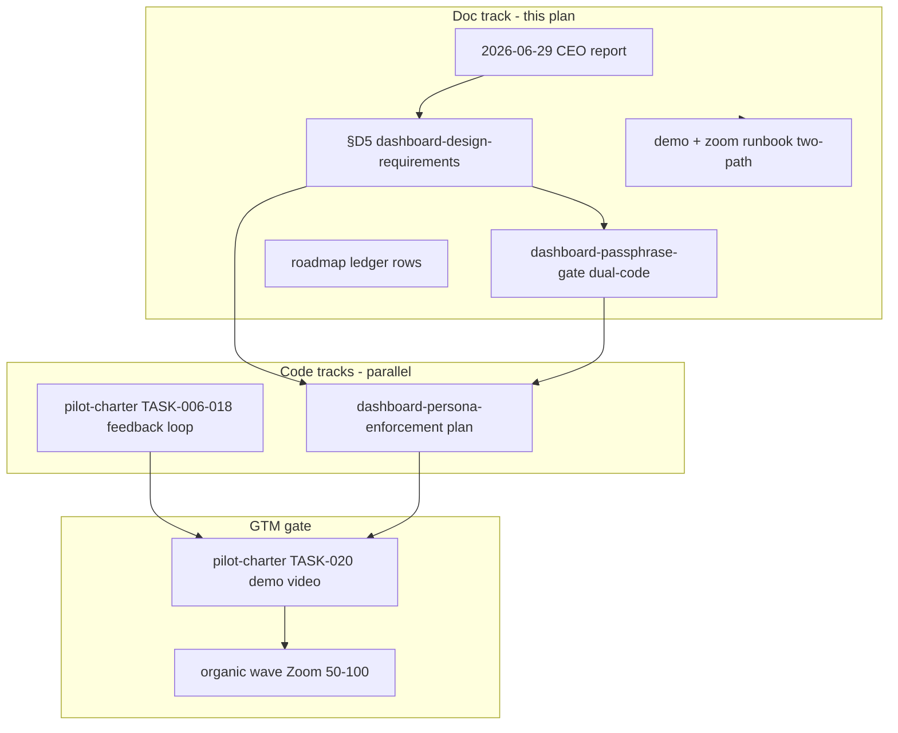

# CEO Educator Wave — Documentation Plan

**Primary outputs:** CEO signal report, persona IA specs (§D5 + dual-passphrase), Zoom-ready ops docs, P1 policy-builder scaffold, companion dashboard gating plan.

**Explicit non-goals:**
- No `src/` or `dashboard/` implementation in this plan.
- Persona dashboard implementation lives only in [`dashboard-persona-enforcement.plan.md`](.cursor/plans/dashboard-persona-enforcement.plan.md) (created by TASK-021).
- No Cognito/SSO resolution (Phase 2).
- No reordering of [`pilot-charter-onboarding.plan.md`](.cursor/plans/pilot-charter-onboarding.plan.md) TASK-006+.
- Policy builder remains P1 scaffold — not promoted to P0.

---

## Deploy-tier vocabulary (Check 1)

Words like **deploy / host / integrate / ship / launch / live** are overloaded. This plan uses:

| Tier | What | Organic wave status |
|------|------|---------------------|
| **A** | AWS control-layer backend (Lambda + API Gateway + DynamoDB) | **Required** — hosted pilot API |
| **B** | Live LMS integration / classroom-workflow deployment | **Deferred** — upload/ingest path first |
| **C** | Dashboard hosting (Next.js portal at reachable URL) | **Required** — Amplify-hosted dashboard |
| **Persona gating** | Route/nav allowlists in dashboard middleware | **C-only** — no new backend tier |

"Local/SQLite" describes the data + engine tier for controlled eval, **not** dashboard hosting. Organic wave requires **C hosted** + **A API**; defers **B** LMS connectors.

---

## Part B — Role × feature × infrastructure map (SSoT for §D5)

Document this table in §D5 (`TASK-016`) and the CEO report (`TASK-001`):

| Feature / route | Educator code | Compliance code | Infra tier |
|-----------------|:-------------:|:---------------:|------------|
| Overview, Attention, Learners | Yes | Yes | C |
| Learner Struggles & progress | Yes | Yes | C reads A (`/v1/learners`, `/v1/state`) |
| Learner State / Trajectory / JSON | No | Yes | C |
| Decisions stream + trace export | No | Yes | C reads A |
| Signals log + upload wizard | No | Yes | C proxy + A admin preflight |
| Reports + export | No | Yes | C (+ staged program-metrics on A) |
| Policy admin API | No | Yes (API key server-side) | A `/v1/admin/policies/*` |
| Product feedback POST | Yes | Yes | A (pilot-charter TASK-006+) |
| Per-decision Approve/Reject | Yes | Yes | A + C |

---

## Phase 1 — CEO report + roadmap framing

### PREREQ-001: Hosted pilot baseline

- **Verify:** [`docs/guides/operators/aws-pilot-runbook.md`](docs/guides/operators/aws-pilot-runbook.md) §4 smoke green on tier A + C before packaging organic wave docs that assume a live URL.
- **Exit:** Runbook §4 pass recorded; Amplify dashboard reachable with passphrase gate.

### TASK-001: CEO educator-wave directives report

**Create:** [`docs/reports/2026-06-29-ceo-educator-wave-directives.md`](docs/reports/2026-06-29-ceo-educator-wave-directives.md)

**Extend prior CEO report pattern** ([`2026-06-23-ceo-meeting-directives.md`](docs/reports/2026-06-23-ceo-meeting-directives.md)) with organic educator-wave signal (2026-06-29).

**Fourth decoded directive** (from demo feedback, same date):

- Teachers: classroom-relevant learner data + plain-language *why* only.
- Admin/compliance: audit drill-down, receipts, export.

**Readiness assessment (Check 2) — extend rows:**

| Capability | Verdict | Evidence |
|------------|---------|----------|
| Persona IA enforcement | Gap | Single nav for all users [`dashboard/lib/navigation.ts:21-28`](dashboard/lib/navigation.ts); educator Overview leaks rule/policy [`learner-overview-tab.tsx:132-148`](dashboard/app/(dashboard)/learners/[ref]/_components/learner-overview-tab.tsx) |
| Audit/export for compliance | Built, not gated | Decision trace export [`decision-trace-view.tsx`](dashboard/app/(dashboard)/decisions/[id]/_components/decision-trace-view.tsx); `/reports` export hooks exist |

**Capability vs infrastructure tension (Check 2) — cite both sides:**

- [`docs/specs/dashboard-design-requirements.md:18-23`](docs/specs/dashboard-design-requirements.md) declares two audiences.
- [`docs/specs/dashboard-passphrase-gate.md:15`](docs/specs/dashboard-passphrase-gate.md) defers RBAC to Phase 2.
- Today: one human role, full sidebar.

**Open questions:**

- **Resolved (interim pilot):** dual access codes — educator passphrase vs compliance/admin passphrase (user decision 2026-06-29).
- **Pending:** Cognito/SSO long-term; merge with policy-builder MVP-1 teacher overlay.

### TASK-002: Roadmap amendment

**Amend:** [`docs/foundation/roadmap.md`](docs/foundation/roadmap.md)

- New subsection **Persona surfaces (D5)** under Current Direction: teacher vs compliance feature map; links §D5 spec.
- **Ledger rows:**
  - `ceo_educator_wave_docs_5f6ef773.plan.md` — **Active** while doc tasks run.
  - `dashboard-persona-enforcement.plan.md` — **Staged → Active** after TASK-021 creates it; **Next action** = first nav-gating task (PE-001).
  - Keep `pilot-charter-onboarding` order **1**; persona plan order **1b** (parallel, GTM-blocking for TASK-020).

### TASK-003: Organic educator wave scenario path

**Create:** [`docs/guides/scenarios/organic-educator-wave.md`](docs/guides/scenarios/organic-educator-wave.md)

Thin how-to router (Diátaxis): prerequisites → ordered links → exit criteria. Links zoom runbook (TASK-010), two-path demo (TASK-006), persona specs (TASK-016–017). No duplicated runbook commands.

### TASK-004: Pilot-charter plan context

**Amend:** [`.cursor/plans/pilot-charter-onboarding.plan.md`](.cursor/plans/pilot-charter-onboarding.plan.md)

Add context rows:

| Decision | Answer |
|----------|--------|
| Organic educator wave | Valid shape for TASK-018/020 |
| Persona before demo video | **TASK-020 blocked on** persona plan OR scripted educator-only path documented in demo script |
| Zoom 50–100 | Blocked on TASK-006–018 **and** persona enforcement (or runbook interim mitigations only) |

---

## Phase 2 — Zoom-ready ops docs

### TASK-005: Customer feedback loop taxonomy

**Amend:** [`docs/specs/customer-feedback-loop.md`](docs/specs/customer-feedback-loop.md)

Existing additions: `policy_config`, `learning_gaps`.

**Add:**

| Value | Maps to |
|-------|---------|
| `roles_access` | Persona/role confusion, "too much data for teachers", access boundaries |

Grep/update contract enums in `tests/contracts/` and `src/` if categories are closed-set tested.

### TASK-006: Springs pilot demo two-path

**Amend:** [`docs/guides/playbooks/springs-pilot-demo.md`](docs/guides/playbooks/springs-pilot-demo.md)

Add **two-path demo** section (normative for pilot-charter TASK-020):

- **Educator path (5 min):** `/` → `/attention` → `/learners/[ref]` Struggles tab → Approve/Reject. **Never** open `/decisions`, `/signals`, State/Trajectory tabs.
- **Compliance path (separate login / second tab):** `/decisions` → trace → Export JSON; optional `/reports`.

Update route table (~line 40) to mark audit routes compliance-only.

### TASK-010: Zoom runbook

**Create:** [`docs/guides/playbooks/organic-educator-wave-zoom.md`](docs/guides/playbooks/organic-educator-wave-zoom.md)

Zoom 50–100 organic wave runbook: host checklist, two-path demo script reference, dual-code distribution, tier A+C prerequisites, interim mitigations when persona plan not shipped.

### TASK-011: Scenario index updates

**Amend:** [`docs/guides/README.md`](docs/guides/README.md), [`docs/README.md`](docs/README.md)

Add organic educator wave scenario row linking to TASK-003 path and TASK-010 runbook.

### TASK-012: Exit criteria by persona

**Amend:** organic wave onboarding docs (zoom runbook + scenario path)

Split exit criteria:

- **Educator:** log in (educator code), view gaps, review decisions, send product feedback.
- **Compliance/admin:** log in (admin code), signal upload, audit stream, export.
- Remove undifferentiated "educators can upload" unless using admin code.

### TASK-013: Known limitations

**Amend:** zoom runbook (TASK-010)

- No per-teacher policy self-service (existing).
- **Until persona plan ships:** educator code still sees full nav if using single legacy code — interim = distribute two codes + follow two-path script.

### TASK-014: Pilot gates cross-reference

**Amend:** [`docs/guides/operators/pilot-readiness-gates.md`](docs/guides/operators/pilot-readiness-gates.md), [`docs/guides/operators/pilot-launch-checklist.md`](docs/guides/operators/pilot-launch-checklist.md)

Reference persona enforcement or documented interim mitigations (dual codes + two-path script) for organic wave launch gates.

---

## Phase 2.5 — Persona IA documentation (doc-only)

### TASK-016: §D5 Persona surfaces spec

**Amend:** [`docs/specs/dashboard-design-requirements.md`](docs/specs/dashboard-design-requirements.md)

New directive **D5 — Persona surfaces (normative)**:

**Educator surface (default for educator access code)**

- Nav: Overview, Attention, Learners only.
- Learner L2 tabs: Overview, Struggles & progress only.
- L0 columns: summary-first; no `matched_rule_id`, state version, policy id.
- Overview KPIs: hide or relocate "Rejected signals today" to compliance surface (align with D4 "Program health" — note D4 must defer to D5 for educator mode).

**Compliance/admin surface (compliance access code)**

- Full nav including Decisions, Signals, Reports.
- Learner State, Trajectory, trace JSON export, program/research export when available.

**Cross-ref:** §2.1 three-tier model unchanged; D5 adds *who sees which tier*.

Include Part B role × feature table from this plan.

### TASK-017: Dual-passphrase auth spec

**Amend:** [`docs/specs/dashboard-passphrase-gate.md`](docs/specs/dashboard-passphrase-gate.md)

- `DASHBOARD_ACCESS_CODE_EDUCATOR` + `DASHBOARD_ACCESS_CODE_COMPLIANCE` (or documented alias pattern).
- Session cookie carries resolved persona (`educator` | `compliance`).
- Middleware enforces route allowlists per persona (spec prose only here; impl in persona plan).
- Phase 2 Cognito replaces codes, not IA rules.

### TASK-018: Spec index drift reconciliation

**Amend:** [`docs/specs/README.md`](docs/specs/README.md)

- [`nextjs-amplify-dashboard-migration.md`](docs/specs/nextjs-amplify-dashboard-migration.md): Amplify deploy **done** for pilot (pilot-charter TASK-004), not "deferred pending credits."
- [`ai-educator-explanations.md`](docs/specs/ai-educator-explanations.md): Bedrock enablement status aligned with pilot-charter TASK-005 completion wording.

Run `/post-impl-doc-sync` pass for those two specs if literal status blocks differ.

### TASK-019: FAQ + design cross-links

- [`docs/guides/customers/faq.md`](docs/guides/customers/faq.md): "Why do teachers and admins get different login codes?" + "What can teachers see?"
- [`docs/specs/educator-policy-builder.md`](docs/specs/educator-policy-builder.md) MVP-1: dependency on D5 role model + dual passphrase (not "TBD").

---

## Phase 3 — P1 policy-builder scaffold (doc-only)

### TASK-007: Educator policy builder spec

**Create:** [`docs/specs/educator-policy-builder.md`](docs/specs/educator-policy-builder.md)

MVP-1 requires **compliance persona** for policy writes. MVP-2 per-teacher overlay requires auth beyond dual passphrase — flag in open questions (see TASK-020).

### TASK-008: Policy generation service spec

**Create:** [`docs/specs/policy-generation-service.md`](docs/specs/policy-generation-service.md)

External LLM policy generation service — separate from control-layer engine; referenced by educator-policy-builder and backlog user stories.

### TASK-009: Educator policy builder plan scaffold

**Create:** [`.cursor/plans/educator-policy-builder.plan.md`](.cursor/plans/educator-policy-builder.plan.md)

P1 scaffold with YAML todos (all `pending`). Links TASK-007/008 specs. Non-goals: P0 promotion, backend RBAC.

### TASK-020: Link policy builder to role model

In TASK-007 prose (and cross-ref in TASK-009 plan):

- MVP-1 requires compliance persona for policy writes.
- MVP-2 per-teacher overlay requires auth beyond dual passphrase — flag in open questions.

---

## Phase 3.5 — Scaffold implementation plan (doc creates plan file only)

### TASK-021: Create dashboard-persona-enforcement plan

**Create:** [`.cursor/plans/dashboard-persona-enforcement.plan.md`](.cursor/plans/dashboard-persona-enforcement.plan.md)

YAML todos (all `pending`). Primary spec: `dashboard-design-requirements.md` §D5. Auth spec: `dashboard-passphrase-gate.md`.

| ID | Task | Files |
|----|------|-------|
| PE-001 | Dual-code login + persona cookie | `dashboard/middleware.ts`, `dashboard/app/(auth)/login/`, `dashboard/lib/*` |
| PE-002 | Nav allowlist by persona | [`dashboard/lib/navigation.ts`](dashboard/lib/navigation.ts), [`app-sidebar.tsx`](dashboard/components/layout/app-sidebar.tsx) |
| PE-003 | Route guard redirect for compliance-only paths | middleware |
| PE-004 | Learner tab gating | [`learner-detail-view.tsx`](dashboard/app/(dashboard)/learners/[ref]/_components/learner-detail-view.tsx) |
| PE-005 | Scrub educator Overview leaks | [`learner-overview-tab.tsx`](dashboard/app/(dashboard)/learners/[ref]/_components/learner-overview-tab.tsx) |
| PE-006 | Overview KPI persona filter | overview components / `overview-metrics.ts` |
| PE-007 | Unit + E2E persona smoke | `dashboard/e2e/`, component tests |
| PE-008 | Runbook note in aws-pilot-runbook § env vars for two codes | [`docs/guides/operators/aws-pilot-runbook.md`](docs/guides/operators/aws-pilot-runbook.md) |

**Non-goals for persona plan:** Cognito, per-teacher policy overlay, backend RBAC changes.

After TASK-021 lands, update roadmap ledger (`TASK-002` / `TASK-015`): `dashboard-persona-enforcement.plan.md` → **Active**, next action PE-001.

---

## Phase 5 — Ledger close-out

### TASK-015: Final roadmap ledger

After all 22 doc tasks complete, amend [`docs/foundation/roadmap.md`](docs/foundation/roadmap.md) Program Status Ledger:

| Plan | Group | Status |
|------|-------|--------|
| `ceo_educator_wave_docs_5f6ef773.plan.md` | Shipped | 22/22 |
| `dashboard-persona-enforcement.plan.md` | Active | 0/8 — PE-001 dual-code login |
| `educator-policy-builder.plan.md` | Staged | 0/N |

Remove `ceo_educator_wave_docs` from Active / next group.

---

## Execution order

1. **Start immediately (parallel):**
   - TASK-001–004 (CEO report + roadmap framing).
   - TASK-016–017 (§D5 + passphrase spec) — can follow TASK-001 by one day.
   - `pilot-charter` TASK-006 (feedback loop) — unchanged order.
2. **After TASK-001:** TASK-005–006, TASK-010–014 (Zoom docs with two-path + limitations).
3. **After §D5 drafted:** TASK-021 (create persona impl plan) → begin PE-001–003 in parallel with TASK-007–011 (policy builder scaffold).
4. **Before pilot-charter TASK-020 demo video:** persona plan PE-001–006 **or** enforce two-path script only (document choice in TASK-004).
5. **TASK-015 + TASK-018** at doc plan close-out.

---

## Success criteria

- [ ] Persona IA has normative home (§D5 + dual-passphrase gate spec).
- [ ] CEO report cites Check 2 persona gap with file:line evidence on both sides of capability vs infrastructure tension.
- [ ] Dual-passphrase decision documented as resolved interim pilot approach (educator vs compliance codes).
- [ ] Roadmap shows **three parallel tracks**: charter pilot code, organic wave GTM docs, persona enforcement code.
- [ ] Two-path demo script normative in springs-pilot-demo + zoom runbook.
- [ ] pilot-charter TASK-020 demo video criteria reference two-path demo or persona plan complete.
- [ ] All 22 doc tasks (`PREREQ-001` + `TASK-001`–`TASK-021`) marked complete in YAML frontmatter.
- [ ] Companion [`dashboard-persona-enforcement.plan.md`](.cursor/plans/dashboard-persona-enforcement.plan.md) exists with PE-001–PE-008 pending.
- [ ] No `src/` or `dashboard/` code changes in this plan's PRs.

---

## Files touched (summary)

**Create:** [`docs/reports/2026-06-29-ceo-educator-wave-directives.md`](docs/reports/2026-06-29-ceo-educator-wave-directives.md), [`docs/specs/educator-policy-builder.md`](docs/specs/educator-policy-builder.md), [`docs/specs/policy-generation-service.md`](docs/specs/policy-generation-service.md), [`docs/guides/scenarios/organic-educator-wave.md`](docs/guides/scenarios/organic-educator-wave.md), [`docs/guides/playbooks/organic-educator-wave-zoom.md`](docs/guides/playbooks/organic-educator-wave-zoom.md), [`.cursor/plans/dashboard-persona-enforcement.plan.md`](.cursor/plans/dashboard-persona-enforcement.plan.md), [`.cursor/plans/educator-policy-builder.plan.md`](.cursor/plans/educator-policy-builder.plan.md).

**Amend:** [`docs/foundation/roadmap.md`](docs/foundation/roadmap.md), [`docs/specs/dashboard-design-requirements.md`](docs/specs/dashboard-design-requirements.md), [`docs/specs/dashboard-passphrase-gate.md`](docs/specs/dashboard-passphrase-gate.md), [`docs/specs/README.md`](docs/specs/README.md), [`docs/specs/customer-feedback-loop.md`](docs/specs/customer-feedback-loop.md), [`docs/guides/playbooks/springs-pilot-demo.md`](docs/guides/playbooks/springs-pilot-demo.md), [`.cursor/plans/pilot-charter-onboarding.plan.md`](.cursor/plans/pilot-charter-onboarding.plan.md), [`docs/guides/README.md`](docs/guides/README.md), [`docs/README.md`](docs/README.md), [`docs/guides/customers/faq.md`](docs/guides/customers/faq.md), pilot gates/checklists.
