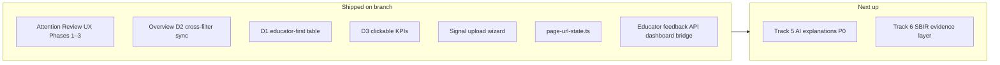
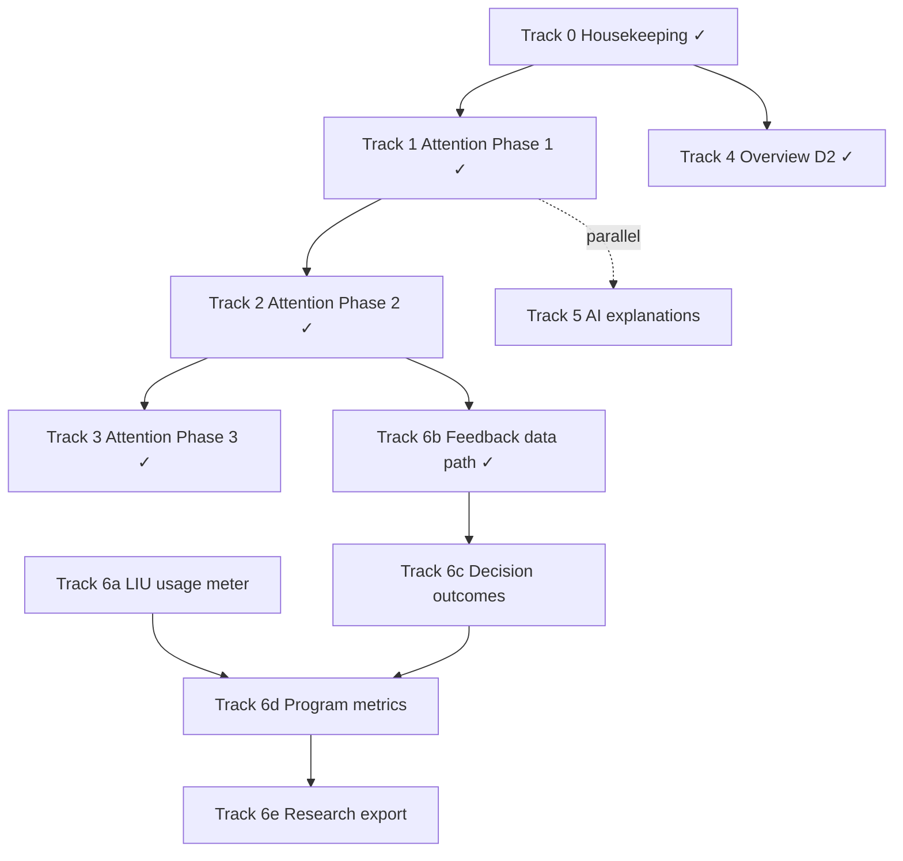

# Dashboard Pilot Roadmap

Tracks the execution sequence from the `/review` of uncommitted dashboard work. **Do not re-run** [`.cursor/plans/dashboard-uiux-improvements.plan.md`](.cursor/plans/dashboard-uiux-improvements.plan.md) — it is complete (D1/D3/freshness/upload). Remaining design-spec gaps are scoped slices below.

## Current state (2026-06-25)

Tracks **0–4** are **shipped on branch**. Remaining pilot dashboard work is **Track 5** (AI educator explanations, controlled-eval P0) and **Track 6** (SBIR evidence layer, staged).

**Key implementation anchors:**
- Review store: `8p3p-review-log:v1` in [`decision-review.ts`](dashboard/lib/decision-review.ts); shared actions in [`review-actions.ts`](dashboard/lib/review-actions.ts)
- Overview D2: single RSC fetch via [`overview-surfaces.tsx`](dashboard/app/(dashboard)/_components/overview-surfaces.tsx) + [`OverviewSyncProvider`](dashboard/app/(dashboard)/_components/overview-sync-provider.tsx) (design spec §2.1 names `OverviewExplorer`; implementation uses this composition per [`overview-cross-filter-sync.md`](docs/specs/overview-cross-filter-sync.md) § Architecture)
- Educator feedback: proxy cookie bridge in [`route.ts`](dashboard/app/api/control/[...path]/route.ts); login/logout mint/clear `fb_session`

---

## Track 0 — Housekeeping (same PR as Phase 1 start)

Doc-only; no re-implementation of the design spec.

| ID | Action | Owner doc |
|----|--------|-----------|
| HK-01 | Run `/post-impl-doc-sync` on [`docs/specs/dashboard-design-requirements.md`](docs/specs/dashboard-design-requirements.md) — mark signal upload wizard `[x]`, confirm D1/D3/freshness checklist | Design spec §14 |
| HK-02 | Add [`docs/specs/attention-review-ux.md`](docs/specs/attention-review-ux.md) to [`docs/specs/README.md`](docs/specs/README.md) under **Active** | Spec index |
| HK-03 | Commit untracked attention + URL-state + policies files currently on the branch | Git hygiene |

**Spec tension (before D2 coding):** [`overview-cross-filter-sync.md`](docs/specs/overview-cross-filter-sync.md) line 24 says KPI cards become filter sources when sync ON; [`dashboard-design-requirements.md`](docs/specs/dashboard-design-requirements.md) §2.1 (2026-06-23) says KPI cards **always navigate** (D3). Update cross-filter spec to match design authority: chart + table are filter sources; Needs attention / Pending decisions KPIs **recompute only**; Rejected signals + Improving learners stay program-wide.

---

## Track 1 — Attention Review UX Phase 1 (pilot blocker) — **shipped**

**Spec:** [`docs/specs/attention-review-ux.md`](docs/specs/attention-review-ux.md) § Phase 1  
**Plan:** [`.cursor/plans/attention-review-ux.plan.md`](.cursor/plans/attention-review-ux.plan.md) (Phase 1 tasks complete)

### Foundation (P1-F03)

Replace [`dashboard/lib/decision-review.ts`](dashboard/lib/decision-review.ts) with the spec's store API:

- Key migration: `8p3p-reviewed-decisions` → `8p3p-review-log:v1`
- Exports: `recordReview`, `undoReview`, `listRecentReviews`, `countReviewedToday`, `isReviewedLocally`
- Update [`dashboard/lib/attention-decisions.ts`](dashboard/lib/attention-decisions.ts) to filter via `isReviewedLocally`

### UI wiring (P1-F01, F02, F04–F08, F10)

| File | Work |
|------|------|
| New `dashboard/lib/review-actions.ts` (or hook) | Centralize approve/reject: record → toast → queue tick → auto-advance |
| [`attention-queue.tsx`](dashboard/app/(dashboard)/attention/_components/attention-queue.tsx) | Recently reviewed band; header badges `{pending} awaiting · {reviewedToday} reviewed today`; context-aware empty state |
| [`attention-review-sheet.tsx`](dashboard/app/(dashboard)/attention/_components/attention-review-sheet.tsx) | Auto-advance to next pending row (P1-F05); pass action type to handler |
| [`attention-review-bar.tsx`](dashboard/app/(dashboard)/attention/_components/attention-review-bar.tsx) | Distinct Approve/Reject; add **Back to Attention** link (P1-F09) |
| [`WhatToDo.tsx`](dashboard/components/panels/WhatToDo.tsx) | Same toast + store (P1-F08) |

**Toast literals** (from spec § Toast pattern): Sonner, 8 s undo window, title `{actionPastTense} · {learnerReference}`, View decision → `/decisions/[decision_id]`.

### Tests

- Unit tests for review store + migration in `dashboard/lib/__tests__/decision-review.test.ts`
- Extend e2e in [`dashboard/e2e/decision-panel.spec.ts`](dashboard/e2e/decision-panel.spec.ts) for toast, undo, recently reviewed band

### Done when

All Phase 1 acceptance criteria in the spec pass (6 Given/When/Then blocks).

---

## Track 2 — Attention Review UX Phase 2 (persistence) — **shipped**

**Spec:** same file § Phase 2  
**Depends on:** Track 1 complete; backend [`educator-feedback-api`](docs/specs/educator-feedback-api.md) shipped in `src/feedback/`

| ID | Requirement | Key files |
|----|-------------|-----------|
| P2-F04/F05 | Next.js login/logout mint/clear `fb_session`; proxy injects cookie on `v1/decisions/*/feedback` and `*/view` | [`dashboard/app/api/control/[...path]/route.ts`](dashboard/app/api/control/[...path]/route.ts), login route |
| P2-F01–F03 | Approve POST; Reject inline reason step in sheet; optimistic UI + rollback | New hooks `use-decision-feedback.ts`, review sheet |
| P2-F06–F08 | View log on sheet open; persist `feedbackId`; server `latest_action` authoritative for queue | attention-decisions builder |

**Note:** Next.js BFF bridge (P2-F04/F05) ships in [`login/route.ts`](dashboard/app/(auth)/login/route.ts), [`logout/route.ts`](dashboard/app/(auth)/logout/route.ts), and [`route.ts`](dashboard/app/api/control/[...path]/route.ts).

---

## Track 3 — Attention Review UX Phase 3 (discoverability) — **shipped**

**Spec:** § Phase 3

- `/decisions` Review status filter (P3-F01)
- Optional "Your action" column (P3-F02)
- Pending KPI footer "N reviewed today" (P3-F03)
- Learner detail action chips (P3-F04)

Register any new query params in [`page-url-state.ts`](dashboard/lib/page-url-state.ts) per [`.cursor/rules/dashboard-url-linked-state/RULE.md`](.cursor/rules/dashboard-url-linked-state/RULE.md).

---

## Track 4 — Overview D2 cross-filter sync — **shipped**

**Spec:** [`docs/specs/overview-cross-filter-sync.md`](docs/specs/overview-cross-filter-sync.md)  
**Plan:** [`.cursor/plans/overview-cross-filter-sync.plan.md`](.cursor/plans/overview-cross-filter-sync.plan.md) (all tasks complete)

Implemented: single RSC fetch via [`OverviewSurfaces`](dashboard/app/(dashboard)/_components/overview-surfaces.tsx) + client [`OverviewSyncProvider`](dashboard/app/(dashboard)/_components/overview-sync-provider.tsx); KPI cards always navigate (D3); chart + table are filter sources when sync ON. E2e: [`overview-cross-filter.spec.ts`](dashboard/e2e/overview-cross-filter.spec.ts).

**Out of scope for pilot unless requested:** URL-synced Overview filters, chart drag-brush.

---

## Track 5 — Backend P0 (parallel)

**Plan:** [`.cursor/plans/ai-educator-explanations.plan.md`](.cursor/plans/ai-educator-explanations.plan.md) (all tasks pending)

Improves `educator_summary` quality across Overview, Attention, Learner detail. Independent of Tracks 1–3 UI work; can run in parallel once pilot bandwidth allows.

---

## Track 6 — SBIR / live-pilot evidence layer (staged — not controlled-eval critical path)

**Scope:** Staged SBIR and live-pilot evidence work for Phase 0 Springs → Phase I SBIR. This is **not** the controlled-evaluation critical path — that remains Track 5 (AI educator explanations) per [`docs/foundation/roadmap.md`](docs/foundation/roadmap.md) § Current Objective.

**Prerequisite for educator-impact metrics:** Track 2 dashboard feedback writes **shipped** (2026-06-25). Backend [`educator-feedback-api`](docs/specs/educator-feedback-api.md) is in `src/feedback/`. MC-B* metrics still require Track 6 `program-metrics` implementation.

Ordered by dependency — LIU is promoted to pre-Month 0 and supplies volume denominators per [`program-metrics.md`](docs/specs/program-metrics.md) § Overview:

| Priority | Spec | Existing plan | Unblocks |
|----------|------|---------------|----------|
| 1 | [`liu-usage-meter.md`](docs/specs/liu-usage-meter.md) | [`.cursor/plans/liu-usage-meter.plan.md`](.cursor/plans/liu-usage-meter.plan.md) | MC-A01 denominator; decisions/day rate metrics |
| 2 | [`educator-feedback-api.md`](docs/specs/educator-feedback-api.md) + Track 2 writes | Backend + dashboard POST **shipped** | MC-B01..B08 (via program-metrics) |
| 3 | [`decision-outcomes.md`](docs/specs/decision-outcomes.md) | [`.cursor/plans/decision-outcomes.plan.md`](.cursor/plans/decision-outcomes.plan.md) | MC-C01..C07 |
| 4 | [`program-metrics.md`](docs/specs/program-metrics.md) | [`.cursor/plans/program-metrics.plan.md`](.cursor/plans/program-metrics.plan.md) | MC-A/B/C catalog + `/v1/admin/program-metrics` |
| 5 | [`pilot-research-export.md`](docs/specs/pilot-research-export.md) | [`.cursor/plans/pilot-research-export.plan.md`](.cursor/plans/pilot-research-export.plan.md) | DOE/IES research bundle |

---

## Track 7 — Deferred (post-pilot)

- [`customer-feedback-loop.md`](docs/specs/customer-feedback-loop.md) — plan pending
- [`tenant-config.md`](docs/specs/tenant-config.md)
- Design spec Phase C polish: command palette, multi-org switcher, responsive/a11y pass
- Settings policies CRUD (currently read-only table aligns with design spec §6)

---

## Execution order (historical — Tracks 0–4 complete)

**Remaining work:** Track **5** (controlled-eval P0 — AI educator explanations) and Track **6** (staged SBIR evidence: LIU → outcomes → program-metrics → research-export). Tracks 0–4 and the Track 6b feedback data path are complete on branch.

**Answer to "re-implement design spec?":** No. D1/D2/D3 and Attention Review UX are shipped; do not re-run [`dashboard-uiux-improvements.plan.md`](.cursor/plans/dashboard-uiux-improvements.plan.md) or attention-review plans except for post-impl doc sync.

## Verification gates

| Gate | Command |
|------|---------|
| Tracks 1–3 (shipped) | `cd dashboard && npm test -- --run` + `dashboard/e2e/decision-panel.spec.ts` |
| Track 4 (shipped) | `dashboard/e2e/overview-cross-filter.spec.ts` + unit tests in `dashboard/lib/overview/__tests__/` |
| Track 5 (pending) | Backend explanation tests + dashboard copy surfaces |
| Track 6 (pending) | Contract tests per staged SBIR specs |
| After any track | `/review` on changed files |

---

## Post-impl doc sync (2026-06-25)

Reconciled this roadmap and referenced specs after Tracks 1–4 landed and [`.cursor/plans/task-6-doc-cleanup.plan.md`](.cursor/plans/task-6-doc-cleanup.plan.md) Track 6 sequencing cleanup:

| Check | Result |
|-------|--------|
| Roadmap "Current state" vs branch | Updated — removed stale Phase 1 gap diagram; Tracks 1–4 marked shipped |
| `attention-review-ux.md` requirement checkboxes | Phases 1–3 marked `[x]`; overview prose updated (dashboard consumes feedback API) |
| `overview-cross-filter-sync.md` requirements | Functional checklist marked `[x]` |
| `dashboard-design-requirements.md` §14 D2 | Marked `[x]`; implementation note points to `OverviewSurfaces` composition |
| `docs/specs/README.md` Active table | Attention review + cross-filter status updated to impl complete on branch |
| Track 6 SBIR sequence | Unchanged — LIU → feedback → outcomes → metrics → export (per task-6 cleanup) |
| Foundation roadmap P0 | AI educator explanations remain sole controlled-eval critical path |
