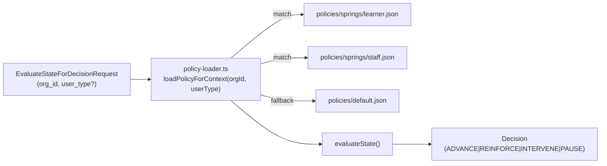

# Decision Types + Policy Loader Pilot Plan

## Architecture: Policy Resolution Flow




## Batch 1 — Staged Change Fixes (commit-blocking)

Three doc errors from the staged PII-hardening diff, fix before commit:

- `**[docs/specs/signal-ingestion.md](docs/specs/signal-ingestion.md)**` — remove `name` from the PII forbidden keys block (code intentionally excludes it; spec must match)
- `**[docs/reports/2026-02-20-pilot-readiness-v1-v1.1.md](docs/reports/2026-02-20-pilot-readiness-v1-v1.1.md)**` — row 10 status says "Not built"; change to "Done — DEF-DEC-007, DEF-DEC-008-PII implemented"
- `**[docs/foundation/roadmap.md](docs/foundation/roadmap.md)**` — 5 links are wrapped as `[text](url)` (backtick kills the hyperlink); restore to `[text](url)` without wrapping backtick

---

## Batch 2 — Lock Decision Types to 4

Current state: 7 types (`reinforce | advance | intervene | pause | escalate | recommend | reroute`) across 5 locations.

Target: `reinforce | advance | intervene | pause` only.

### Files to change

`**[src/shared/types.ts](src/shared/types.ts)**` line 278-281:

```typescript
// Before
export type DecisionType = 'reinforce' | 'advance' | 'intervene' | 'pause' | 'escalate' | 'recommend' | 'reroute';
export const DECISION_TYPES = ['reinforce', 'advance', 'intervene', 'pause', 'escalate', 'recommend', 'reroute']

// After
export type DecisionType = 'reinforce' | 'advance' | 'intervene' | 'pause';
export const DECISION_TYPES = ['reinforce', 'advance', 'intervene', 'pause']
```

`**[src/contracts/schemas/decision.json](src/contracts/schemas/decision.json)**` — update `enum` on `decision_type` to `["reinforce", "advance", "intervene", "pause"]`

`**[src/contracts/validators/decision.ts](src/contracts/validators/decision.ts)**` line 75 — update hardcoded error message string to list 4 types

`**[src/decision/policies/default.json](src/decision/policies/default.json)**` — rebuild as 4-rule policy. Remove `rule-escalate`, `rule-reroute`, `rule-recommend`. Remap their conditions into the remaining 4 rules (escalate → INTERVENE with high-risk condition, reroute → PAUSE, recommend → collapsed into ADVANCE). Keep `default_decision_type: "reinforce"`.

**Tests** — update all test vectors that reference removed types:

- `tests/contracts/decision-engine.test.ts`: `validTypes` array (line 224-228), vec-8a (`escalate`→`intervene`), vec-8c (`reroute`→`pause`), vec-8g (`recommend`→`advance`)
- `tests/unit/decision-validator.test.ts`: `validTypes` array (line 192)
- Any `describe`/`it` blocks testing the 3 removed types: either delete or repurpose to test valid-4 acceptance and invalid-type rejection

---

## Batch 3 — Policy Loader: org+userType Keyed Resolution

### Type change

`**[src/shared/types.ts](src/shared/types.ts)`** — add `user_type` to the evaluate request:

```typescript
interface EvaluateStateForDecisionRequest {
  // ... existing fields ...
  user_type?: string;  // e.g. "learner" | "staff"; defaults to "learner"
}
```

### Policy loader extension

`**[src/decision/policy-loader.ts](src/decision/policy-loader.ts)**` — replace single-policy cache with a `Map<string, PolicyDefinition>` keyed on `${orgId}:${userType}`. Add `loadPolicyForContext(orgId: string, userType: string): PolicyDefinition` that resolves:

1. `src/decision/policies/{orgId}/{userType}.json`
2. `src/decision/policies/{orgId}/default.json`
3. `src/decision/policies/default.json`

Keep existing `loadPolicy(policyPath?)` for backward compat (test and direct-load use cases).

### Engine update

`**[src/decision/engine.ts](src/decision/engine.ts)**` — update `evaluateState()` to call `loadPolicyForContext(request.org_id, request.user_type ?? 'learner')` instead of `loadPolicy()`.

### Springs pilot policy configs (new files)

`**src/decision/policies/springs/learner.json**` — student progress thresholds using 4 decision types and `ConditionNode` schema:

- `rule-intervene`: low `stabilityScore` + high `timeSinceReinforcement` → `intervene`
- `rule-reinforce`: moderate `stabilityScore` + overdue reinforcement → `reinforce`
- `rule-advance`: high `stabilityScore` + high `masteryScore` → `advance`
- `default_decision_type: "reinforce"`

`**src/decision/policies/springs/staff.json**` — staff training compliance thresholds:

- `rule-intervene`: training compliance below threshold + high days overdue → `intervene`
- `rule-pause`: missing required certification → `pause`
- `rule-advance`: all compliance met + high scores → `advance`
- `default_decision_type: "reinforce"`

---

## Batch 4 — Spec + Doc Updates

`**[polivy-rules-clarification.md](polivy-rules-clarification.md)**` — three changes:

1. Replace `ESCALATE` with `PAUSE` in the `DecisionType` union and constraints section
2. Replace `StateExpression` with `ConditionNode` (reference `src/shared/types.ts` definition)
3. Add `scope?: string | null` reserved field to `OrgPolicy` interface (default `null`; enables future per-charter scoping without breaking change)

`**[docs/guides/pilot-integration-guide.md](docs/guides/pilot-integration-guide.md)**` — add a new section "Webhook Integration Pattern (Option A)" documenting:

- How to receive Canvas/LMS webhook events on the customer's side
- How to map a Canvas assignment-completion event to `SignalEnvelope` fields
- How to `POST /v1/signals` with the mapped payload
- Example `source_system: "canvas-lms"`, `learner_reference: "user-{canvas_user_id}"`, payload with canonical fields only

---

## What is NOT in scope

- Policy REST API (`POST /v1/orgs/{orgId}/policies`, versioning, activate/archive) — deferred to v1.1 when a second customer needs self-serve
- Outbound webhooks / EventBridge — explicitly deferred per roadmap
- Database-backed policy storage — file-based loader is sufficient for 1-2 pilot customers

