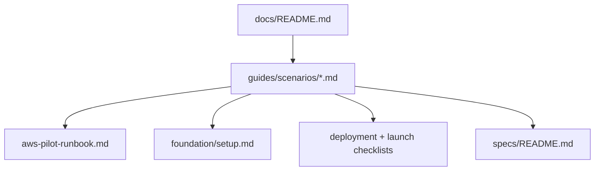

# Documentation scenario routing (Phase 1)

**Status: Complete (2026-06-29).** Phase 2 subfolder moves (`customers/`, `operators/`, `playbooks/`) and DOC-005 scenario link tests also landed. Optional follow-up: slim runbook §0–§4 prose now that scenario paths exist.

## Problem

The repo already has a strong **six-tier model** ([`docs/foundation/documentation-boundaries.md`](docs/foundation/documentation-boundaries.md): T1 Foundation, T2 Specs, T3 Guides, etc.), but **T3 Guides is a flat list of 13+ overlapping docs** with no top-level “I need to do X” router. New developers (e.g. first AWS pilot deploy) cannot tell which docs to read in order.

Industry fix: apply **[Diátaxis](https://diataxis.fr/)** without adding a new tier — **scenario paths are thin how-to routers** inside T3; authoritative content stays in existing runbooks, checklists, and specs.



**Hard rule for new files:** scenario docs contain **prerequisites, numbered links, exit criteria only** — no duplicated commands from [`docs/guides/operators/aws-pilot-runbook.md`](docs/guides/operators/aws-pilot-runbook.md).

---

## Deliverables

### 1. Create [`docs/README.md`](docs/README.md) — primary human + agent entry

Sections:

- **Start here** — one sentence: pick a scenario below
- **Scenario table** (8 rows) — “I want to…” → scenario path → exit criteria
- **Audience split** — 8P3P engineer/operator vs customer integrator (customers never start at AWS runbook)
- **Tier legend** — short pointer to T1–T5 from [`documentation-boundaries.md`](docs/foundation/documentation-boundaries.md) (no new tier)
- **Diátaxis note** — tutorials / how-to / reference / explanation mapped to existing folders

Scenario rows to include:

| Scenario | Path | Exit criteria |
|----------|------|---------------|
| Run locally | `guides/scenarios/run-locally.md` | `/health`, dashboard Overview |
| Deploy AWS charter pilot | `guides/scenarios/deploy-aws-pilot.md` | Runbook §4 smoke green |
| Launch customer | `guides/scenarios/launch-pilot-customer.md` | Launch checklist signed |
| Integrate customer LMS | `guides/scenarios/integrate-customer-lms.md` | First signal → decision |
| Operate / ship updates | `guides/scenarios/operate-pilot-updates.md` | CI + deploy/Amplify green |
| Build a feature (spec-driven) | `guides/scenarios/build-a-feature.md` | Spec → plan → impl synced |
| Fly fallback deploy | `guides/scenarios/deploy-fly-fallback.md` | Optional; links [`pilot-host-deployment.md`](docs/guides/operators/pilot-host-deployment.md) |
| Look up API / requirements | Direct links to [`specs/README.md`](docs/specs/README.md), [`api/openapi.yaml`](docs/api/openapi.yaml) | — |

### 2. Create [`docs/guides/scenarios/`](docs/guides/scenarios/) — 7 thin path docs

Each file follows a fixed template (~30–50 lines):

```markdown
# {Title}
**Type:** How-to (scenario path) — links only; authority lives in linked docs.

## Prerequisites
## Path (numbered links with anchors)
## Gates / reference (checklists, specs)
## Exit criteria
```

**Key content decisions:**

- **`deploy-aws-pilot.md`** — mirrors runbook §0→§4 order; links Profile B in [`setup.md`](docs/foundation/setup.md) with `org_id=southwest-charter`; tags deploy tiers A (CDK API) and C (Amplify) per [analysis-consistency rule](.cursor/rules/analysis-consistency-checks.mdc)
- **`run-locally.md`** — links [`setup.md`](docs/foundation/setup.md) § First-time setup, env profiles, daily loop, pre-commit gates
- **`launch-pilot-customer.md`** — chains [`deployment-checklist.md`](docs/guides/operators/deployment-checklist.md) → [`pilot-readiness-gates.md`](docs/guides/operators/pilot-readiness-gates.md) → [`pilot-launch-checklist.md`](docs/guides/operators/pilot-launch-checklist.md) → [`customer-onboarding-quickstart.md`](docs/guides/customers/customer-onboarding-quickstart.md)
- **`integrate-customer-lms.md`** — links [`pilot-integration-guide.md`](docs/guides/customers/pilot-integration-guide.md), [`ingestion-preflight.md`](docs/specs/ingestion-preflight.md), [`onboarding-field-mappings.md`](docs/guides/customers/onboarding-field-mappings.md)
- **`operate-pilot-updates.md`** — links runbook §6, [`ci-cd-pipeline.md`](docs/specs/ci-cd-pipeline.md), [`deploy.yml`](.github/workflows/deploy.yml)
- **`build-a-feature.md`** — links [`definitive-workflow.md`](docs/foundation/definitive-workflow.md), specs index, [`post-impl-doc-sync` skill](.cursor/skills/post-impl-doc-sync/SKILL.md)

Use **relative markdown links** only (no `internal-docs/` hrefs — preserves DOC-001).

### 3. Rewrite [`docs/guides/README.md`](docs/guides/README.md)

Restructure to:

1. **Scenario paths first** — table linking to `scenarios/*.md`
2. **Customer guides** — existing customer-facing docs (unchanged paths)
3. **Operator guides** — runbook, checklists, fallback (unchanged paths)
4. **Quick reference** — keep “I want to…” rows but point at scenarios where applicable
5. Deprecate duplicate narrative — one line: “For ordered deploy steps, use [`scenarios/deploy-aws-pilot.md`](scenarios/deploy-aws-pilot.md), not this index alone.”

### 4. Update [`docs/foundation/documentation-boundaries.md`](docs/foundation/documentation-boundaries.md)

Add under T3 Guides:

- **Scenarios subfolder** = Diátaxis *how-to* routers (not SSoT)
- **Agent reading order** — prepend: `docs/README.md` → pick scenario → existing chain (`roadmap` → spec → plan → code for feature work)

Update Navigation table:

| T3 — Guides | [`docs/README.md`](../README.md) (scenarios) · [`docs/guides/README.md`](../guides/README.md) (catalog) |

### 5. Update root [`README.md`](README.md)

Minimal diff in Documentation section (~3 lines):

- Replace “start at guides/README” with **“start at [`docs/README.md`](docs/README.md)”**
- Keep existing deep links (architecture, specs, API) as secondary

### 6. Optional agent pointer — [`.cursor/rules/project-context/RULE.md`](.cursor/rules/project-context/RULE.md)

Add a **Documentation navigation** bullet under project context:

- Human/onboarding tasks → `docs/README.md` scenario first
- Feature implementation → existing spec/plan chain

(Small change; avoids agents grep-ing runbook when user asks “deploy pilot”.)

---

## Explicitly out of scope (Phase 1)

- Moving files into `guides/customers/` or `guides/operators/` (Phase 2)
- Slimming or splitting [`aws-pilot-runbook.md`](docs/guides/operators/aws-pilot-runbook.md)
- New contract tests (Phase 2 optional: DOC-005 scenario link resolution in [`tests/contracts/documentation-boundary.test.ts`](tests/contracts/documentation-boundary.test.ts))
- Doc site / Stripe-like UX (aspirational in migration spec)

---

## Verification

Manual:

- Click every link in `docs/README.md` and each `scenarios/*.md` from a fresh clone — all resolve to committed files
- Confirm no `internal-docs/` hrefs in new files

Automated (existing):

```bash
npm run test:contracts -- tests/contracts/documentation-boundary.test.ts
```

Full CI gate unchanged.

---

## Phase 2 follow-up (separate PR, not in this plan)

- `git mv` guides into `customers/` / `operators/` / `playbooks/`
- Link sweep + optional DOC-005 test that all `scenarios/*.md` hrefs resolve
- Consider slimming runbook intro to point at scenario path
