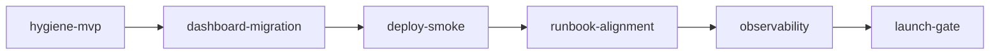

# Pilot MVP Launch — Wave 3 Master Plan

**Parent**: `.cursor/plans/urs_product_readiness_55b0b52e.plan.md` (Wave 1–2 complete)
**Roadmap**: `internal-docs/foundation/roadmap.md` (Pre-Month 0 pilot proof surface)
**Rules**: `.cursor/rules/project-context/RULE.md`, `.cursor/rules/document-traceability/RULE.md`

## Why this plan exists

Wave 2 shipped the deck-shaped URS API and gate screenshot, but **no product surface consumes it**. The Decision Panel still fan-outs three endpoints per learner. Wave 3 closes the loop: stable contract → dashboard migration → deployed smoke → customer-ready runbook → observability → launch gate.

**Explicitly out of scope (post-pilot):**
- SDK / TypeScript client (`8p3p-sdk`)
- ETag + 304 caching (`.cursor/plans/learner-summary-api-hygiene.plan.md` TASK-002..004)
- `signals_summary.by_source` (hygiene TASK-005)
- Per-tenant API key provisioning UI
- SSO/OAuth (passphrase gate sufficient per `docs/specs/dashboard-passphrase-gate.md`)

## Wave 3 dependency graph



## Sub-plans

| Step | Plan file | Est. effort |
|------|-----------|-------------|
| W3-001 | `.cursor/plans/learner-summary-api-hygiene-mvp.plan.md` | 2–4 hours |
| W3-002 | `.cursor/plans/dashboard-summary-migration.plan.md` | 1 day |
| W3-003–006 | This document (TASK-W3-003..006 below) | 1–2 days |

---

## W3-001: Contract hygiene MVP

- **Action**: Execute `.cursor/plans/learner-summary-api-hygiene-mvp.plan.md` via `/implement-spec`.
- **Outcome**: URL decision documented; OpenAPI closed; `policy_key` enum; SUM-012 green.
- **Verification**: `npm run check`

---

## W3-002: Dashboard summary migration

- **Action**: Execute `.cursor/plans/dashboard-summary-migration.plan.md` via `/implement-spec`.
- **Depends on**: W3-001
- **Outcome**: Decision panels (Who Needs Help Now, What Should Happen Next) read `GET /v1/learners/:ref/summary`; per-skill panels (What Do They Need Help With, Did the Support Work) keep reading `GET /v1/state` `skills.*` per the 9th Grade Literacy Pilot; panel titles + skill IDs aligned to the pilot guide; `&learner=` param fixed.
- **Verification**: Dashboard e2e + Panel 2 shows per-skill rows (e.g. Jordan text_evidence)

---

## W3-003: Deployed-environment smoke

- **Spec refs**: `docs/specs/aws-deployment.md`, `docs/guides/deployment-checklist.md`, `docs/guides/springs-pilot-demo.md`
- **Files**: `internal-docs/reports/pilot-smoke-{date}.md` (create)
- **Action**:
  1. Deploy CDK stage (`npm run cdk:deploy` or CI prod workflow per `docs/specs/ci-cd-pipeline.md`).
  2. Seed literacy demo: `npm run apply-template -- --org-id <id> --template literacy` then `npm run seed:literacy-demo -- --org-id <id>`.
  3. Build dashboard with `VITE_API_BASE_URL`, `VITE_API_KEY`, `VITE_ORG_ID` pointing at deployed API.
  4. Enable passphrase gate: set `DASHBOARD_ACCESS_CODE`, `COOKIE_SECRET` on server hosting `/dashboard`.
  5. Manual smoke: login → four panels → Jordan (`stu-30456` or seeded ref) shows advance + educator_summary.
  6. Record curl proof: `GET /v1/learners/{ref}/summary?org_id=...` with `x-api-key`.
  7. File screenshot + curl output in `internal-docs/reports/`.
- **Depends on**: W3-002
- **Verification**: Report on disk; Wave 2 gate narrative reproducible on deployed stack

---

## W3-004: Pilot onboarding runbook alignment

- **Existing docs**: `internal-docs/pilot-operations/pilot-readiness-definition.md`, `internal-docs/pilot-operations/onboarding-runbook.md`, `docs/guides/pilot-integration-guide.md`, `docs/guides/deployment-checklist.md`
- **Files to modify**:
  - `docs/guides/pilot-integration-guide.md` — add § "Decision Panel (staff UI)" referencing `/dashboard` + passphrase gate + summary-backed panels
  - `docs/guides/deployment-checklist.md` — add Wave 3 gates (summary migration, smoke report)
  - `internal-docs/pilot-operations/onboarding-runbook.md` — add handoff steps: share access code securely, API key rotation note, seed + verify summary
- **Optional**: `scripts/onboard-pilot-tenant.sh` — wraps apply-template + seed + health check (prefer existing npm scripts per prefer-existing-solutions rule)
- **Depends on**: W3-003
- **Verification**: New customer onboarding path documented end-to-end; no broken links to `internal-docs/pilot-operations/`

---

## W3-005: Observability

- **Spec ref**: `docs/specs/aws-deployment.md`, `infra/lib/control-layer-stack.ts`
- **Prefer existing**: CloudWatch built-in Lambda metrics + API Gateway access logs (already `MethodLoggingLevel.INFO` at line 305)
- **Action**:
  1. CDK: CloudWatch Dashboard construct for `InspectFunction` — invocations, errors, duration p95.
  2. CDK: Two alarms — error rate > 1% (5 min), duration p95 > 2000ms (5 min) → SNS email (pilot) or existing topic.
  3. Application: structured log line in `handleGetLearnerSummary` / `handleLearnerSummaryCore` — `org_id`, `learner_reference`, `duration_ms`, `statusCode`.
  4. Document SLO paragraph in `docs/specs/learner-summary-api.md` § Notes: p95 500ms target, 99.5% availability during school hours (aspirational pilot SLO).
- **Depends on**: W3-003 (deployed stack to validate alarms)
- **Verification**: Dashboard visible in AWS console; test alarm with synthetic fault optional

---

## W3-006: Pilot launch checklist

- **File**: `docs/guides/pilot-launch-checklist.md` (create) OR extend `docs/guides/deployment-checklist.md` § Wave 3
- **Checklist items**:
  - [ ] W3-001 and W3-002 sub-plans all tasks `completed`
  - [ ] `internal-docs/reports/pilot-smoke-*.md` filed
  - [ ] `DASHBOARD_ACCESS_CODE` shared via secure channel (not email)
  - [ ] Customer data-use / FERPA acknowledgment on file
  - [ ] On-call contact defined
  - [ ] Rollback documented (`cdk deploy` previous artifact; DynamoDB PITR if enabled)
  - [ ] `npm run check` green on release tag
- **Depends on**: W3-004, W3-005
- **Verification**: Checklist signed by launch owner before first customer login

---

## Requirements Traceability

| Goal | Source | Wave 3 task |
|------|--------|-------------|
| Pilot proof surface (Decision Panel) | roadmap Pre-Month 0 #21 | W3-002 |
| FERPA-safe dashboard access | dashboard-passphrase-gate | W3-003 (gate enabled in deploy) |
| One-call URS for educators | learner-summary-api | W3-001, W3-002 |
| Repeatable customer onboarding | pilot-integration-guide | W3-004 |
| Production operability | deployment-checklist | W3-005, W3-006 |

## Deviations from Spec

None at master-plan level — sub-plans own their deviation tables.

## Risks

| Risk | Impact | Mitigation |
|------|--------|------------|
| Dashboard build embeds API key | High (FERPA) | Passphrase gate + build-time key only on server-side proxy path long-term; document in runbook |
| Pilot scale exceeds throttle (20 rps) | Low | Usage plan already in CDK; monitor W3-005 |
| internal-docs/pilot-operations missing locally | Medium | W3-004 verifies paths exist or recreates from deployment-checklist refs |

## Verification Checklist (master)

- [ ] W3-001 hygiene MVP complete
- [ ] W3-002 dashboard migration complete
- [ ] W3-003 smoke report on disk
- [ ] W3-004 runbooks updated
- [ ] W3-005 CloudWatch dashboard + alarms
- [ ] W3-006 launch checklist signed
- [ ] `urs_product_readiness` follow-ups todo updated

## Implementation Order

```
W3-001 → W3-002 → W3-003 → W3-004 → W3-005 → W3-006
```

## Next command

```
/implement-spec .cursor/plans/learner-summary-api-hygiene-mvp.plan.md
```
