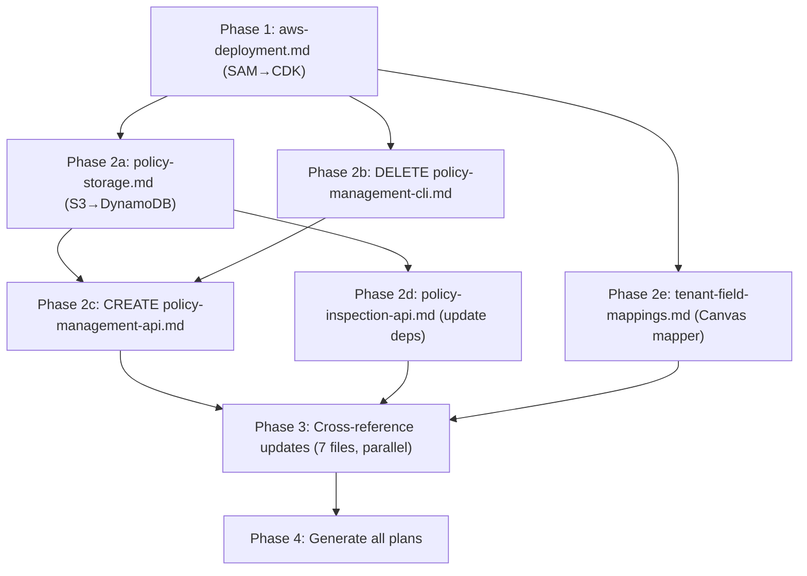

# Policy API + CDK Spec Alignment Plan

## What is changing and why

- **IaC: SAM → CDK** — policy management API, DynamoDB PoliciesTable, and future infra complexity justify CDK's TypeScript-native approach over SAM YAML
- **Policy storage: S3 → DynamoDB** — the admin write API needs transactional writes and optimistic locking; DynamoDB is the right backing store
- **Policy management: CLI spec → API spec** — `PUT /v1/admin/policies` enables customer self-service and future dashboard integration
- **Soft enable/disable** — policies have a `status` field (`active | disabled`). Disabled policies are skipped in resolution; the engine falls back to the next candidate. Toggled via `PATCH /v1/admin/policies/:org_id/:policy_key`.
- **Canvas data mapper (tenant-field-mappings v2)** — existing `tenant-field-mappings.md` (DEF-DEC-006) handles alias normalization and type enforcement but explicitly defers computed transforms and remote config. The pilot customer's #1 ask is sending raw Canvas webhook payloads and having 8P3P map them to canonical fields. This task lifts two items from Out of Scope into v1.1: (a) declarative computed transforms (e.g., `value / 100`), (b) DynamoDB-backed mapping config (replaces static file via `TENANT_FIELD_MAPPINGS_PATH`). Canvas schema is the pilot proof-of-concept.
- **Plans deferred to Phase 4** — no implementation plans are generated until all specs are finalized

## DynamoDB design principles (references)

Specs that define `PoliciesTable` must follow AWS DynamoDB guidance so the schema and operations are implementable without rework. Rationale: project rule to *justify recommendations with evidence* — all bullets below cite official [Amazon DynamoDB Developer Guide](https://docs.aws.amazon.com/amazondynamodb/latest/developerguide/).

- **Access patterns first, then schema** — [First steps for modeling relational data in DynamoDB](https://docs.aws.amazon.com/amazondynamodb/latest/developerguide/bp-modeling-nosql.html): *"You shouldn't start designing your schema until you know the questions that it needs to answer."* The policy-storage and policy-management-api specs must list access patterns in a table, then derive the key schema and operations from them.
- **Partition key and traffic distribution** — [Best practices for designing partition keys](https://docs.aws.amazon.com/amazondynamodb/latest/developerguide/bp-partition-key-uniform-load.html): `org_id` as partition key is acceptable for pilot (low cardinality); document that a GSI or different key design may be needed if cross-org query volume grows.
- **Explicit conditional writes** — Optimistic locking and existence checks must be specified as DynamoDB `ConditionExpression` patterns in the spec so implementers don't guess; see TASK-002 and TASK-004 bullets below.
- **Attribute type for policy payload** — [Item sizes and formats](https://docs.aws.amazon.com/amazondynamodb/latest/developerguide/HowItWorks.html): Store `policy_json` as DynamoDB **Map (M)**, not String, so Lambda can read nested attributes without a parse step and future `UpdateExpression` patches are possible; item size remains well under 400KB.

## Dependency graph

---

## Phase 1 — Core infrastructure spec

### TASK-001: Rewrite `docs/specs/aws-deployment.md` — SAM → CDK

- **File:** `[docs/specs/aws-deployment.md](docs/specs/aws-deployment.md)`
- **Action:** Modify
- Key changes:
  - IaC Tool Choice table: flip `AWS CDK` to **Selected**, `AWS SAM` to Deferred
  - Remove all `sam build`, `sam deploy`, `sam validate`, `sam local invoke` commands; replace with `cdk synth`, `cdk deploy`, `cdk diff`
  - Remove `samconfig.toml`; replace `infra/template.yaml` with `infra/lib/control-layer-stack.ts` in file structure
  - Add `PoliciesTable` to DynamoDB table list and Service Map (with note: defined in `policy-storage.md`)
  - Update Deployment Pipeline section (manual + CI/CD) from SAM to CDK commands
  - Update CI/CD YAML: `aws-actions/setup-sam` → `npm install -g aws-cdk`, `sam build && sam deploy` → `cdk deploy`
  - Update Notes section: replace SAM rationale with CDK rationale from the review analysis
  - Update Prerequisites last line: `…and the CDK stack` (not SAM template)
  - Update spec footer timestamp

---

## Phase 2 — Policy storage and management specs

### TASK-002: Rewrite `docs/specs/policy-storage.md` — S3 → DynamoDB

- **File:** `[docs/specs/policy-storage.md](docs/specs/policy-storage.md)`
- **Action:** Modify
- Key changes:
  - **Access patterns first (DynamoDB best practice):** Add a "Access patterns" subsection *before* schema. Enumerate in a table: (1) Get policy for org+key → `GetItem(PK=org_id, SK=policy_key)`; (2) List policies for one org → `Query(PK=org_id)`; (3) Resolution chain: multiple `GetItem` calls in order (org+userType, org+default, global default), skip item if `status !== "active"`. Reference: [bp-modeling-nosql](https://docs.aws.amazon.com/amazondynamodb/latest/developerguide/bp-modeling-nosql.html).
  - Replace all S3 references with DynamoDB `PoliciesTable`
  - New architecture diagram: `PUT /v1/admin/policies` → DynamoDB `PoliciesTable` → Lambda reads via `GetItem`
  - New resolution order: `DynamoDB: policies/{orgId}/{userType}` → `DynamoDB: policies/{orgId}/default` → `DynamoDB: policies/default` → bundled failsafe
  - **Schema (derived from access patterns):** `PK: org_id` (String), `SK: policy_key` (String). Attributes: `policy_json` as **DynamoDB Map (M)** (native nested object; avoids parse on read, enables future `UpdateExpression` patches; [Item size limit](https://docs.aws.amazon.com/amazondynamodb/latest/developerguide/HowItWorks.html) 400KB is sufficient for 1–5KB policies), `policy_version` (Number, for optimistic locking), `status` (String, `active | disabled`), `updated_at` (String, ISO8601), `updated_by` (String).
  - **Conditional writes / optimistic locking:** Spec must document the exact DynamoDB `ConditionExpression` patterns: (a) **PUT (create or replace):** optional `ConditionExpression: attribute_not_exists(PK) OR policy_version = :expected` when client sends `If-Match`/version; (b) **Resolution read:** application filters out items where `status <> 'active'` (no FilterExpression on GetItem; single-item read then skip in code). Reference: [ConditionExpression](https://docs.aws.amazon.com/amazondynamodb/latest/developerguide/Expressions.ConditionExpressions.html).
  - Replace S3 constraints with DynamoDB constraints (conditional writes, optimistic locking)
  - Update `Out of Scope`: remove S3 versioning references; note DynamoDB TTL available if needed; note GSI on `status` deferred (cross-org filtered list not required for pilot).
  - Update Dependencies: `infra/template.yaml (SAM)` → `infra/lib/control-layer-stack.ts (CDK)`, add `PoliciesTable` DynamoDB resource
  - Update `Provides to Other Specs`: replace "S3 bucket" → "DynamoDB PoliciesTable"
  - Update contract tests (POL-S3-001–005): replace S3 mock with DynamoDB mock (`@aws-sdk/client-dynamodb` mock); add POL-S3-006 (disabled policy skipped in resolution, next candidate used)
  - Update Notes: replace S3 rationale with DynamoDB rationale; update env var `POLICY_BUCKET` → `POLICIES_TABLE`; document that resolution skips items where `status !== "active"`; note partition key `org_id` cardinality is acceptable for pilot, revisit if cross-org query patterns grow ([partition key best practices](https://docs.aws.amazon.com/amazondynamodb/latest/developerguide/bp-partition-key-uniform-load.html))

### TASK-003: Delete `docs/specs/policy-management-cli.md`

- **File:** `[docs/specs/policy-management-cli.md](docs/specs/policy-management-cli.md)`
- **Action:** Delete
- Replace with `docs/specs/policy-management-api.md` in TASK-004

### TASK-004: Create `docs/specs/policy-management-api.md`

- **File:** `docs/specs/policy-management-api.md` *(new)*
- **Action:** Create
- Spec the admin write API with:
  - **Access patterns:** Add a short "Access patterns" subsection (or reference `policy-storage.md` and extend): PUT → `PutItem`; PATCH → `GetItem` (existence) then `UpdateItem`; DELETE → `DeleteItem` with condition; GET all orgs → `Scan`. Ensures alignment with DynamoDB "design for the questions you need to answer" ([bp-modeling-nosql](https://docs.aws.amazon.com/amazondynamodb/latest/developerguide/bp-modeling-nosql.html)).
  - **Endpoints:**
    - `PUT /v1/admin/policies/:org_id/:policy_key` — create or replace a policy (body: full `PolicyDefinition` JSON); sets `status: "active"` by default
    - `PATCH /v1/admin/policies/:org_id/:policy_key` — update policy status only; body: `{ "status": "active" | "disabled" }`. Enables or disables without overwriting the policy JSON. Returns 404 if policy doesn't exist.
    - `POST /v1/admin/policies/validate` — validate policy JSON without saving; returns validation errors or `{ "valid": true }`
    - `DELETE /v1/admin/policies/:org_id/:policy_key` — permanently remove a policy record from DynamoDB (hard delete). For soft deactivation, use PATCH with `status: "disabled"` instead.
    - `GET /v1/admin/policies` — operator list across all orgs, including `status` field for each entry. **Implementation note:** requires a full table **Scan** (no partition key); acceptable for pilot scale (low org count, admin-only, low frequency). Document in spec; GSI on `status` for cross-org filtered queries is out of scope for pilot. Reference: [Distribute queries](https://docs.aws.amazon.com/amazondynamodb/latest/developerguide/bp-general-nosql-design.html) — Scan is explicit trade-off for this single admin use case.
  - **Auth:** separate admin API key (env var `ADMIN_API_KEY`), checked before the tenant API key. Admin endpoints are not accessible via tenant keys.
  - **Storage:** writes to DynamoDB `PoliciesTable` (from TASK-002), including `status`, `updated_at`, `updated_by` (key prefix) audit fields. `status` defaults to `"active"` on PUT; PATCH updates only `status`, `updated_at`, `updated_by`. **ConditionExpression:** (a) **PATCH** — use `UpdateItem` with `ConditionExpression: attribute_exists(PK) AND attribute_exists(SK)` so missing policy returns 404; (b) **DELETE** — use `DeleteItem` with `ConditionExpression: attribute_exists(PK) AND attribute_exists(SK)` for idempotent hard delete (return 204 if deleted, 404 if not present). Spec must document these so implementation is consistent with `policy-storage.md`.
  - **Resolution impact:** `policy-loader.ts` skips policies where `status !== "active"` when reading from DynamoDB (falls through to next resolution candidate). A disabled org policy falls back to the global default; a disabled global default falls back to the bundled failsafe.
  - **Validation:** reuses `validatePolicyStructure` from `src/decision/policy-loader.ts`
  - **Thin CLI wrapper:** note that `scripts/upload-policy.ts` and `scripts/validate-policy.ts` are thin HTTP wrappers around these endpoints for operator convenience — they are not the primary implementation
  - Contract tests:
    - POL-ADMIN-001 — PUT valid policy → 200, `status: "active"` in DynamoDB
    - POL-ADMIN-002 — PUT invalid policy JSON → 400, validation error
    - POL-ADMIN-003 — POST validate valid policy → `{ "valid": true }`, no DB write
    - POL-ADMIN-004 — DELETE policy → 204, policy removed from DynamoDB
    - POL-ADMIN-005 — PATCH `status: "disabled"` → 200; subsequent signal for that org uses next resolution candidate
    - POL-ADMIN-006 — PATCH `status: "active"` → 200; policy resumes being used for evaluation
    - POL-ADMIN-007 — PATCH on non-existent policy → 404
    - POL-ADMIN-008 — admin endpoint called with tenant API key → 401
  - Dependencies: `policy-storage.md` (PoliciesTable), `aws-deployment.md` (CDK stack, AdminFunction Lambda)

### TASK-016: Rewrite `docs/specs/tenant-field-mappings.md` — Canvas data mapper

- **File:** `[docs/specs/tenant-field-mappings.md](docs/specs/tenant-field-mappings.md)`
- **Action:** Modify
- **Context:** Pilot customer (Springs Charter School) needs to POST raw Canvas webhook payloads and have 8P3P transform them into canonical fields. The existing spec (DEF-DEC-006) handles alias normalization, required-field enforcement, and type checking — but explicitly defers computed transforms and remote config storage. This task lifts those two items into v1.1 scope.
- Key changes:
  - **Computed transforms:** Add a `transforms` section to the tenant mapping config. Each transform is a declarative expression: `{ "target": "stabilityScore", "source": "mathMastery", "expression": "value / 100" }`. Expressions are a restricted safe-eval subset (arithmetic only: `+`, `-`, `*`, `/`, `Math.min`, `Math.max`, `Math.round`). No arbitrary code execution. Transforms run after alias normalization, before required-field enforcement.
  - **DynamoDB-backed config (replaces static file):** Mapping configs stored in a new `FieldMappingsTable` (or as items in the existing `PoliciesTable` with a distinct SK prefix like `mapping#{source_system}`). Loaded per-org at ingestion time with in-memory cache + TTL (same pattern as policy cache). `TENANT_FIELD_MAPPINGS_PATH` env var retained as local-dev fallback.
  - **Source-system scoped mappings:** Mappings keyed by `org_id + source_system` (e.g., `springs + canvas-lms`), so the same org can have different mappings for Canvas vs. iReady vs. Branching Minds.
  - **Canvas proof-of-concept:** Include a concrete Canvas mapping example in the spec: Canvas assignment submission webhook fields → canonical `stabilityScore`, `masteryScore`, `timeSinceReinforcement`. Document the Canvas API schema fields used (assignment groups, weights, scores).
  - **Admin API for mappings:** `PUT /v1/admin/mappings/:org_id/:source_system` and `GET /v1/admin/mappings/:org_id` — managed via the same `ADMIN_API_KEY` auth as policy management. Routes to the AdminFunction Lambda.
  - Move "Transform functions" and "Remote configuration stores" from Out of Scope to in-scope.
  - Update Dependencies: add `policy-storage.md` (DynamoDB patterns), `aws-deployment.md` (CDK stack)
  - Update contract tests: add SIG-API-016 (computed transform produces canonical field), SIG-API-017 (invalid expression rejected at upload), SIG-API-018 (DynamoDB mapping loaded for org), SIG-API-019 (fallback to static file when DynamoDB unreachable)
  - Update Notes: document restricted expression grammar; document cache TTL strategy; document that the mapping is tenant-owned config (vendor-agnosticism preserved per IP doc §Canonical Fields).

### TASK-005: Update `docs/specs/policy-inspection-api.md` — align to DynamoDB storage

- **File:** `[docs/specs/policy-inspection-api.md](docs/specs/policy-inspection-api.md)`
- **Action:** Modify
- Key changes:
  - Remove constraint "No policy write API — `PUT /v1/policies` is explicitly deferred" — replace with "Write operations handled by Policy Management API (`docs/specs/policy-management-api.md`)"
  - Update Dependencies: S3 reference → DynamoDB `PoliciesTable`, add `docs/specs/policy-management-api.md`
  - Update Notes: "policy listing reads from `PoliciesTable` via `QueryCommand` on `org_id` HASH key, not filesystem scan"
  - Add cross-reference to `policy-management-api.md` in Provides section

---

## Phase 3 — Cross-reference updates (all parallel after Phase 2)

### TASK-006: Update `docs/specs/tenant-provisioning.md`

- **File:** `[docs/specs/tenant-provisioning.md](docs/specs/tenant-provisioning.md)`
- **Action:** Modify
- Remove constraint: `"No admin API — tenant management is CLI-only"` (line 272)
- Remove from Out of Scope: `"Admin dashboard for tenant management"`
- Update Dependencies: `aws-deployment.md` reference changes from SAM to CDK
- Add note: policy provisioning (setting tenant policies) handled by Policy Management API

### TASK-007: Update `docs/specs/README.md` (specs index)

- **File:** `[docs/specs/README.md](docs/specs/README.md)`
- **Action:** Modify
- Change `aws-deployment.md` description: `"(SAM)"` → `"(CDK)"`
- Add to v1.1 section: `policy-storage.md`, `policy-inspection-api.md`, `policy-management-api.md`
- Update `tenant-field-mappings.md` description: add "computed transforms, DynamoDB config, Canvas mapper"
- Remove: `policy-management-cli.md` (deleted in TASK-003)

### TASK-008: Update `README.md` (project root)

- **File:** `[README.md](README.md)`
- **Action:** Modify
- Specs table row for `aws-deployment.md`: change `(SAM)` → `(CDK)` in description
- Add rows for `policy-storage.md`, `policy-inspection-api.md`, `policy-management-api.md`
- Update `tenant-field-mappings.md` row: add "computed transforms + Canvas mapper"

### TASK-009: Update `internal-docs/foundation/roadmap.md`

- **File:** `[internal-docs/foundation/roadmap.md](internal-docs/foundation/roadmap.md)`
- **Action:** Modify
- v1.1 Key Specs: SAM → CDK on aws-deployment line; replace `policy-management-cli.md` with `policy-management-api.md`; update `policy-storage.md` description from "S3-backed" to "DynamoDB PoliciesTable"; update `tenant-field-mappings.md` description to include computed transforms + Canvas mapper
- Active Plans table: add rows for policy-storage, policy-management-api, policy-inspection-api, tenant-field-mappings (status: Pending — plan generation deferred to Phase 4)

### TASK-010: Update `docs/guides/pilot-integration-guide.md`

- **File:** `[docs/guides/pilot-integration-guide.md](docs/guides/pilot-integration-guide.md)`
- **Action:** Modify
- Add a §7 (or equivalent): "View your active policies" — points to `GET /v1/policies` and `GET /v1/policies/:key` with example curl and response

### TASK-011: Update `docs/guides/customer-onboarding-quickstart.md`

- **File:** `[docs/guides/customer-onboarding-quickstart.md](docs/guides/customer-onboarding-quickstart.md)`
- **Action:** Modify
- Add Step 4 after the decisions step: "Check your active policy" — `GET /v1/policies` with example curl, explain how to read rule thresholds

---

## Phase 4 — Generate all implementation plans (after all spec edits above are complete)

### TASK-012: Generate plan for `aws-deployment.md`

- Run `/plan-impl docs/specs/aws-deployment.md`
- Replaces the existing (never-started) aws-deployment plan concept. CDK-based tasks.

### TASK-013: Generate plan for `policy-storage.md`

- Run `/plan-impl docs/specs/policy-storage.md`
- DynamoDB adapter for policy loader; CDK table definition; env var wiring.

### TASK-014: Generate plan for `policy-management-api.md`

- Run `/plan-impl docs/specs/policy-management-api.md`
- Admin Lambda, admin auth middleware, DynamoDB write path, contract tests.

### TASK-015: Generate plan for `policy-inspection-api.md`

- Run `/plan-impl docs/specs/policy-inspection-api.md`
- Fastify routes + Lambda handler routing; contract tests POL-API-001–005.

### TASK-017: Generate plan for `tenant-field-mappings.md`

- Run `/plan-impl docs/specs/tenant-field-mappings.md`
- Computed transform engine, DynamoDB mapping store, Canvas schema mapping, admin mapping endpoints, contract tests SIG-API-016–019.

