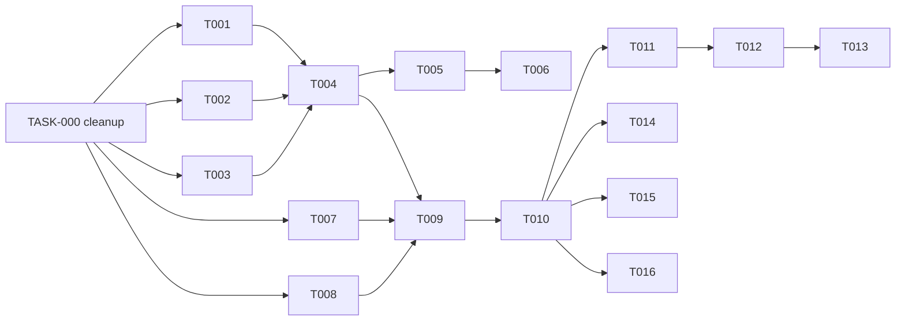

# Add TASK-000 to `ingestion-preflight.plan.md` for pre-implementation consistency

## Why

Three drift defects already documented in [.cursor/plans/ingestion-preflight.plan.md](.cursor/plans/ingestion-preflight.plan.md) `## Deviations from Spec` (lines 616–626) currently sit with the resolution `"Update spec in same PR"` but have no concrete owner. Plus the 2026-05-15 strategy report claims a doc edit that did not actually land. Both produce real "spec-vs-code" drift the moment TASK-001 starts. Solution: one task at the front of the graph that absorbs all four edits before any leaf task runs.

Evidence the strategy report is inaccurate:

```
$ rg "preflight|forbidden_pii|forbidden_semantic|raw sample" \
     internal-docs/pilot-operations/pilot-readiness-definition.md
(no matches)
```

But [docs/reports/2026-05-15-ingestion-strategy-decision.md:15](docs/reports/2026-05-15-ingestion-strategy-decision.md) asserts the file was rewritten with a path-picker and a BLOCKING preflight gate. Confirms TASK-016 is correctly framed as *append* (not *verify*), and the report — not the readiness doc — is what needs the correction.

## What TASK-000 does (four atomic edits)

### 1. `docs/specs/ingestion-preflight.md` — fix "27 PII keys" narrative
- § Contract Tests FORBIDDEN-KEYS-SPLIT-001 currently says *"all 27 PII keys"*. The literal list in § Requirements (and the on-disk `src/ingestion/forbidden-keys.ts` lines 59–86) enumerates 28 entries.
- Change `27` → `28`. Tracked at plan line 622.

### 2. `docs/specs/ingestion-preflight.md` — `MappingSuggestion.suggested_canonical` nullability
- § Mapping Suggestion Catalog § MappingSuggestion shape currently declares `suggested_canonical: string` but the v1 seed table § Mapping Suggestion Catalog has a `status` row with `—` (no canonical).
- Change to `suggested_canonical: string | null`. Tracked at plan line 623.

### 3. `docs/specs/ingestion-preflight.md` — INGEST-PREFLIGHT-004 expected output
- § Contract Tests row INGEST-PREFLIGHT-004 says `forbidden_semantic_after_mapping: []` and `verdict: 'semantic_resolvable_by_mapping'`. § Test strategy note + § Acceptance Criteria bullet 2 both say the array is **additive** — `score` is retained.
- Align row to: `forbidden_semantic_after_mapping: [{ key: 'score', path: 'payload.submission.score' }]`, `verdict: 'semantic_blocking'`. Tracked at plan line 624.

### 4. `docs/reports/2026-05-15-ingestion-strategy-decision.md` — correct line 15
- Currently asserts the readiness doc was rewritten with the gate. It was not (verified above).
- Replace the bullet with: *"`internal-docs/pilot-operations/pilot-readiness-definition.md` (gitignored) — § Integration rewrite + preflight BLOCKING gate **scheduled in TASK-016 of `.cursor/plans/ingestion-preflight.plan.md`**; not yet on disk."*

## Edits to `.cursor/plans/ingestion-preflight.plan.md` itself

### Frontmatter `todos:` (line 7)
Insert as the first entry:

```yaml
- id: "TASK-000"
  content: Pre-implementation consistency cleanup (3 spec deviations + 1 strategy-report correction)
  status: "pending"
```

### `## Tasks` section (insert before TASK-001 at line 293)
New `### TASK-000` block with the four atomic edits above, each with file path, line anchor where known, exact before/after text, and a one-line "Depends on: none" + verification step (`npm run validate:api && rg "27 PII keys" docs/specs/ingestion-preflight.md` returns no matches, etc.).

### `## Files Summary` § To Modify (line 549)
Add two rows:

```
| docs/specs/ingestion-preflight.md                              | TASK-000 | Resolve 3 spec-internal deviations |
| docs/reports/2026-05-15-ingestion-strategy-decision.md         | TASK-000 | Correct line-15 readiness-doc claim |
```

### `## Deviations from Spec` table (lines 620–626)
Change the `Resolution` column on the three existing rows from `"Update spec in same PR"` to `"Resolved by TASK-000"` so the deviation table cross-references the cleanup task instead of relying on reviewer vigilance.

### `## Implementation Order` graph (lines 654–666)
Prepend `TASK-000` as the universal predecessor:



### `## Verification Checklist` (line 642)
Replace the existing last item *"Spec deviations (rows in § Deviations) resolved in the same PR via a follow-up spec edit or reverted"* with *"TASK-000 completed before any of TASK-001..016 (deviations table § Resolution column points at TASK-000)"*.

## Out of scope for this plan

- Any change to `internal-docs/pilot-operations/pilot-readiness-definition.md` — that edit lives in TASK-016 and stays there.
- Any code change in `src/`, `infra/`, or `tests/` — TASK-000 is doc-only.
- Opening `.cursor/plans/webhook-adapters.plan.md` or `.cursor/plans/signal-streamer.plan.md` — those triggers fire after TASK-016 is green, per the strategy report's sequencing.

## Verification (after TASK-000 lands)

- `npm run validate:api` passes (OpenAPI unaffected; sanity check only).
- `rg "27 PII keys" docs/specs/ingestion-preflight.md` returns no matches.
- `rg "string \| null" docs/specs/ingestion-preflight.md` returns at least one match in the MappingSuggestion shape block.
- `rg "scheduled in TASK-016" docs/reports/2026-05-15-ingestion-strategy-decision.md` returns one match.
- `rg "TASK-000" .cursor/plans/ingestion-preflight.plan.md` returns matches in `todos:`, `## Tasks`, `## Files Summary`, `## Deviations from Spec`, `## Implementation Order`, and `## Verification Checklist` (six locations).
- The plan's frontmatter `status` line is unchanged; CEO-direction block (lines 5–6) is unchanged.

## Effort

Single doc-only PR. ~30 minutes including review. Unblocks the 16-task implementation graph cleanly.