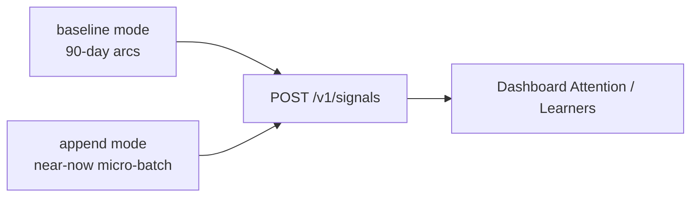

# Seed continuing trends and scenario variety

## Does this make sense?

Yes. Educators don’t see a frozen quarter — they see **ongoing** multi-skill stories (recovering, declining, gifted, staff compliance, whole-child gaps). Today `[examples/springs/seed-springs-demo.mjs](examples/springs/seed-springs-demo.mjs)` builds a one-shot 90-day history with **stable `signal_id`s**, so re-run without wipe → mostly duplicates and a stale “ending.” That fights a live demo instance.

**Chosen approach:** keep wipe-and-reseed as the clean baseline, and add an **append mode** that emits new, wave-keyed signals continuing each persona’s trend so the hosted/local demo can stay fresh without wiping educator review history every time.



## Scenario catalog (educator-facing)

Keep the six personas; make each an explicit **continuing scenario** (not just a pile of scores):

| Persona   | Scenario educators face            | Baseline beat                                            | Append continuation                                                  |
| --------- | ---------------------------------- | -------------------------------------------------------- | -------------------------------------------------------------------- |
| Maya      | Whole-child multi-skill            | Math advance / ELA reinforce / Reading+Science intervene | Reading slowly improves; Science stays intervene; Math stays advance |
| Alex      | Within-subject gap + multi-subject | Math advance; ELA-201 crisis; Science intervene          | ELA-201 slight lift (still intervene/reinforce); Science flat        |
| Jordan    | Intervention worked                | Math 45→90 advance; History+Science reinforce            | Math stays advance; Science edges up (reinforce→near advance)        |
| Sam       | Multi-skill decline                | Math reinforce; Science+ELA intervene                    | ELA keeps decaying or plateaus low; Math slips toward intervene      |
| Priya     | Gifted / enrichment                | Four skills advance-only                                 | Keep advance; maintain evidence for gifted-interest                  |
| Ms. Davis | Staff compliance decay             | reinforce → intervene                                    | Stay overdue / intervene (or slight recovery if we want contrast)    |

Add **one new sparse-evidence learner** (e.g. `stu-60001` “Casey Nguyen”) so demos can show “not enough signal yet / early reinforce” — a common real case the current cast under-represents.

## Implementation plan

### 1. Refactor signal generation into scenario builders

In `[examples/springs/seed-springs-demo.mjs](examples/springs/seed-springs-demo.mjs)`:

- Extract per-persona builders: `buildMayaBaseline(spanDays)`, `buildAppendSignals({ asOf, wave })`, etc.
- Keep shared helpers (`canvasSignal`, `blackboardSignal`, `ireadySignal`, `absorbSignal`).
- Centralize persona metadata in `PERSONAS` (summary + scenario id + skills).

### 2. Add CLI modes

```text
npm run seed:springs-demo                 # baseline (current behavior)
npm run seed:springs-demo -- --mode append [--wave YYYYMMDD] [--as-of ISO] [--window-minutes 90]
```

- `**baseline**`: full historical arcs + ambient (today’s behavior). Document wipe for clean narrative.
- `**append**`: incremental **near-now micro-batch** — event times in the last `--window-minutes` (default 90) ending at now / `--as-of`, with IDs like `maya-iready-read-append-20260711-01` so each wave is unique and idempotent-safe. (`--mode refresh` remains a deprecated alias.)
- `--wave` defaults to today’s UTC date stamp (from `--as-of` when set) so multiple appends on different days stack; same-day re-run stays idempotent (duplicates).
- `--days` is **deprecated** for append (was a multi-day backfill window); ignored with a warning.

### 3. Continuing trend rules (deterministic)

For append, compute the next score from a small deterministic step function per skill (no randomness — demos must be reproducible):

- **Improving**: `score += step` capped at scenario ceiling (Jordan Math, Maya Reading).
- **Stable strong**: jitter within advance band (Maya Math, Priya).
- **Stable weak / crisis**: stay below intervene thresholds (Maya Science, Alex Science).
- **Declining**: `score -= step` floored (Sam ELA).
- Always set `expectDecision` from the same Springs thresholds already used in verification (intervene / advance / reinforce), so Phase 3 stays trustworthy.

### 4. Verification + narrative

- Phase 3: in append mode, only verify append signals; print “continuation” one-liners per persona.
- Print mastery_breakdown for Maya (whole-child) after both modes.
- Exit non-zero on expectation mismatches (same as today).

### 5. Docs

Update `[docs/guides/playbooks/springs-pilot-demo.md](docs/guides/playbooks/springs-pilot-demo.md)`:

- When to wipe + baseline vs append for hosted demo freshness.
- Persona table notes continuation behavior.
- Fix leftover “v3/v4” wording to v5/v6.

### 6. Light regression coverage

Extend `[tests/integration/springs-pilot.test.ts](tests/integration/springs-pilot.test.ts)` (or a small unit test of pure builders if extracted):

- Assert append builders produce unique `signalId`s containing the wave stamp.
- Assert Maya append set still covers four skills with mixed expected decisions.

## Out of scope

- Changing Springs policy rules or subject maps.
- Dashboard UI changes.
- Random generative noise (breaks reproducible demos).

## Success criteria

- Clean wipe + baseline: 100% verified matches (today’s bar).
- Without wipe, `--mode append` accepts new signals and moves Attention/trajectory “today.”
- Educators can demo: whole-child gaps, within-subject gap, recovery, decline, gifted, staff alert, sparse evidence — with stories that still evolve on append.
