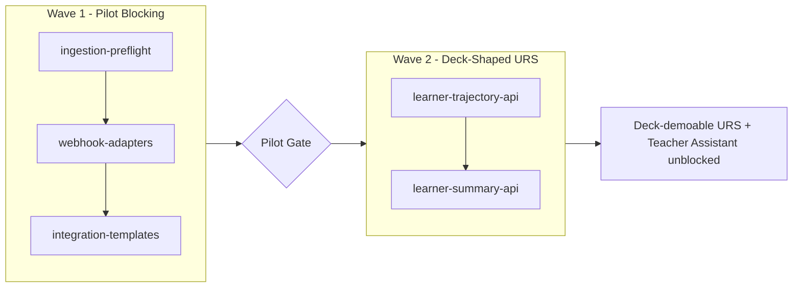

# URS Product Readiness — P0 + P1 Master Plan

> **Status (Wave 1 + Wave 2 shipped).** The frontmatter `todos` are the source of truth: Wave 1 (ingestion-preflight, webhook-adapters, integration-templates) and Wave 2 (learner-trajectory-api, learner-summary-api) are **complete**, with sub-plans on disk and all tasks `completed`. The "Why / Wave 1 / Wave 2" prose below is the **original planning-time narrative** — phrasings like "not built" or "no plan file exists" describe the state when this plan was written, not today. Active work is **Wave 3 — Pilot MVP Launch** (`.cursor/plans/pilot-mvp-launch.plan.md`); see the Wave 3 section and Follow-up plans table.

Single coordinating plan over five specs. References existing sub-plans where they exist; opens three new sub-plans for unplanned specs. Total estimated effort: 3–5 weeks solo-dev.

## Why this plan, why now

- **Deck alignment.** The deck's "Student Learning Record" image and "AI Teacher Assistant" product narrative both depend on a *one-call URS read surface*. That surface is spec'd in [docs/specs/learner-summary-api.md](docs/specs/learner-summary-api.md) but not built. Internal data is already there (see [docs/foundation/architecture.md:129-146](docs/foundation/architecture.md) Living Student Record), the gap is the API.
- **Pilot blocking.** [docs/reports/2026-05-15-ingestion-strategy-decision.md:14-18](docs/reports/2026-05-15-ingestion-strategy-decision.md) promoted ingestion-preflight + webhook-adapters + integration-templates to pilot-blocking. Wave 2 cannot be demoed to a real customer until Wave 1 lands.
- **AI Teacher Assistant readiness.** 4 of 5 required API capabilities are already shipped; only `GET /v1/learners/:ref/summary` is missing. Wave 2 closes that loop without core architectural change.

## Scope boundary

In scope: 5 specs across 2 waves (below). Out of scope (deferred to follow-up plans after Wave 2 lands): LIU usage meter, EventBridge `decision.emitted`, 8p3p-sdk, dashboard SPA deployment split, feedback-as-signal migration. Each becomes its own `.cursor/plans/*.plan.md` once Wave 2 verifies.

## Wave dependency graph



`learner-summary-api` depends sequentially on `learner-trajectory-api` per [docs/specs/learner-summary-api.md:11-21](docs/specs/learner-summary-api.md). `state-delta-detection` is a prereq for both and is already implemented.

---

## Wave 1 — Pilot Blocking (~1.5–2 weeks)

### TASK-W1-1: Execute ingestion-preflight plan
- **Plan**: [.cursor/plans/ingestion-preflight.plan.md](.cursor/plans/ingestion-preflight.plan.md) — 17 tasks (TASK-000..016) already staged. CEO-directed pilot-blocking per [docs/reports/2026-05-15-ingestion-strategy-decision.md:14-18](docs/reports/2026-05-15-ingestion-strategy-decision.md).
- **Action**: Execute as written. No re-planning needed.
- **Outcome**: `POST /v1/admin/ingestion/preflight` (side-effect-free), forbidden-key categorization (`pii` vs `semantic`), and a pilot-readiness gate row in `pilot-readiness-definition.md`.
- **Verification**: All 17 tasks completed (`status: completed` in plan frontmatter); `npm test` green; preflight 200 on Springs sample payload.

### TASK-W1-2: Open and execute webhook-adapters plan
- **Spec**: [docs/specs/webhook-adapters.md](docs/specs/webhook-adapters.md) (complete; no plan file exists).
- **Action**: Create `.cursor/plans/webhook-adapters.plan.md` with TASK-001..0NN derived from spec acceptance criteria. Expected task breakdown (to be expanded when sub-plan opens):
  1. `POST /v1/webhooks/:source_system` route + Fastify handler.
  2. Envelope extraction core (vendor-neutral; reuses `tenant-field-mappings` resolution).
  3. Source-system event-type filtering (drop pings, ack-only events).
  4. Pass-through to `handleSignalIngestionCore` — must reuse the same code path as `POST /v1/signals` so contract behavior is identical.
  5. CDK API Gateway route + Lambda wiring.
  6. OpenAPI documentation.
  7. Contract tests (per spec).
- **Depends on**: TASK-W1-1 (preflight ships first — webhook-adapter is the streaming-first sibling per [docs/reports/2026-05-15-ingestion-strategy-decision.md:35-39](docs/reports/2026-05-15-ingestion-strategy-decision.md)).
- **Verification**: Raw Canvas webhook POST results in an accepted signal in the signal log with the same shape as a direct `POST /v1/signals`.

### TASK-W1-3: Execute integration-templates plan
- **Plan**: [.cursor/plans/integration-templates.plan.md](.cursor/plans/integration-templates.plan.md) (existing; status to be verified before execution).
- **Action**: Audit status; execute remaining tasks. Templates seed `FieldMappingsTable` for Canvas, I-Ready, Branching Minds so a tenant gets working mappings on one click.
- **Depends on**: TASK-W1-2 (templates are activation UX over webhook adapters).
- **Verification**: `apply-template canvas-lms --org-id <id>` results in functional end-to-end ingest from a recorded Canvas webhook payload.

### Wave 1 Gate (must pass before Wave 2 starts)

- All three sub-plans show `completed` for every task.
- `npm test` passes for the full suite (target: 700+ tests, up from 666).
- `npm run validate:contracts` clean.
- Manual: Springs pilot host can ingest a Canvas-shaped webhook payload end-to-end, decision emitted, no PII leakage.
- Pilot readiness gate row exists on disk in `internal-docs/pilot-operations/pilot-readiness-definition.md`.

---

## Wave 2 — Deck-Shaped URS (~2–3 weeks)

### TASK-W2-1: Open and execute learner-trajectory-api plan
- **Spec**: [docs/specs/learner-trajectory-api.md](docs/specs/learner-trajectory-api.md) (complete; no plan file exists).
- **Action**: Create `.cursor/plans/learner-trajectory-api.plan.md`. Expected task breakdown:
  1. Add `getStateVersionRange(orgId, learnerRef, fromVersion, toVersion)` to [src/state/store.ts](src/state/store.ts) + DynamoDB repository.
  2. Trajectory handler core — pure projection over stored state versions; reads `{field}_direction` companions written by [src/state/engine.ts:129-171](src/state/engine.ts) (state-delta-detection, already shipped).
  3. `GET /v1/state/trajectory` Fastify route + Lambda wiring.
  4. OpenAPI updates.
  5. Contract tests (TRAJ-001..0NN per spec acceptance criteria).
- **Why first in Wave 2**: `learner-summary-api` reuses `getStateVersionRange()` directly per [docs/specs/learner-summary-api.md:144](docs/specs/learner-summary-api.md).
- **No new data model.** Pure read projection.
- **Verification**: 3-version learner returns trajectory with correct `improving/declining/stable` directions matching stored `{field}_direction` values.

### TASK-W2-2: Open and execute learner-summary-api plan
- **Spec**: [docs/specs/learner-summary-api.md](docs/specs/learner-summary-api.md) (complete; SUM-001..008 contract tests defined).
- **Action**: Create `.cursor/plans/learner-summary-api.plan.md`. Expected task breakdown:
  1. `GET /v1/learners/:learner_reference/summary` Fastify route.
  2. Handler core — `Promise.all` concurrent fetch over: `getState`, recent decisions (via existing decision store), trajectory summary (reuse TASK-W2-1 core), `loadPolicyForContext`, signal count + date range from signal log. See spec § Notes implementation pattern.
  3. PII exclusion — drop `state_snapshot` from each decision in response (spec § Response Shape Details `recent_decisions`).
  4. Lambda wiring (likely `InspectFunction` per spec § Dependencies).
  5. OpenAPI updates.
  6. Contract tests SUM-001..008 verbatim from spec § Contract Tests.
- **Depends on**: TASK-W2-1 (`getStateVersionRange` must exist).
- **No new data model.** Pure aggregation over existing stores; spec § Constraints "Aggregation only — no new data."
- **Verification**: SUM-001 — Springs `learner_001` with 3 state versions and 2 decisions returns a single response containing all 5 sections (`current_state`, `recent_decisions`, `field_trajectories`, `active_policy`, `signals_summary`). SUM-005 PII check passes against the forbidden-keys list.

### Wave 2 Gate (deck-demoable, assistant-unblocked)

- Both sub-plans show `completed`.
- `GET /v1/learners/learner_001/summary?org_id=springs` returns the deck-shaped Student Learning Record in a single call.
- The JSON response visibly maps to every row of the deck's "Unified Student Learning Record" image (skill mastery, learning stability, evidence history count, risk status via latest decision, next-step recommendations, version count for "record grows over time").
- An external client could now build the AI Teacher Assistant's "Analyze" step using only `GET /v1/learners/:ref/summary` + `GET /v1/decisions` + `POST /v1/signals` — no further core work required.

---

## Risks and mitigations

| Risk | Impact | Mitigation |
|---|---|---|
| Wave 1 webhook-adapters reveals payload shapes Connector Layer can't normalize | High — blocks pilot | Preflight (TASK-W1-1) lands first specifically to catch this on a real customer sample before Wave 1 completes |
| `learner-summary-api` Promise.all hits N+1 patterns on DynamoDB (recent decisions query, then per-decision rationale fetch) | Medium — p95 latency | Spec § Notes says "stores are hit concurrently where possible"; verify with a 50-decision learner during TASK-W2-2 contract tests; add a `recent_decisions_limit` cap (spec already requires max 50) |
| PII leak via `state_snapshot` in `recent_decisions` | High (FERPA / SBIR) | SUM-005 contract test is mandatory; do NOT mark TASK-W2-2 complete until SUM-005 green |
| `getStateVersionRange` on a learner with hundreds of versions degrades trajectory perf | Low at pilot scale | Pagination already in spec (`page_size` 1-100); enforce in TASK-W2-1 |
| Sub-plan task counts balloon past estimates | Medium — schedule slip | Each sub-plan capped at 1 week of effort; if a sub-plan exceeds 15 tasks, surface to user for re-scoping before continuing |
| Educator-feedback unstaged work (`src/feedback/*`) lands during Wave 1 and conflicts with `/v1/decisions/*` routing for Wave 2 summary endpoint | Low | Wave 2's `/v1/learners/:ref/summary` is on a different route prefix; no expected conflict, but rebase before W2-2 |

## Verification checklist (master)

- [ ] Wave 1 Gate passed (all four items above)
- [ ] Wave 2 Gate passed (all four items above)
- [ ] `npm test` passes throughout (no test count regression)
- [ ] `npm run validate:contracts` passes after each task
- [ ] `npm run validate:api` passes after each OpenAPI change
- [ ] Three new sub-plan files exist with `completed` frontmatter: `webhook-adapters.plan.md`, `learner-trajectory-api.plan.md`, `learner-summary-api.plan.md`
- [x] Deck demo recorded: paste a `learner_reference` into a curl call against `GET /v1/learners/:ref/summary`, get back the deck's URS card data, screenshot it next to the deck slide ([internal-docs/reports/wave2-gate-screenshot.png](../../internal-docs/reports/wave2-gate-screenshot.png); compose at [wave2-gate-screenshot-compose.html](../../internal-docs/reports/wave2-gate-screenshot-compose.html); verified `stu-30456` — mastery 0.9, advance, educator_summary "Ready to move on")
- [ ] No new write paths added to STATE Store, Signal Log, or Decision Store (STATE Authority preserved)
- [ ] No dashboard / UI / assistant code added to `src/` outside `dashboard/` (core stays API-first)

## Wave 3 — Pilot MVP Launch (product surface)

**Plan**: [.cursor/plans/pilot-mvp-launch.plan.md](.cursor/plans/pilot-mvp-launch.plan.md)

| Step | Sub-plan | Outcome |
|------|----------|---------|
| W3-001 | [learner-summary-api-hygiene-mvp.plan.md](.cursor/plans/learner-summary-api-hygiene-mvp.plan.md) | Contract locked for dashboard (no ETag/by_source) |
| W3-002 | [dashboard-summary-migration.plan.md](.cursor/plans/dashboard-summary-migration.plan.md) | Panels consume summary endpoint |
| W3-003–006 | pilot-mvp-launch.plan.md | Deploy smoke, runbook, CloudWatch, launch gate |

**Wave 3 Gate:** Customer can log into `/dashboard` with passphrase, see four URS panels backed by `GET /v1/learners/:ref/summary`, on a deployed stack with smoke report on disk.

---

## Follow-up plans (out of scope; open after Wave 3 lands)

| Plan to open | Source spec | Why deferred |
|---|---|---|
| `learner-summary-api-hygiene.plan.md` (full) | [docs/specs/learner-summary-api.md](docs/specs/learner-summary-api.md) | ETag/304/by_source — perf, not pilot-blocking |
| `learner-summary-skills-section.plan.md` (new) | [docs/specs/learner-summary-api.md](docs/specs/learner-summary-api.md) + [docs/specs/skill-level-tracking.md](docs/specs/skill-level-tracking.md) | Add a per-skill `skills_summary` section so one summary call can back the literacy dashboard Panels 2/4 (currently on GET /v1/state per `.cursor/plans/dashboard-summary-migration.plan.md`). Reverses part of URS projection stripping. Deferred — pilot uses two endpoints; only worth it if single-call dashboard is required post-pilot. |
| `liu-usage-meter.plan.md` (already exists as plan file — verify status) | [docs/specs/liu-usage-meter.md](docs/specs/liu-usage-meter.md) | Required before first paying customer, not pilot |
| `eventbridge-decision-events.plan.md` (new) | [docs/api/asyncapi.yaml](docs/api/asyncapi.yaml) | Lets AI Teacher Assistant react instead of poll; not needed for Wave 2 demo |
| `8p3p-sdk-typescript.plan.md` (new) | Roadmap Phase 4 | Productizes the Wave 2 API surface; depends on contract stability after Wave 3 verifies |
| `dashboard-deployment-split.plan.md` (new) | This gap analysis | Removes `dashboard/` mount from `src/server.ts:253-275`; v1.2 deployment hygiene |
| `feedback-as-signal-migration.plan.md` (new) | [docs/specs/educator-feedback-api.md](docs/specs/educator-feedback-api.md) | Closes the URS reinforcement loop; only after current feedback endpoints prove the data shape in SBIR Phase I |

---

## Implementation order (sequential, with parallelizable callouts)

```
Wave 1:
  TASK-W1-1 (ingestion-preflight)
       |
       v
  TASK-W1-2 (webhook-adapters)  -- parallelizable with W1-3 once specs stabilize
       |
       v
  TASK-W1-3 (integration-templates)
       |
       v
  [WAVE 1 GATE]
       |
       v
Wave 2:
  TASK-W2-1 (learner-trajectory-api)
       |
       v
  TASK-W2-2 (learner-summary-api)
       |
       v
  [WAVE 2 GATE]
       |
       v
Wave 3:
  W3-001 (hygiene-mvp) → W3-002 (dashboard-migration) → W3-003..006 (pilot-mvp-launch)
       |
       v
  [WAVE 3 GATE — customer-ready dashboard on deployed stack]
       |
       v
  Open follow-up plans (full hygiene ETag, LIU meter, SDK, EventBridge, dashboard split)
```

W1-2 and W1-3 can overlap once W1-2's webhook envelope contract stabilizes (estimated ~3 days in). W2-1 and W2-2 cannot overlap — W2-2 imports W2-1's `getStateVersionRange`.