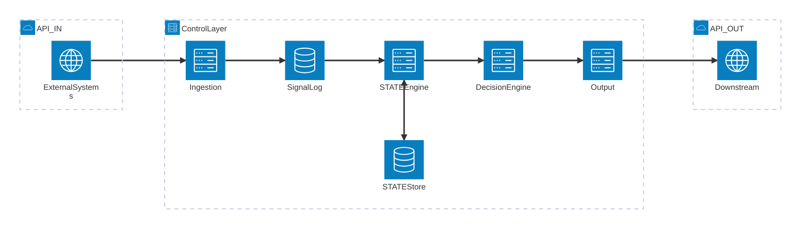

# 8P3P Learning Intelligence Control Layer

**A vendor-agnostic, contract-driven intelligence engine for adaptive learning systems**

[](LICENSE)

---

## Overview

The 8P3P Control Layer is an enterprise-grade intelligence infrastructure that transforms learning signals into actionable decisions while maintaining complete separation from UI, workflows, and domain-specific implementations. Built on immutable principles and contract-first design, it provides the foundational intelligence layer for adaptive learning platforms at scale.

### Core Capabilities

- **Signal Ingestion** — Accept learning events from any source system via API or event streams
- **Immutable State Management** — Maintain append-only learner state with full provenance tracking
- **Deterministic Decision Engine** — Generate consistent, traceable decisions from state
- **Multi-Tenant Architecture** — Built-in org-level isolation with zero cross-tenant leakage
- **Contract-First Design** — Comprehensive interface contracts with structural validation
- **Vendor Neutrality** — No platform lock-in, no domain assumptions, pure intelligence layer

---

## Architecture

> Full architecture details: [`docs/foundation/architecture.md`](docs/foundation/architecture.md)

### System Overview



### Lifecycle Stages

| Stage | Component | Responsibility |
|-------|-----------|----------------|
| **1** | Signal Ingestion | Receive, validate, and accept signals from external systems |
| **2** | Signal Log | Store signals immutably with full provenance |
| **3** | STATE Engine | Apply signals to learner state; single source of truth |
| **4** | Decision Engine | Evaluate state and generate deterministic decisions |
| **5** | Output Interfaces | Expose decisions via API and/or events |

### Key Principles

| Principle | Description |
|-----------|-------------|
| **API-First** | All access via defined interface contracts |
| **Immutability** | Append-only signal log, no state overwrites |
| **Determinism** | Same state always produces same decision |
| **STATE Authority** | No external state overrides permitted |
| **Idempotency** | Safe retry for all operations |
| **Vendor Neutrality** | Zero platform or domain coupling |

---

## Decision Types

The control layer supports seven decision types, forming a closed set:

| Decision Type | Description |
|--------------|-------------|
| `reinforce` | Continue current learning path |
| `advance` | Progress to next level |
| `intervene` | Require assistance |
| `pause` | Temporary hold |
| `escalate` | Elevate to human review |
| `recommend` | Suggest content |
| `reroute` | Change learning path |

---

## Interface Contracts

| Contract | Schema | Validator |
|----------|--------|-----------|
| **Signal Envelope** | [`src/contracts/schemas/signal-envelope.json`](src/contracts/schemas/signal-envelope.json) | [`src/contracts/validators/signal-envelope.ts`](src/contracts/validators/signal-envelope.ts) |
| **Decision Object** | See [Interface Contracts doc](docs/foundation/) | Planned |

For detailed contract specifications, see the [Component Interface Contracts](docs/foundation/) documentation.

---

## Tech Stack

| Technology | Purpose |
|------------|---------|
| **TypeScript** | Primary language |
| **Fastify** | HTTP server framework |
| **Ajv** | JSON Schema validation |
| **better-sqlite3** | SQLite database driver |
| **Vitest** | Test framework |
| **ESLint** | Code quality |

> See [`package.json`](package.json) for current versions and all dependencies.

---

## Project Structure

```
src/
├── contracts/        # JSON schemas and validators
│   ├── schemas/      # Signal envelope JSON schema
│   └── validators/   # Ajv-based validation
├── ingestion/        # Signal ingestion layer
│   ├── handler.ts    # Request handling
│   ├── routes.ts     # API routes
│   ├── forbidden-keys.ts
│   └── idempotency.ts
├── signalLog/        # Immutable signal storage
│   ├── store.ts      # SQLite-backed storage
│   ├── handler.ts    # Request handling
│   ├── routes.ts     # GET /signals routes
│   └── validator.ts  # Query validation
├── shared/           # Shared types and error codes
│   ├── types.ts
│   └── error-codes.ts
├── decision/         # Decision engine (planned)
├── state/            # STATE engine (planned)
├── output/           # Output interfaces (planned)
└── server.ts         # Application entry point
```

---

## Documentation

| Document | Description |
|----------|-------------|
| [Architecture](docs/foundation/architecture.md) | System architecture and data flow |
| [Component Interface Contracts](docs/foundation/) | Complete API and event schemas |
| [Contract Test Matrix](docs/foundation/) | Comprehensive test cases for validation |
| [Interface Validation Ruleset](docs/foundation/) | Structural validation rules and error codes |

### Specifications

| Spec | Description |
|------|-------------|
| [Signal Ingestion](docs/specs/signal-ingestion.md) | Signal ingestion API specification |
| [Signal Log](docs/specs/signal-log.md) | Immutable signal storage specification |

---

## Project Status

This project is in **active development**. The foundational contracts, validation rules, and initial components have been implemented.

### Completed
- [x] Component interface contracts
- [x] Contract test matrix
- [x] Interface validation ruleset
- [x] Technology stack selection (TypeScript, Fastify, Ajv, Vitest)
- [x] Project scaffolding
- [x] Signal Ingestion layer implementation
- [x] Signal Envelope schema and validators
- [x] Signal Log store and query API implementation
- [x] Contract tests for Signal Ingestion
- [x] Contract tests for Signal Log
- [x] Unit tests for idempotency, forbidden-keys, signal-log-store

### In Progress
- [ ] STATE Engine implementation
- [ ] Decision Engine implementation

### Planned
- [ ] Output Interfaces
- [ ] EventBridge integration (Phase 3)
- [ ] SDK development

---

## License

Licensed under the Apache License, Version 2.0. See [LICENSE](LICENSE) for details.

---

**Maintained by the 8P3P Team**
