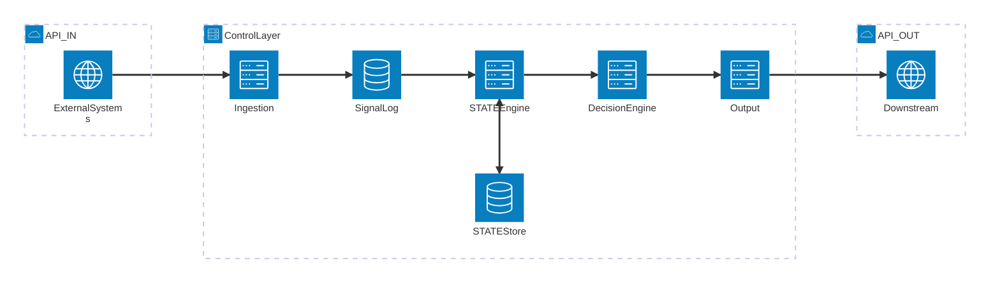

# 8P3P Learning Intelligence Control Layer

**A vendor-agnostic, contract-driven intelligence engine for adaptive learning systems**

[](LICENSE)

---

## Overview

The 8P3P Control Layer is an enterprise-grade intelligence infrastructure that transforms learning signals into actionable decisions while maintaining complete separation from UI, workflows, and domain-specific implementations. Built on immutable principles and contract-first design, it provides the foundational intelligence layer for adaptive learning platforms at scale.

### Core Capabilities

- **Signal Ingestion** — Accept learning events from any source system via API or event streams
- **Immutable State Management** — Maintain append-only learner state with full provenance tracking
- **Deterministic Decision Engine** — Generate consistent, traceable decisions from state
- **Multi-Tenant Architecture** — Built-in org-level isolation with zero cross-tenant leakage
- **Contract-First Design** — Comprehensive interface contracts with structural validation
- **Vendor Neutrality** — No platform lock-in, no domain assumptions, pure intelligence layer

---

## Architecture

> Full architecture details: [`docs/foundation/architecture.md`](docs/foundation/architecture.md)

### System Overview



### Lifecycle Stages

| Stage | Component | Responsibility |
|-------|-----------|----------------|
| **1** | Signal Ingestion | Receive, validate, and accept signals from external systems |
| **2** | Signal Log | Store signals immutably with full provenance |
| **3** | STATE Engine | Apply signals to learner state; single source of truth |
| **4** | Decision Engine | Evaluate state and generate deterministic decisions |
| **5** | Output Interfaces | Expose decisions via API and/or events |

### Key Principles

| Principle | Description |
|-----------|-------------|
| **API-First** | All access via defined interface contracts |
| **Immutability** | Append-only signal log, no state overwrites |
| **Determinism** | Same state always produces same decision |
| **STATE Authority** | No external state overrides permitted |
| **Idempotency** | Safe retry for all operations |
| **Vendor Neutrality** | Zero platform or domain coupling |

---

## Decision Types

The control layer supports seven decision types, forming a closed set:

| Decision Type | Description |
|--------------|-------------|
| `reinforce` | Continue current learning path |
| `advance` | Progress to next level |
| `intervene` | Require assistance |
| `pause` | Temporary hold |
| `escalate` | Elevate to human review |
| `recommend` | Suggest content |
| `reroute` | Change learning path |

---

## Interface Contracts

| Contract | Schema | Validator |
|----------|--------|-----------|
| **REST API** | [`docs/api/openapi.yaml`](docs/api/openapi.yaml) | Served at `/docs` (Swagger UI) |
| **Events** | [`docs/api/asyncapi.yaml`](docs/api/asyncapi.yaml) | — |
| **Signal Envelope** | [`src/contracts/schemas/signal-envelope.json`](src/contracts/schemas/signal-envelope.json) | [`src/contracts/validators/signal-envelope.ts`](src/contracts/validators/signal-envelope.ts) |
| **Decision Object** | [`src/contracts/schemas/decision.json`](src/contracts/schemas/decision.json) | [`src/contracts/validators/decision.ts`](src/contracts/validators/decision.ts) |

For detailed contract specifications, see the [Component Interface Contracts](<docs/foundation/[POC Playbook] 8P3P Learning Intelligence Control Layer-Component Interface Contracts.md>) and API specs in [`docs/api/`](docs/api/).

---

## Tech Stack

| Technology | Purpose |
|------------|---------|
| **TypeScript** | Primary language |
| **Fastify** | HTTP server framework |
| **@fastify/swagger** | OpenAPI spec serving |
| **@fastify/swagger-ui** | Interactive API docs at `/docs` |
| **Ajv** | JSON Schema validation |
| **better-sqlite3** | SQLite database driver |
| **Vitest** | Test framework |
| **ESLint** | Code quality |

> See [`package.json`](package.json) for current versions and all dependencies.

---

## Project Structure

```
src/
├── contracts/        # JSON schemas and validators
│   ├── schemas/      # signal-envelope.json, decision.json
│   └── validators/   # Ajv-based validation (signal-envelope.ts, decision.ts)
├── ingestion/        # Signal ingestion layer
│   ├── handler.ts    # Request handling
│   ├── routes.ts     # API routes
│   ├── forbidden-keys.ts
│   └── idempotency.ts
├── signalLog/        # Immutable signal storage
│   ├── store.ts      # SQLite-backed storage
│   ├── handler.ts    # Request handling
│   ├── routes.ts     # GET /signals routes
│   └── validator.ts  # Query validation
├── state/            # STATE engine
│   ├── engine.ts     # Signal application logic (applySignals, computeNewState)
│   ├── store.ts      # SQLite-backed learner state storage
│   └── validator.ts  # Request and state validation
├── decision/         # Decision engine
│   ├── engine.ts     # evaluateState() — policy evaluation, decision construction
│   ├── handler.ts    # Request handling
│   ├── routes.ts     # GET /v1/decisions routes
│   ├── store.ts      # SQLite-backed decision storage
│   ├── validator.ts  # Request validation
│   └── policies/     # Policy definitions
│       └── default.json
├── shared/           # Shared types and error codes
│   ├── types.ts
│   └── error-codes.ts
├── output/           # Output interfaces (planned)
└── server.ts         # Application entry point

scripts/
├── validate-schemas.ts    # JSON Schema compilation check
├── validate-contracts.ts  # Contract alignment (JSON Schema ↔ OpenAPI ↔ AsyncAPI)
└── validate-api.sh        # OpenAPI linting (Redocly)

tests/
├── contracts/        # Contract tests (spec-driven)
│   ├── signal-ingestion.test.ts
│   ├── signal-log.test.ts
│   ├── state-engine.test.ts
│   ├── decision-engine.test.ts
│   ├── output-api.test.ts
│   └── contract-drift.test.ts  # JSON Schema ↔ OpenAPI ↔ AsyncAPI drift detection
├── integration/      # End-to-end integration tests
│   └── e2e-signal-to-decision.test.ts
└── unit/             # Unit tests
    ├── forbidden-keys.test.ts
    ├── idempotency.test.ts
    ├── signal-log-store.test.ts
    ├── state-engine.test.ts
    ├── state-store.test.ts
    ├── state-validator.test.ts
    ├── decision-engine.test.ts
    ├── decision-store.test.ts
    ├── decision-validator.test.ts
    └── policy-loader.test.ts
```

---

## Documentation

| Document | Description |
|----------|-------------|
| [Architecture](docs/foundation/architecture.md) | System architecture and data flow |
| [Setup](docs/foundation/setup.md) | Environment and runbook |
| [Component Interface Contracts](<docs/foundation/[POC Playbook] 8P3P Learning Intelligence Control Layer-Component Interface Contracts.md>) | Complete API and event schemas |
| [Contract Test Matrix](<docs/foundation/[POC Playbook] 8P3P Learning Intelligence Control Layer-Contract Test Matrix.md>) | Comprehensive test cases for validation |
| [Interface Validation Ruleset](<docs/foundation/[POC Playbook] 8P3P Learning Intelligence Control Layer-Interface Validation Ruleset.md>) | Structural validation rules and error codes |
| [Solo Dev Execution Playbook](docs/foundation/solo-dev-execution-playbook.md) | Milestone-driven build plan, Phase 1–3 roadmap, DynamoDB migration checklist |
| [IP Defensibility & Value Proposition](docs/foundation/ip-defensibility-and-value-proposition.md) | Competitive moat analysis and value differentiation |
| [QA Testing POC v1](docs/testing/qa-test-pocv1.md) | Manual QA test cases via Swagger UI |
| [POC v1 Summary Report](docs/reports/poc-v1-summary-report.md) | POC v1 completion summary and evidence |
| [API Specs Index](docs/api/README.md) | Index for OpenAPI/AsyncAPI specs in `docs/api/` |
| [Archived Reviews](docs/archive/reviews/) | Historical `/review` snapshots (may be stale vs current implementation) |

### API specifications (machine-readable)

| Spec | Description |
|------|-------------|
| [OpenAPI](docs/api/openapi.yaml) | REST API contract (v1); interactive docs at `/docs` |
| [AsyncAPI](docs/api/asyncapi.yaml) | Event contracts (e.g. `signal.ingested`, `decision.emitted`) |

### Specifications (prose)

| Spec | Description |
|------|-------------|
| [Signal Ingestion](docs/specs/signal-ingestion.md) | Signal ingestion API specification |
| [Signal Log](docs/specs/signal-log.md) | Immutable signal storage specification |
| [State Engine](docs/specs/state-engine.md) | STATE engine specification (schemas, contracts, Phase 2 storage abstraction) |
| [Decision Engine](docs/specs/decision-engine.md) | Decision engine specification (policy evaluation, deterministic decisions) |

---

## Project Status

This project is in **active development** (Phase 1). Four of five lifecycle stages are implemented and hardened through multiple review cycles. **337 tests passing** across 17 test files.

### Completed
- [x] Component interface contracts
- [x] Contract test matrix
- [x] Interface validation ruleset
- [x] Technology stack selection (TypeScript, Fastify, Ajv, Vitest)
- [x] Project scaffolding
- [x] **Signal Ingestion** — POST /signals, validation, forbidden key detection, idempotency
- [x] Signal Envelope schema and Ajv validators
- [x] **Signal Log** — append-only storage, time-range queries, pagination, org isolation
- [x] **STATE Engine** — signal application, deep merge, optimistic locking, provenance tracking
- [x] STATE Engine org-scoped queries (SQL-level isolation, DynamoDB-ready)
- [x] Atomic `saveStateWithAppliedSignals` (state + applied_signals in single transaction)
- [x] Contract tests for Signal Ingestion (SIG-API-001 through SIG-API-011)
- [x] Contract tests for Signal Log (SIGLOG-001 through SIGLOG-010)
- [x] Contract tests for STATE Engine (STATE-001 through STATE-014)
- [x] Unit tests for all implemented components (state-engine, state-store, state-validator, signal-log-store, forbidden-keys, idempotency)
- [x] API versioning (`/v1` prefix for signals and decisions)
- [x] OpenAPI spec ([`docs/api/openapi.yaml`](docs/api/openapi.yaml)) and Swagger UI at `/docs`
- [x] AsyncAPI spec ([`docs/api/asyncapi.yaml`](docs/api/asyncapi.yaml)) for event contracts
- [x] `validate:api` script (Redocly lint for OpenAPI)
- [x] Phase 2 storage abstraction documented (StateRepository interface, DynamoDB table designs, migration checklist)
- [x] **Decision Engine** — Policy-driven evaluation, deterministic decisions, full trace provenance
- [x] Decision JSON Schema and Ajv validator (`src/contracts/schemas/decision.json`)
- [x] Contract tests for Decision Engine (DEC-001 through DEC-010+)
- [x] Unit tests for decision engine, store, validator, and policy loader
- [x] E2E integration tests (signal ingestion → state → decision pipeline)
- [x] `validate:contracts` script (JSON Schema ↔ OpenAPI ↔ AsyncAPI alignment)
- [x] Contract drift prevention (automated detection in `npm run check`)

### Next Up
- [ ] Policy Expansion — promote single-rule POC v1 policy to 7-rule v2 covering all decision types (`policy-expansion.plan.md`)
- [ ] Repository Extraction — extract DecisionRepository interface for vendor-agnostic persistence (`repository-extraction.plan.md`)
- [ ] Output Interfaces (Stage 5)

### Planned (Phase 2+)
- [ ] Storage migration: SQLite → DynamoDB (StateRepository / SignalLogRepository adapter pattern)
- [ ] AWS deployment (API Gateway + Lambda + DynamoDB)
- [ ] EventBridge integration (Phase 3)

---

## License

Licensed under the Apache License, Version 2.0. See [LICENSE](LICENSE) for details.

---

**Maintained by the 8P3P Team**
