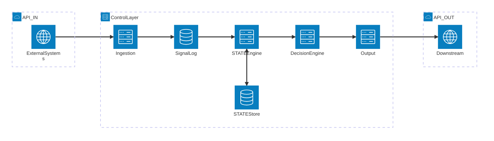

# 8P3P Learning Intelligence Control Layer

**A vendor-agnostic, contract-driven intelligence engine for adaptive learning systems**

[](LICENSE)

---

## Overview

The 8P3P Control Layer is an enterprise-grade intelligence infrastructure that transforms learning signals into actionable decisions while maintaining complete separation from UI, workflows, and domain-specific implementations. Built on immutable principles and contract-first design, it provides the foundational intelligence layer for adaptive learning platforms at scale.

### Core Capabilities

- **Signal Ingestion** — Accept learning events from any source system via API or event streams
- **Immutable State Management** — Maintain append-only learner state with full provenance tracking
- **Deterministic Decision Engine** — Generate consistent, traceable decisions from state
- **Multi-Tenant Architecture** — Built-in org-level isolation with zero cross-tenant leakage
- **Contract-First Design** — Comprehensive interface contracts with structural validation
- **Vendor Neutrality** — No platform lock-in, no domain assumptions, pure intelligence layer

---

## Architecture

> Full architecture details: [`docs/foundation/architecture.md`](docs/foundation/architecture.md)

### System Overview


```mermaid
architecture-beta
    group api_in(cloud)[API_IN]
    group control_layer(server)[ControlLayer]
    group api_out(cloud)[API_OUT]

    service ext_systems(internet)[ExternalSystems] in api_in
    service ingestion(server)[Ingestion] in control_layer
    service signal_log(database)[SignalLog] in control_layer
    service state_engine(server)[STATEEngine] in control_layer
    service state_store(database)[STATEStore] in control_layer
    service decision_engine(server)[DecisionEngine] in control_layer
    service output(server)[Output] in control_layer
    service downstream(internet)[Downstream] in api_out

    ext_systems:R --> L:ingestion
    ingestion:R --> L:signal_log
    signal_log:R --> L:state_engine
    state_engine:B <--> T:state_store
    state_engine:R --> L:decision_engine
    decision_engine:R --> L:output
    output:R --> L:downstream
```

### Lifecycle Stages

| Stage | Component | Responsibility |
|-------|-----------|----------------|
| **1** | Signal Ingestion | Receive, validate, and accept signals from external systems |
| **2** | Signal Log | Store signals immutably with full provenance |
| **3** | STATE Engine | Apply signals to learner state; single source of truth |
| **4** | Decision Engine | Evaluate state and generate deterministic decisions |
| **5** | Output Interfaces | Expose decisions via API and/or events |

### Key Principles

| Principle | Description |
|-----------|-------------|
| **API-First** | All access via defined interface contracts |
| **Immutability** | Append-only signal log, no state overwrites |
| **Determinism** | Same state always produces same decision |
| **STATE Authority** | No external state overrides permitted |
| **Idempotency** | Safe retry for all operations |
| **Vendor Neutrality** | Zero platform or domain coupling |

---

## Decision Types

The control layer supports four decision types, forming a closed set (see `src/contracts/schemas/decision.json`). The default policy maps conceptual variants such as escalate, recommend, and reroute into these four types.

| Decision Type | Description |
|--------------|-------------|
| `reinforce` | Continue current learning path |
| `advance` | Progress to next level |
| `intervene` | Require assistance |
| `pause` | Temporary hold |

---

## Interface Contracts

| Contract | Schema | Validator |
|----------|--------|-----------|
| **REST API** | [`docs/api/openapi.yaml`](docs/api/openapi.yaml) | Served at `/docs` (Swagger UI) |
| **Events** | [`docs/api/asyncapi.yaml`](docs/api/asyncapi.yaml) | — |
| **Signal Envelope** | [`src/contracts/schemas/signal-envelope.json`](src/contracts/schemas/signal-envelope.json) | [`src/contracts/validators/signal-envelope.ts`](src/contracts/validators/signal-envelope.ts) |
| **Decision Object** | [`src/contracts/schemas/decision.json`](src/contracts/schemas/decision.json) | [`src/contracts/validators/decision.ts`](src/contracts/validators/decision.ts) |

For detailed contract specifications, see the [Component Interface Contracts](internal-docs/foundation/poc-playbooks/Component%20Interface%20Contracts.md) and API specs in [`docs/api/`](docs/api/).

---

## Tech Stack

| Technology | Purpose |
|------------|---------|
| **TypeScript** | Primary language |
| **Fastify** | HTTP server framework |
| **@fastify/swagger** | OpenAPI spec serving |
| **@fastify/swagger-ui** | Interactive API docs at `/docs` |
| **Ajv** | JSON Schema validation |
| **better-sqlite3** | SQLite database driver |
| **Vitest** | Test framework |
| **ESLint** | Code quality |

> See [`package.json`](package.json) for current versions and all dependencies.

---

## Project Structure

```
src/
├── contracts/        # JSON schemas and validators
│   ├── schemas/      # signal-envelope.json, decision.json
│   └── validators/   # Ajv-based validation (signal-envelope.ts, decision.ts)
├── ingestion/        # Signal ingestion layer
│   ├── handler.ts    # Request handling
│   ├── routes.ts     # API routes
│   ├── forbidden-keys.ts
│   └── idempotency.ts
├── signalLog/        # Immutable signal storage
│   ├── store.ts      # SQLite-backed storage
│   ├── handler.ts    # Request handling
│   ├── routes.ts     # GET /v1/signals routes
│   └── validator.ts  # Query validation
├── state/            # STATE engine
│   ├── engine.ts     # Signal application logic (applySignals, computeNewState)
│   ├── store.ts      # SQLite-backed learner state storage
│   └── validator.ts  # Request and state validation
├── decision/         # Decision engine
│   ├── engine.ts     # evaluateState() — policy evaluation, decision construction
│   ├── handler.ts    # Request handling
│   ├── policy-loader.ts  # Policy loading, hot-reload, semver validation
│   ├── routes.ts     # GET /v1/decisions routes
│   ├── store.ts      # SQLite-backed decision storage
│   ├── validator.ts  # Request validation
│   └── policies/     # Policy definitions
│       └── default.json
├── shared/           # Shared types and error codes
│   ├── types.ts
│   └── error-codes.ts
└── server.ts         # Application entry point

scripts/
├── validate-schemas.ts    # JSON Schema compilation check
├── validate-contracts.ts  # Contract alignment (JSON Schema ↔ OpenAPI ↔ AsyncAPI)
└── validate-api.sh        # OpenAPI linting (Redocly)

tests/
├── contracts/        # Contract tests (spec-driven)
│   ├── signal-ingestion.test.ts
│   ├── signal-log.test.ts
│   ├── state-engine.test.ts
│   ├── decision-engine.test.ts
│   ├── output-api.test.ts
│   └── contract-drift.test.ts  # JSON Schema ↔ OpenAPI ↔ AsyncAPI drift detection
├── integration/      # End-to-end integration tests
│   └── e2e-signal-to-decision.test.ts
└── unit/             # Unit tests
    ├── forbidden-keys.test.ts
    ├── idempotency.test.ts
    ├── signal-log-store.test.ts
    ├── state-engine.test.ts
    ├── state-store.test.ts
    ├── state-validator.test.ts
    ├── decision-engine.test.ts
    ├── decision-store.test.ts
    ├── decision-validator.test.ts
    └── policy-loader.test.ts
```

---

## Documentation

### Guides

Common business use-cases and integration workflows (built from the existing API contracts):

| Guide | Description |
|------|-------------|
| [Guides Index](docs/guides/README.md) | Entry point for integration workflows |
| [Customer Onboarding Quick Start](docs/guides/customer-onboarding-quickstart.md) | First 15 minutes: real data and meaningful API output |
| [FAQ (Pilot)](docs/guides/faq.md) | Common questions: payload, state, policy, decisions, identity |
| [Pilot Integration Guide (v1)](docs/guides/pilot-integration-guide.md) | “Send signals → consume decisions” |
| [Get all learner decisions from my org](docs/guides/get-all-learner-decisions-from-org.md) | Org-wide decision export (list learners → fetch decisions per learner) |
| [Pilot Deployment Checklist (v1)](docs/guides/deployment-checklist.md) | Pre-deployment gates (requires `API_KEY_ORG_ID`) |

### Foundation

| Document | Description |
|----------|-------------|
| [Architecture](docs/foundation/architecture.md) | System architecture, data flow, and lifecycle stages |
| [Terminology](docs/foundation/terminology.md) | Decision types, canonical fields, and core terms |
| [Setup](docs/foundation/setup.md) | Local environment setup and runbook |

### Specifications (prose)

| Spec | Phase | Description |
|------|-------|-------------|
| [Signal Ingestion](docs/specs/signal-ingestion.md) | Implemented | Signal ingestion API, validation, idempotency |
| [Signal Log](docs/specs/signal-log.md) | Implemented | Immutable signal storage, time-range queries, pagination |
| [State Engine](docs/specs/state-engine.md) | Implemented | STATE engine, versioned learner state, optimistic locking |
| [Decision Engine](docs/specs/decision-engine.md) | Implemented | Policy evaluation, deterministic decisions, trace provenance |
| [Inspection API](docs/specs/inspection-api.md) | v1 — spec'd | Read-only query endpoints: ingestion log, state query, enriched decision trace |
| [Inspection Panels](docs/specs/inspection-panels.md) | v1 — spec'd | 4 read-only panels: Signal Intake, State Viewer, Decision Stream, Decision Trace |
| [Tenant Provisioning](docs/specs/tenant-provisioning.md) | v1.1 — spec'd | API key issuance, tenant onboarding, rate limits via API Gateway usage plans |
| [AWS Deployment](docs/specs/aws-deployment.md) | v1.1 — spec'd | API Gateway + Lambda + DynamoDB serverless deployment (SAM) |

### API specifications (machine-readable)

| Spec | Description |
|------|-------------|
| [OpenAPI](docs/api/openapi.yaml) | REST API contract (v1); interactive docs at `/docs` |
| [AsyncAPI](docs/api/asyncapi.yaml) | Event contracts (e.g. `signal.ingested`, `decision.emitted`) |
| [API Specs Index](docs/api/README.md) | Index for OpenAPI/AsyncAPI specs |

### Testing

| Document | Description |
|----------|-------------|
| [QA Testing POC v1](docs/testing/qa-test-pocv1.md) | Manual QA test cases (historical POC v1 policy) |
| [QA Testing POC v2](docs/testing/qa-test-pocv2.md) | Manual QA test cases for current POC v2 policy |

---

## Project Status

**426 tests passing** across 23 test files. Full pipeline proven end-to-end: signal → validate → store → state accumulate → policy evaluate → decision with trace. All 4 decision types verified with JSON evidence.

### Milestone Summary

| Milestone | Target | Status |
|-----------|--------|--------|
| **POC v1** — single-rule pipeline | Feb 10 | Complete |
| **POC v2** — 4-rule policy, all decision types | Feb 17 | Complete |
| **POC v2 QA** — full test execution with JSON trace evidence | Feb 18 | Complete |
| **v1: 1-Customer Pilot-Ready** — enriched trace + inspection panels + demo dataset | Week 4 | In progress (specs complete, build pending) |
| **v1.1: 2-3 Concurrent Pilots** — AWS deployed + tenant provisioning + per-tenant policy | Week 6-7 | Spec'd (build follows v1) |

### What's Built (POC v1 + v2)

- [x] **Signal Ingestion** — POST `/v1/signals`, validation, forbidden key detection, idempotency
- [x] **Signal Log** — append-only storage, time-range queries, pagination, org isolation
- [x] **STATE Engine** — signal application, deep merge, optimistic locking, provenance tracking, atomic `saveStateWithAppliedSignals`
- [x] **Decision Engine** — policy evaluation, deterministic decisions, full trace provenance
- [x] **Policy Expansion** — POC v2 policy with 4 rules covering all decision types (`policy_version: "1.0.0"`)
- [x] **Output API** — GET `/v1/decisions` with trace (state_id, state_version, policy_version, matched_rule_id)
- [x] **Contract System** — JSON Schemas, OpenAPI, AsyncAPI, Ajv validators, contract drift detection
- [x] **426 tests** — unit, contract, integration, and drift detection across 23 files

### v1: 1-Customer Pilot-Ready (4 weeks)

- [ ] Decision Repository Extraction — vendor-agnostic persistence interface ([plan](.cursor/plans/repository-extraction.plan.md))
- [ ] Inspection API — ingestion log, state query, enriched decision trace, decision stream metadata ([spec](docs/specs/inspection-api.md))
- [ ] Inspection Panels — 4 read-only panels at `/inspect` ([spec](docs/specs/inspection-panels.md))
- [ ] Demo seed script + rehearsal

### v1.1: 2-3 Concurrent Pilots (+2-3 weeks after v1)

- [ ] Remaining repository extractions — Idempotency ([plan](.cursor/plans/idempotency-repository-extraction.plan.md)), Signal Log ([plan](.cursor/plans/signal-log-repository-extraction.plan.md)), State ([plan](.cursor/plans/state-repository-extraction.plan.md))
- [ ] Per-tenant policy lookup (`loadPolicy(orgId)` with default fallback)
- [ ] AWS deployment — API Gateway + Lambda + DynamoDB ([spec](docs/specs/aws-deployment.md))
- [ ] Tenant provisioning — API keys, rate limits, org enforcement ([spec](docs/specs/tenant-provisioning.md))

### Deferred (Full Contract / Production)

- [ ] JWT/OAuth authentication
- [ ] EventBridge integration
- [ ] Per-tenant field mappings
- [ ] Public documentation site (Stripe/Plaid-quality UX)
- [ ] CI/CD pipeline
- [ ] Multi-region deployment

---

## License

Licensed under the Apache License, Version 2.0. See [LICENSE](LICENSE) for details.

---

**Maintained by the 8P3P Team**
