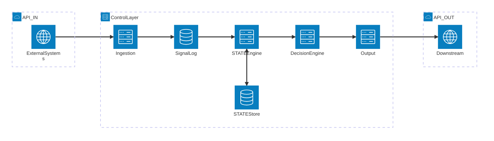

# 8P3P Learning Intelligence Control Layer

**A vendor-agnostic, contract-driven intelligence engine for adaptive learning systems**

[](LICENSE)

---

## Overview

The 8P3P Control Layer is an enterprise-grade intelligence infrastructure that transforms learning signals into actionable decisions while maintaining complete separation from UI, workflows, and domain-specific implementations. Built on immutable principles and contract-first design, it provides the foundational intelligence layer for adaptive learning platforms at scale.

Each governed learning decision — signal ingested → state updated → policy applied → decision produced — is one **Learning Intelligence Unit (LIU)**, the core billing metric for 8P3P's usage-based pricing model.

### Core Capabilities

- **Signal Ingestion** — Accept learning events from any source system via API or event streams
- **Immutable State Management** — Maintain append-only learner state with full provenance tracking
- **Deterministic Decision Engine** — Generate consistent, traceable decisions from state
- **State Delta Detection** — Automatic `_delta` / `_direction` fields for every numeric state field (decay detection)
- **Multi-Tenant Architecture** — Built-in org-level isolation with zero cross-tenant leakage
- **Policy Management** — Admin CRUD for policy lifecycle with validation, soft enable/disable, and versioning
- **LIU Usage Metering** — Per-org monthly LIU consumption tracking for billing transparency
- **Contract-First Design** — Comprehensive interface contracts with structural validation
- **Vendor Neutrality** — No platform lock-in, no domain assumptions, pure intelligence layer

---

## Architecture

> Full architecture details: [`docs/foundation/architecture.md`](docs/foundation/architecture.md)

### System Overview


```mermaid
architecture-beta
    group api_in(cloud)[API_IN]
    group control_layer(server)[ControlLayer]
    group api_out(cloud)[API_OUT]

    service ext_systems(internet)[ExternalSystems] in api_in
    service ingestion(server)[Ingestion] in control_layer
    service signal_log(database)[SignalLog] in control_layer
    service state_engine(server)[STATEEngine] in control_layer
    service state_store(database)[STATEStore] in control_layer
    service decision_engine(server)[DecisionEngine] in control_layer
    service output(server)[Output] in control_layer
    service downstream(internet)[Downstream] in api_out

    ext_systems:R --> L:ingestion
    ingestion:R --> L:signal_log
    signal_log:R --> L:state_engine
    state_engine:B <--> T:state_store
    state_engine:R --> L:decision_engine
    decision_engine:R --> L:output
    output:R --> L:downstream
```

### Lifecycle Stages

| Stage | Component | Responsibility |
|-------|-----------|----------------|
| **1** | Signal Ingestion | Receive, validate, and accept signals from external systems |
| **2** | Signal Log | Store signals immutably with full provenance |
| **3** | STATE Engine | Apply signals to learner state; compute delta/direction fields |
| **4** | Decision Engine | Evaluate state and generate deterministic decisions |
| **5** | Output Interfaces | Expose decisions via API and/or events |

### Key Principles

| Principle | Description |
|-----------|-------------|
| **API-First** | All access via defined interface contracts |
| **Immutability** | Append-only signal log, no state overwrites |
| **Determinism** | Same state always produces same decision |
| **STATE Authority** | No external state overrides permitted |
| **Idempotency** | Safe retry for all operations |
| **Vendor Neutrality** | Zero platform or domain coupling |

---

## Decision Types

The control layer supports four decision types, forming a closed set (see `src/contracts/schemas/decision.json`). The default policy maps conceptual variants such as escalate, recommend, and reroute into these four types.

| Decision Type | Description |
|--------------|-------------|
| `reinforce` | Continue current learning path |
| `advance` | Progress to next level |
| `intervene` | Require assistance |
| `pause` | Possible learning decay detected; watch closely |

---

## Interface Contracts

| Contract | Schema | Validator |
|----------|--------|-----------|
| **REST API** | [`docs/api/openapi.yaml`](docs/api/openapi.yaml) | Served at `/docs` (Swagger UI) |
| **Events** | [`docs/api/asyncapi.yaml`](docs/api/asyncapi.yaml) | — |
| **Signal Envelope** | [`src/contracts/schemas/signal-envelope.json`](src/contracts/schemas/signal-envelope.json) | [`src/contracts/validators/signal-envelope.ts`](src/contracts/validators/signal-envelope.ts) |
| **Decision Object** | [`src/contracts/schemas/decision.json`](src/contracts/schemas/decision.json) | [`src/contracts/validators/decision.ts`](src/contracts/validators/decision.ts) |

For detailed contract specifications, see the API specs in [`docs/api/`](docs/api/).

---

## Tech Stack

| Technology | Purpose |
|------------|---------|
| **TypeScript** | Primary language (API + dashboard) |
| **Fastify** | Control-layer HTTP server |
| **Next.js 15** | Decision Panel (`dashboard/`) — App Router, server-side API proxy |
| **React 19** | Dashboard UI |
| **TanStack Query** | Dashboard data fetching |
| **Tailwind CSS 4 + shadcn/ui** | Dashboard styling and components |
| **@fastify/swagger** | OpenAPI spec serving |
| **@fastify/swagger-ui** | Interactive API docs at `/docs` |
| **Ajv** | JSON Schema validation |
| **better-sqlite3** | SQLite database driver (local dev) |
| **@aws-sdk/client-dynamodb** | DynamoDB client (AWS deployment) |
| **aws-lambda-fastify** | Lambda adapter bridge |
| **AWS CDK** | Infrastructure as code (`infra/`) |
| **Vitest** | API test framework |
| **Playwright** | Dashboard e2e tests |
| **ESLint** | Code quality |
| **Redocly CLI** | OpenAPI linting |

> See [`package.json`](package.json) and [`dashboard/package.json`](dashboard/package.json) for current versions and all dependencies.

---

## Local development

Two processes: **Fastify API** (repo root) and **Next.js Decision Panel** (`dashboard/`).

```bash
# Terminal 1 — API (port 3000)
cp .env.example .env && npm install && npm run dev

# Terminal 2 — seed reference org `springs`
npm run seed:springs-demo

# Terminal 3 — Decision Panel (port 3001)
cd dashboard && cp .env.example .env.local && npm install && npm run dev -- -p 3001
```

| URL | Service |
|-----|---------|
| http://localhost:3000/docs | Swagger UI |
| http://localhost:3000/health | API health |
| http://localhost:3001/ | Decision Panel |

Full runbook (env profiles, testing, making changes, reset, troubleshooting): **[Local Dev & Testing](docs/foundation/setup.md)**.

**Environment variables:** API — [`.env.example`](.env.example); dashboard — [`dashboard/.env.example`](dashboard/.env.example). The dashboard holds `CONTROL_LAYER_API_KEY` server-side (no `VITE_*` build-time keys). Passphrase gate: [`docs/specs/dashboard-passphrase-gate.md`](docs/specs/dashboard-passphrase-gate.md).

---

## Project Structure

```
src/                          # Control-layer API (Fastify)
├── admin/                    # Admin policy management
├── auth/                     # API key middleware, session cookie helpers
├── config/                   # Tenant field mappings, dashboard CORS
├── connectors/               # Connector templates and routes
├── contracts/                # JSON schemas and Ajv validators
├── decision/                 # Decision engine + policies/
├── feedback/                 # Educator feedback persistence
├── ingestion/                # Signal ingestion, idempotency, webhooks
├── lambda/                   # AWS Lambda entrypoints
├── learners/                 # Learner summary, trajectory, URS projection
├── policies/                 # Tenant policy inspection routes
├── routes/                   # Admin mappings, webhooks, preflight
├── signalLog/                # Immutable signal storage
├── state/                    # STATE engine + delta detection
├── shared/                   # Types and error codes
└── server.ts                 # API entry point

dashboard/                    # Decision Panel (Next.js 15 App Router)
├── app/
│   ├── (auth)/               # Login / logout route handlers
│   ├── (dashboard)/          # Overview, Attention, Learners, Decisions, Signals, …
│   └── api/control/          # Server-side proxy to control-layer /v1/*
├── components/               # shadcn/ui, layout, panels, shared badges
├── hooks/                    # TanStack Query hooks
├── lib/                      # Auth, API client, env, navigation
├── e2e/                      # Playwright tests
└── amplify.yml               # Amplify Hosting build spec (deploy blocked pending AWS account)

infra/                        # AWS CDK (API Gateway, Lambdas, DynamoDB)
scripts/                      # Schema/contract validation, API key generation
tests/                        # Vitest — contracts/, integration/, unit/
docs/                         # Specs, guides, API OpenAPI/AsyncAPI
examples/springs/             # Springs demo seed script
```

> Full local dev and test workflow: [`docs/foundation/setup.md`](docs/foundation/setup.md).

---

## Documentation

### Guides

Common business use-cases and integration workflows (built from the existing API contracts):

| Guide | Description |
|------|-------------|
| [Guides Index](docs/guides/README.md) | Entry point for integration workflows |
| [Customer Onboarding Quick Start](docs/guides/customer-onboarding-quickstart.md) | First 15 minutes: real data and meaningful API output |
| [FAQ (Pilot)](docs/guides/faq.md) | Common questions: payload, state, policy, decisions, identity |
| [Pilot Integration Guide (v1)](docs/guides/pilot-integration-guide.md) | "Send signals → consume decisions" |
| [Get all learner decisions from my org](docs/guides/get-all-learner-decisions-from-org.md) | Org-wide decision export (list learners → fetch decisions per learner) |
| [Pilot Deployment Checklist (v1)](docs/guides/deployment-checklist.md) | Pre-deployment gates (requires `API_KEY_ORG_ID`) |

### Foundation

| Document | Description |
|----------|-------------|
| [Architecture](docs/foundation/architecture.md) | System architecture, data flow, and lifecycle stages |
| [Terminology](docs/foundation/terminology.md) | Decision types, canonical fields, and core terms |
| [Setup](docs/foundation/setup.md) | Local dev & testing runbook |

### Specifications

The canonical, status-grouped spec index is **[`docs/specs/README.md`](docs/specs/README.md)** (Active / Shipped / Deferred). Specs are the single source of truth for requirements and interfaces.

**Current product focus (P0):** [AI Educator Explanations](docs/specs/ai-educator-explanations.md) — a short, plain-language explanation of *where* a learner is showing learning decay and *why*, framed as the system's confidence in the learner's learning (not a grade) and fully auditable ("AI explains, never decides").

### API specifications (machine-readable)

| Spec | Description |
|------|-------------|
| [OpenAPI](docs/api/openapi.yaml) | REST API contract (v1); interactive docs at `/docs` |
| [AsyncAPI](docs/api/asyncapi.yaml) | Event contracts (e.g. `signal.ingested`, `decision.emitted`) |
| [API Specs Index](docs/api/README.md) | Index for OpenAPI/AsyncAPI specs |

### Testing

| Document | Description |
|----------|-------------|
| [QA Testing POC v1](docs/testing/qa-test-pocv1.md) | Manual QA test cases (historical POC v1 policy) |
| [QA Testing POC v2](docs/testing/qa-test-pocv2.md) | Manual QA test cases for current POC v2 policy |

---

## Project Status

**948+ Vitest tests** across 59 test files plus **Playwright e2e** for the Next.js dashboard (CI `check` + `dashboard` jobs). Full pipeline proven end-to-end: signal → validate → store → state accumulate → delta detect → policy evaluate → decision with trace. All 4 decision types verified with JSON evidence. Admin policy CRUD operational.

### Milestone Summary

| Milestone | Status |
|-----------|--------|
| **POC v1** — single-rule pipeline | **Complete** |
| **POC v2** — 4-rule policy, all decision types | **Complete** |
| **POC v2 QA** — full test execution with JSON trace evidence | **Complete** |
| **v1: 1-Customer Pilot-Ready** — enriched trace, inspection panels, demo dataset, PII hardening | **Complete** |
| **v1.1 core** — multi-tenant, AWS deployment, LMS integrations, trajectory/summary/URS aggregation | **Complete** |
| **v1.1 SBIR evidence layer** — LIU metering, program metrics, educator/product feedback, research export | **Spec'd; impl pending** |
| **Current focus (P0)** — AI educator-explanation layer (plain-language "why"; confidence-not-grade; auditable) | **In progress** |

### What's Built (v1 — Complete)

- [x] **Signal Ingestion** — POST `/v1/signals`, validation, forbidden key detection, idempotency
- [x] **Signal Log** — append-only storage, time-range queries, pagination, org isolation
- [x] **STATE Engine** — signal application, deep merge, optimistic locking, provenance tracking, atomic `saveStateWithAppliedSignals`
- [x] **State Delta Detection** — automatic `_delta` / `_direction` companion fields for numeric state (decay detection)
- [x] **Decision Engine** — policy evaluation, deterministic decisions, full trace provenance
- [x] **Policy Management API** — admin CRUD (PUT, PATCH, DELETE, validate), `x-admin-api-key` auth, DynamoDB PoliciesTable
- [x] **Policy Storage** — DynamoDB-backed with status field, resolution chain, cache/TTL
- [x] **Policy Expansion** — 4 rules covering all decision types, org-scoped policies with routing
- [x] **Output API** — GET `/v1/decisions`, GET `/v1/receipts` with trace
- [x] **Inspection API** — GET `/v1/state`, GET `/v1/state/list`, GET `/v1/ingestion`
- [x] **Decision Panel** — Next.js 15 dashboard (`dashboard/`) with educator surfaces + inspection views (Signals, Decisions, State, Trace); server-side API proxy (no client `x-api-key`)
- [x] **API Key Middleware** — org-level isolation, forbidden on `/v1/*`
- [x] **PII Hardening** — forbidden keys (DEF-DEC-008-PII), canonical snapshot (DEF-DEC-007)
- [x] **Contract System** — JSON Schemas, OpenAPI, AsyncAPI, Ajv validators, contract drift detection
- [x] **Repository Interfaces** — Decision, State, Signal Log, Idempotency, Ingestion Log (vendor-agnostic)
- [x] **DynamoDB Adapters** — all five repository implementations for AWS deployment
- [x] **Lambda Handlers** — ingest, query, inspect, admin entrypoints
- [x] **CDK Stack** — API Gateway + Lambda + DynamoDB table definitions
- [x] **Demo Seed Script** — `npm run seed:springs-demo`, Springs pilot data
- [x] **948+ tests** — Vitest unit/contract/integration + Playwright dashboard e2e

### Current Focus

The near-term goal is to prove a plain-language **educator-explanation** capability end-to-end on a controlled, de-identified dataset (local/SQLite). The single capability gap is the plain-language "why" — everything else needed is built or a narrow extension.

- **P0** — [AI educator-explanation layer](docs/specs/ai-educator-explanations.md) (Bedrock Converse → template fallback, PII-safe)
- **P0** — Decision Panel D1 inversion (educator summary first; rule id + rationale in detail view)
- **P1** — Per-skill trajectory scope; controlled-evaluation runbook

Full status-grouped spec matrix: [`docs/specs/README.md`](docs/specs/README.md).

**Shipped in v1.1 core:** AWS deployment (API Gateway + Lambda + DynamoDB), tenant provisioning, policy management/inspection, tenant field mappings, webhook adapters, connector templates, learner trajectory + summary APIs, URS aggregation, skill-level tracking, multi-source transforms, ingestion preflight, Next.js Decision Panel + passphrase gate.

> **SBIR evidence layer (LIU metering, program metrics, educator/product feedback, research export)** is spec'd with plans staged; implementation is pending. See [`docs/specs/README.md`](docs/specs/README.md) § Active.

### GitHub Environment Secrets (CI/CD)

The `deploy.yml` pipeline authenticates to AWS via OIDC and requires the following secrets configured in the **`prod`** (and optionally `dev`) GitHub environment:

| Secret | Required | Description |
|--------|----------|-------------|
| `AWS_DEPLOY_ROLE_ARN` | ✅ | IAM role ARN the OIDC provider assumes (`arn:aws:iam::<account>:role/<role>`) |
| `ADMIN_API_KEY` | ✅ | Admin API key injected into the Lambda environment at deploy time |
| `CUSTOM_DOMAIN` | Optional | API custom domain, e.g. `api.8p3p.dev` — triggers ACM + Route 53 provisioning |
| `HOSTED_ZONE_ID` | If `CUSTOM_DOMAIN` set | Route 53 hosted zone ID for the custom domain |
| `HOSTED_ZONE_NAME` | If `CUSTOM_DOMAIN` set | Route 53 zone name, e.g. `8p3p.dev` |
| `CONTRACT_TEST_API_URL` | Optional | Base URL for post-deploy contract tests — skipped if unset |
| `CONTRACT_TEST_API_KEY` | If above set | API key passed to contract tests |

Set secrets via: **GitHub → repo → Settings → Environments → prod → Add secret**

The OIDC trust policy on the IAM role must allow `token.actions.githubusercontent.com` as the identity provider and scope to this repo.

### Roadmap Alignment

The investor deck defines a 24-month product roadmap. The control layer's engineering milestones map to it:

| Phase | Timeline | Control Layer Work |
|-------|----------|-------------------|
| **Pre-Phase 1 (Pilot proof)** | Now | Educator-explanation layer + controlled data evaluation; v1.1 core (AWS, integrations, trajectory/summary) shipped |
| **Phase 1** | 0–6 months | Repeatable deployments, decision visibility, school-system integrations |
| **Phase 2** | 6–12 months | Standardized ingestion, multi-school onboarding, API foundations |
| **Phase 3** | 12–18 months | Public API, Zapier, workflow automation |
| **Phase 4** | 18–24 months | Developer SDK, partner embedding, B2B2C |

### v1.2 Backlog

User stories approved, specs deferred: [`docs/backlog/user-stories-v1.2.md`](docs/backlog/user-stories-v1.2.md)

- US-POLICY-BUILDER-001: AI-assisted policy generation (decoupled LLM service)
- INFRA-SQLITE-001: replace the `better-sqlite3` native addon with Node's built-in `node:sqlite` (post-pilot cleanup)

> US-SKILL-001 (skill-level ingestion + dot-path policy evaluation) has shipped — see [`docs/specs/skill-level-tracking.md`](docs/specs/skill-level-tracking.md).

### Deferred (Full Contract / Production)

- [ ] JWT/OAuth authentication
- [ ] EventBridge integration
- [ ] Public documentation site (Stripe/Plaid-quality UX)
- [ ] Multi-region deployment
- [ ] Usage-based rate limiting (per-LIU throttling)

### Enterprise posture and compliance (internal)

Phased path toward stronger identity controls, regulated-data handling, and common audit frameworks (for example SOC 2–class controls and HIPAA-class data practices) is documented in [`internal-docs/compliance-security-posture-and-migration-path.md`](internal-docs/compliance-security-posture-and-migration-path.md). That document is the canonical internal checklist; it does not replace legal review or third-party attestation.

### Forward-looking specs (drafted, not scheduled)

Domain-neutral, separable work identified during posture analysis. These are not on the current milestone plan; they are implementation vehicles for future phases.

- [Tiered Data Classification](docs/specs/tiered-data-classification.md) — per-tenant per-field classification policy (`allow | tokenize | encrypt | reject`) with enforcement at ingestion and read. Replaces the blanket PII rejection with an auditable tiered posture. Options section evaluates Presidio and AWS Comprehend.

> **Parked pending prerequisite:** [`document-extraction-service.md`](docs/specs/document-extraction-service.md) is drafted but depends on `tiered-data-classification.md` for per-field classification. It is not surfaced in this list until the classification spec has a scheduled plan.

---

## License

Licensed under the Apache License, Version 2.0. See [LICENSE](LICENSE) for details.

---

**Maintained by the 8P3P Team**
