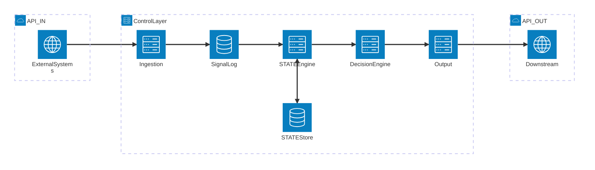

# 8P3P Learning Intelligence Control Layer

**A vendor-agnostic, contract-driven intelligence engine for adaptive learning systems**

[](LICENSE)

---

## Overview

The 8P3P Control Layer transforms learning signals into actionable decisions while staying separate from UI, workflows, and domain-specific implementations. Contract-first design and immutable principles provide the intelligence layer for adaptive learning platforms at scale.

Each governed learning decision — signal ingested → state updated → policy applied → decision produced — is one **Learning Intelligence Unit (LIU)**, the core billing metric for usage-based pricing.

### Core Capabilities

- **Signal Ingestion** — Accept learning events from any source via API or webhooks
- **Immutable State Management** — Append-only learner state with full provenance
- **Deterministic Decision Engine** — Consistent, traceable decisions from state
- **State Delta Detection** — Automatic `_delta` / `_direction` fields for numeric state (decay detection)
- **Multi-Tenant Architecture** — Org-level isolation with zero cross-tenant leakage
- **Policy Management** — Admin CRUD with validation, soft enable/disable, and versioning
- **Educator Feedback** — Approve/Reject/Ignore on decisions with append-only audit trail
- **AI Educator Explanations** — Optional plain-language "why" at decision time (`@8p3p/explanation`; default off)
- **Contract-First Design** — JSON Schemas, OpenAPI, AsyncAPI, Ajv validators

---

## Architecture

> Full details: [`docs/foundation/architecture.md`](docs/foundation/architecture.md)


```mermaid
architecture-beta
    group api_in(cloud)[API_IN]
    group control_layer(server)[ControlLayer]
    group api_out(cloud)[API_OUT]

    service ext_systems(internet)[ExternalSystems] in api_in
    service ingestion(server)[Ingestion] in control_layer
    service signal_log(database)[SignalLog] in control_layer
    service state_engine(server)[STATEEngine] in control_layer
    service state_store(database)[STATEStore] in control_layer
    service decision_engine(server)[DecisionEngine] in control_layer
    service output(server)[Output] in control_layer
    service downstream(internet)[Downstream] in api_out

    ext_systems:R --> L:ingestion
    ingestion:R --> L:signal_log
    signal_log:R --> L:state_engine
    state_engine:B <--> T:state_store
    state_engine:R --> L:decision_engine
    decision_engine:R --> L:output
    output:R --> L:downstream
```

| Stage | Component | Responsibility |
|-------|-----------|----------------|
| **1** | Signal Ingestion | Receive, validate, and accept signals |
| **2** | Signal Log | Store signals immutably with provenance |
| **3** | STATE Engine | Apply signals; compute delta/direction fields |
| **4** | Decision Engine | Evaluate state; produce deterministic decisions |
| **5** | Output | Expose decisions via API and/or events |

---

## Decision Types

Closed set — see [`src/contracts/schemas/decision.json`](src/contracts/schemas/decision.json). Default policy maps variants like escalate, recommend, and reroute into these four types.

| Type | Description |
|------|-------------|
| `reinforce` | Continue current learning path |
| `advance` | Progress to next level |
| `intervene` | Require assistance |
| `pause` | Possible learning decay; watch closely |

---

## Interface Contracts

| Contract | Location |
|----------|----------|
| **REST API** | [`docs/api/openapi.yaml`](docs/api/openapi.yaml) — interactive docs at `/docs` |
| **Events** | [`docs/api/asyncapi.yaml`](docs/api/asyncapi.yaml) |
| **Signal Envelope** | [`src/contracts/schemas/signal-envelope.json`](src/contracts/schemas/signal-envelope.json) |
| **Decision Object** | [`src/contracts/schemas/decision.json`](src/contracts/schemas/decision.json) |

Validators live under [`src/contracts/validators/`](src/contracts/validators/).

---

## Tech Stack

| Layer | Stack |
|-------|-------|
| **API** | TypeScript, Fastify 5, Ajv, SQLite (local) / DynamoDB (AWS) |
| **Dashboard** | Next.js 15, React 19, TanStack Query, Tailwind CSS 4, shadcn/ui |
| **Infra** | AWS CDK (API Gateway, Lambda, DynamoDB) |
| **AI explanations** | Vercel AI SDK (`generateText`), Amazon Bedrock / Gateway — `@8p3p/explanation` package |
| **Quality** | Vitest, Playwright, ESLint, Redocly CLI |

> Versions and full dependency lists: [`package.json`](package.json), [`dashboard/package.json`](dashboard/package.json). **Node.js 22.x** required (`.nvmrc`).

---

## Local development

**Prerequisites:** Node.js **22.x** (`nvm use`), npm ≥ 10.

| Step | Terminal | Command | When ready |
|------|----------|---------|------------|
| **1. API** | repo root | `cp .env.example .env && npm install && npm run dev` | http://localhost:3000/docs |
| **2. Seed** | repo root | `npm run seed:springs-demo` | Springs demo org (API must be running) |
| **3. Dashboard** | `dashboard/` | `cp .env.example .env.local && npm install && npm run dev -- -p 3001` | http://localhost:3001 |

**Environment:** API — [`.env.example`](.env.example); dashboard — [`dashboard/.env.example`](dashboard/.env.example). The Decision Panel proxies `/v1/*` through Next.js route handlers; `CONTROL_LAYER_API_KEY` stays server-side (no `NEXT_PUBLIC_*` secrets). Optional passphrase gate: [`docs/specs/dashboard-passphrase-gate.md`](docs/specs/dashboard-passphrase-gate.md).

**Also in the runbook:** auth profiles, `npm test`, reset, deploy — [`docs/foundation/setup.md`](docs/foundation/setup.md).

---

## Project Structure

```
src/                          # Control-layer API (Fastify)
├── admin/                    # Policy management, field mappings
├── auth/                     # API key middleware, session cookies
├── config/                   # Tenant field mappings, dashboard CORS
├── connectors/               # Connector templates and routes
├── contracts/                # JSON schemas and Ajv validators
├── decision/                 # Decision engine + policies/
├── feedback/                 # Educator feedback persistence
├── ingestion/                # Signal ingestion, idempotency, webhooks
├── lambda/                   # AWS Lambda entrypoints
├── learners/                 # Learner summary, trajectory, URS projection
├── policies/                 # Tenant policy inspection routes
├── routes/                   # Admin mappings, webhooks, preflight
├── signalLog/                # Immutable signal storage
├── state/                    # STATE engine + delta detection
└── server.ts                 # API entry point

dashboard/                    # Decision Panel (Next.js App Router)
├── app/
│   ├── (auth)/               # Passphrase login / logout
│   ├── (dashboard)/          # Overview, Attention, Learners, Decisions, Signals, Reports, Settings
│   └── api/                  # Server-side proxy to control-layer /v1/*
├── components/               # shadcn/ui, layout, panels
├── hooks/                    # TanStack Query hooks
├── lib/                      # Auth, API client, env, navigation
└── e2e/                      # Playwright tests

infra/                        # AWS CDK
scripts/                      # Schema validation, API key generation
tests/                        # Vitest — contracts/, integration/, unit/
docs/                         # Specs, guides, OpenAPI/AsyncAPI
examples/springs/             # Springs demo seed script
services/explanation/         # @8p3p/explanation — AI educator-explanation layer (Bedrock/Gateway)
```

---

## Documentation

| Area | Index |
|------|-------|
| **Integration guides** | [`docs/guides/README.md`](docs/guides/README.md) — onboarding, pilot integration, deployment |
| **Foundation** | [`architecture`](docs/foundation/architecture.md) · [`terminology`](docs/foundation/terminology.md) · [`setup`](docs/foundation/setup.md) |
| **Specifications** | [`docs/specs/README.md`](docs/specs/README.md) — Active / Shipped / Deferred (requirements source of truth) |
| **API specs** | [`docs/api/README.md`](docs/api/README.md) — OpenAPI + AsyncAPI |
| **Manual QA** | [`docs/testing/`](docs/testing/) — POC v1/v2 test cases |

**Current P0:** [AI Educator Explanations](docs/specs/ai-educator-explanations.md) — `@8p3p/explanation` + engine integration shipped; dashboard Panels 2 & 3 prefer `trace.educator_explanation` (`AI_EXPLANATIONS_ENABLED` default off). Next: [Customer Feedback Loop](docs/specs/customer-feedback-loop.md) — product-level "Send feedback" + CSAT (spec'd; impl pending).

---

## Project Status

**~970 Vitest tests** across 62 test files, plus **Playwright e2e** for the dashboard (CI `check` + `dashboard` jobs). Full pipeline proven: signal → validate → store → state → delta → policy → decision with trace.

| Milestone | Status |
|-----------|--------|
| POC v1 / v2 — single- and multi-rule pipeline, all decision types | **Complete** |
| v1 pilot-ready — enriched trace, inspection, demo data, PII hardening | **Complete** |
| v1.1 core — multi-tenant AWS, LMS integrations, trajectory/summary/URS | **Complete** |
| Educator feedback API + Attention review UX (Approve/Reject persistence) | **Complete** |
| v1.1 SBIR evidence — LIU metering, program metrics, research export | **Spec'd; impl pending** |
| **P0** — AI educator-explanation layer + dashboard UX (D1 inversion) | **Backend + panel wiring complete** (`AI_EXPLANATIONS_ENABLED` default off) |
| **P0** — Customer feedback loop (product-level "Send feedback" + CSAT) | **Spec'd; impl pending** |

Shipped capabilities (API, policy CRUD, DynamoDB adapters, CDK, Decision Panel, webhooks, field mappings, etc.) are indexed under **Shipped** in [`docs/specs/README.md`](docs/specs/README.md).

**Near-term focus:**

- [Customer feedback loop](docs/specs/customer-feedback-loop.md) — always-on "Send feedback" + `GET /v1/admin/feedback`; backs roadmap "gives feedback at any time"
- Live Bedrock enablement for AI explanations (PREREQ in spec; feature flag off by default)
- LIU metering + program metrics (SBIR evidence)
- P1 — per-skill trajectory scope; controlled-evaluation runbook

**Backlog (deferred):** [`docs/backlog/user-stories-v1.2.md`](docs/backlog/user-stories-v1.2.md). Forward-looking specs (tiered data classification, etc.): [`docs/specs/README.md`](docs/specs/README.md) § Deferred.

**Deploy:** AWS via CDK — [`docs/specs/aws-deployment.md`](docs/specs/aws-deployment.md) and [`.github/workflows/deploy.yml`](.github/workflows/deploy.yml) (OIDC; GitHub environment secrets for `prod`).

**Enterprise posture:** phased compliance path in the internal compliance posture doc (local only; not legal attestation). See [`docs/guides/internal-operations-stub.md`](docs/guides/internal-operations-stub.md) for internal doc index.

---

## License

Licensed under the Apache License, Version 2.0. See [LICENSE](LICENSE).

---

**Maintained by the 8P3P Team**
