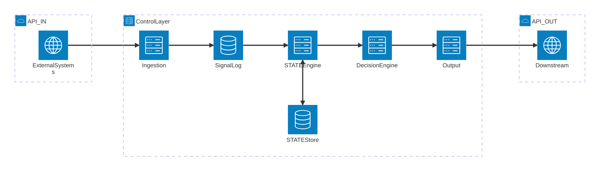

# 8P3P Control Layer Architecture

## System Architecture Diagram



## Lifecycle Stages

| Stage | Component | Responsibility |
|-------|-----------|----------------|
| **1** | Signal Ingestion | Receive, validate, and accept signals from external systems |
| **2** | Signal Log | Store signals immutably with full provenance |
| **3** | STATE Engine | Apply signals to learner state; single source of truth |
| **4** | Decision Engine | Evaluate state and generate deterministic decisions |
| **5** | Output Interfaces | Expose decisions via API and/or events |

## Data Flow Summary

```
External System
       │
       ▼ (API IN: POST /signals)
┌──────────────────┐
│ Signal Ingestion │ ← Validates SignalEnvelope
└────────┬─────────┘
         │
         ▼
┌──────────────────┐
│   Signal Log     │ ← Append-only, immutable
└────────┬─────────┘
         │
         ▼
┌──────────────────┐     ┌─────────────┐
│  STATE Engine    │◄───►│ STATE Store │
└────────┬─────────┘     └─────────────┘
         │
         ▼
┌──────────────────┐
│ Decision Engine  │ ← Deterministic evaluation
└────────┬─────────┘
         │
         ▼
┌──────────────────┐
│ Output Interfaces│
└────────┬─────────┘
         │
         ▼ (API/Event OUT: GET /decisions)
Downstream System
```

## Storage Touchpoints

| Storage | Purpose | Access Pattern |
|---------|---------|----------------|
| **Signal Log** | Immutable record of all ingested signals | Append-only writes; Read by org_id + time range |
| **STATE Store** | Current learner state with version tracking | Read/Write by org_id + learner_reference |

## External Boundaries

| Boundary | Direction | Protocol | Endpoints |
|----------|-----------|----------|-----------|
| **API IN** | Inbound | REST/HTTP | `POST /signals` |
| **API OUT** | Outbound | REST/HTTP | `GET /decisions` |
| **Event OUT** | Outbound | EventBridge (Phase 3) | Decision events |

---

## Key Properties

- **Unidirectional Flow**: Data moves left-to-right through the lifecycle
- **No Shortcuts**: Every signal must traverse all five stages
- **Isolation**: Multi-tenant by `org_id` at every stage
- **Determinism**: Same input state always produces same decision
- **Immutability**: Signal Log is append-only; STATE updates are versioned
