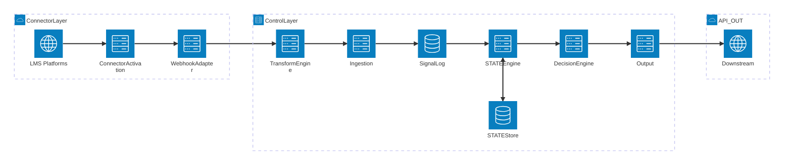

# 8P3P Control Layer Architecture

**Related:** [`docs/foundation/terminology.md`](terminology.md) | [`docs/api/openapi.yaml`](../api/openapi.yaml)

## System Architecture Diagram


```mermaid
architecture-beta
    group connector_layer(cloud)[ConnectorLayer]
    group control_layer(server)[ControlLayer]
    group api_out(cloud)[API_OUT]

    service lms(internet)[LMS Platforms] in connector_layer
    service templates(server)[ConnectorActivation] in connector_layer
    service webhook_adapter(server)[WebhookAdapter] in connector_layer
    service transform(server)[TransformEngine] in control_layer
    service ingestion(server)[Ingestion] in control_layer
    service signal_log(database)[SignalLog] in control_layer
    service state_engine(server)[STATEEngine] in control_layer
    service state_store(database)[STATEStore] in control_layer
    service decision_engine(server)[DecisionEngine] in control_layer
    service output(server)[Output] in control_layer
    service downstream(internet)[Downstream] in api_out

    lms:R --> L:templates
    templates:R --> L:webhook_adapter
    webhook_adapter:R --> L:transform
    transform:R --> L:ingestion
    ingestion:R --> L:signal_log
    signal_log:R --> L:state_engine
    state_engine:B <--> T:state_store
    state_engine:R --> L:decision_engine
    decision_engine:R --> L:output
    output:R --> L:downstream
```

## Connector Layer (Pre-Ingestion)

The Connector Layer sits before Signal Ingestion and eliminates custom integration engineering. It is a three-layer stack — each layer builds on the one below it.

```
┌─────────────────────────────────────────────────────┐
│  LAYER 3: Connector Activation UX                   │
│  Activate → configure event types → get webhook URL │
│  Spec: integration-templates.md                     │
├─────────────────────────────────────────────────────┤
│  LAYER 2: Webhook Adapter (raw payload ingestion)   │
│  POST /v1/webhooks/:source_system                   │
│  Spec: webhook-adapters.md                          │
├─────────────────────────────────────────────────────┤
│  LAYER 1: Transform Engine (payload normalization)  │
│  aliases → transforms → required → types            │
│  Spec: tenant-field-mappings.md                     │
└─────────────────────────────────────────────────────┘
```

| Layer | Component | Responsibility | Spec |
|-------|-----------|----------------|------|
| **3** | Connector Activation | Pre-built templates for Canvas, I-Ready, Branching Minds. One-click activate → webhook URL. | `integration-templates.md` |
| **2** | Webhook Adapter | Accept raw LMS payloads, extract envelope fields, construct `SignalEnvelope` | `webhook-adapters.md` |
| **1** | Transform Engine | Declarative aliases, computed transforms, required fields, type enforcement | `tenant-field-mappings.md` |

The Connector Layer writes into `FieldMappingsTable` (DynamoDB). Layers 1 and 2 read from it. Layer 3 seeds it from templates. The direct `POST /v1/signals` path bypasses the Connector Layer entirely — advanced integrations can still construct their own `SignalEnvelope`.

---

## Lifecycle Stages

| Stage | Component | Responsibility |
|-------|-----------|----------------|
| **0** | Connector Layer | (Optional) Accept raw LMS webhooks, extract envelope, normalize payload into canonical fields |
| **1** | Signal Ingestion | Receive, validate, and accept signals from external systems |
| **2** | Signal Log | Store signals immutably with full provenance |
| **3** | STATE Engine | Apply signals to learner state; single source of truth |
| **4** | Decision Engine | Evaluate state and generate deterministic decisions |
| **5** | Output Interfaces | Expose decisions via API and/or events (implemented in `decision/`: GET `/v1/decisions`, GET `/v1/receipts`) |

## Data Flow Summary

```
LMS Platform (Canvas, I-Ready, etc.)
       │
       ▼ (Raw webhook: POST /v1/webhooks/:source_system)
┌──────────────────┐
│ Webhook Adapter  │ ← Event type filter, envelope extraction
└────────┬─────────┘
         │
         ▼
┌──────────────────┐
│ Transform Engine │ ← Aliases, computed transforms, type enforcement
└────────┬─────────┘
         │
         ▼ (Constructed SignalEnvelope)
┌──────────────────┐
│ Signal Ingestion │ ← Validates SignalEnvelope, forbidden keys, idempotency
└────────┬─────────┘
         │
         ▼
┌──────────────────┐
│   Signal Log     │ ← Append-only, immutable
└────────┬─────────┘
         │
         ▼
┌──────────────────┐     ┌─────────────┐
│  STATE Engine    │◄───►│ STATE Store │
└────────┬─────────┘     └─────────────┘
         │
         ▼
┌──────────────────┐
│ Decision Engine  │ ← Deterministic evaluation against policy
└────────┬─────────┘
         │
         ▼
┌──────────────────┐
│ Output Interfaces│
└────────┬─────────┘
         │
         ▼ (API/Event OUT: GET /v1/decisions)
Downstream System

Alternative path (advanced):
  Direct POST /v1/signals → Signal Ingestion (bypasses Connector Layer)
```

## Living Student Record

The **Living Student Record** is the composite value asset that accumulates across all stages. It is not a single table — it is the combination of:

| Component | What it holds | Where it lives |
|-----------|--------------|----------------|
| **Learner State** | Current canonical field values (stabilityScore, masteryScore, etc.) with version history | STATE Store |
| **Signal History** | Every learning event ever ingested, immutable | Signal Log |
| **Decision History** | Every decision produced, with trace (matched rule, policy version, state snapshot) | Decision Store |
| **Trajectory** | Directional trends (improving / declining / stable) over time | Derived from STATE Store versions |

The Living Student Record grows more valuable with each signal. It persists even if the source LMS is replaced — the canonical fields and decisions are system-agnostic. This is the core product differentiator: *systems can be swapped; the intelligence record cannot be recreated.*

**Read interfaces:**
- `GET /v1/learners/:ref/summary` — aggregated view (state + recent decisions + trajectory)
- `GET /v1/state/trajectory` — version-range trend view
- `GET /v1/decisions` — decision history with traces

---

## Storage Touchpoints

| Storage | Purpose | Access Pattern |
|---------|---------|----------------|
| **Signal Log** | Immutable record of all ingested signals | Append-only writes; Read by org_id + time range |
| **STATE Store** | Current learner state with version tracking | Read/Write by org_id + learner_reference |
| **Decision Store** | Immutable decisions with traces | Append-only writes; Read by org_id + learner_reference + time range |
| **FieldMappingsTable** | Connector configs: transforms, envelope extraction, event type filters | Read at ingestion; Write by admin API / connector activation |
| **PoliciesTable** | Policy rule sets with status and version | Read at decision time; Write by admin API |

## External Boundaries

| Boundary | Direction | Protocol | Endpoints |
|----------|-----------|----------|-----------|
| **Webhook IN** | Inbound | REST/HTTP | `POST /v1/webhooks/:source_system` (Connector Layer) |
| **API IN** | Inbound | REST/HTTP | `POST /v1/signals` (direct path) |
| **API OUT** | Outbound | REST/HTTP | `GET /v1/decisions`, `GET /v1/learners/:ref/summary` |
| **Admin** | Inbound | REST/HTTP | `/v1/admin/connectors/*`, `/v1/admin/policies/*`, `/v1/admin/mappings/*` |
| **Event OUT** | Outbound | EventBridge (Phase 3) | Decision events |

---

## Key Properties

- **Unidirectional Flow**: Data moves left-to-right through the lifecycle
- **No Shortcuts**: Every signal must traverse all stages (Stage 0 is optional; Stages 1–5 are mandatory)
- **Isolation**: Multi-tenant by `org_id` at every stage
- **Determinism**: Same input state always produces same decision
- **Immutability**: Signal Log is append-only; STATE updates are versioned
- **Connector Transparency**: Layers 1 and 2 are unaware of templates — a template-activated mapping is structurally identical to a manually-created one

---

*Updated: 2026-04-06 — added Connector Layer (3-layer stack), Living Student Record concept, expanded storage touchpoints and external boundaries. Original: 2026-02-24.*
