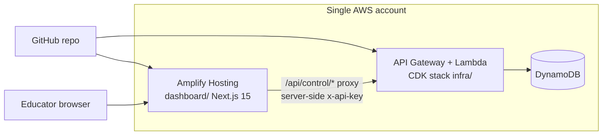

# AWS Pilot Runbook

**Audience:** Solo / small engineering team operating a customer pilot  
**Purpose:** Deploy and run a predictable charter-school pilot on **one AWS account** — **CDK API** (Lambda + API Gateway + DynamoDB) + **Amplify dashboard** (Next.js 15 SSR).  
**Supersedes for AWS pilots:** Fly.io / Render paths in [`pilot-host-deployment.md`](pilot-host-deployment.md) (those remain valid as a fallback only).

> **Interim account OK:** You may run this runbook on a **personal AWS account** until the company account exists. Treat that as `stage=pilot` or `stage=dev`. Migration to a company account is **redeploy + data handling** (§ 10) — not a native “transfer app” button.

---

## Architecture (one account, two deploy surfaces)



| Surface | Source | Deploy command / trigger | Spec |
|---------|--------|------------------------|------|
| **Control-layer API** | `infra/` CDK stack | **[Recommended]** [`.github/workflows/deploy.yml`](../../.github/workflows/deploy.yml) (OIDC) · **[Fallback]** local `cdk deploy` (§ 2.1) | [`aws-deployment.md`](../specs/aws-deployment.md) · [`ci-cd-pipeline.md`](../specs/ci-cd-pipeline.md) |
| **Decision Panel** | `dashboard/` Next.js app | Amplify Git build ([`dashboard/amplify.yml`](../../dashboard/amplify.yml)) | [`nextjs-amplify-dashboard-migration.md`](../specs/nextjs-amplify-dashboard-migration.md) |

**Not on Amplify Hosting:** the Fastify Docker API ([`Dockerfile`](../../Dockerfile)). Amplify Hosting runs the dashboard only. The API is the existing CDK stack — do not rewrite into Amplify Gen 2 (evaluated and rejected in the migration spec).

**Browser security model:** Educators never receive `x-api-key`. The dashboard proxy ([`dashboard/app/api/control/[...path]/route.ts`](../../dashboard/app/api/control/[...path]/route.ts)) attaches `CONTROL_LAYER_API_KEY` server-side.

**First deploy (recommended order):** § 0 pre-flight → § 1.1 bootstrap (once) → § 1.2 GitHub OIDC + secrets → § 2.0 trigger `deploy.yml` → § 2.2–§ 2.3 capture `ApiUrl` + API key → § 3 Amplify dashboard → § 4 smoke. You do **not** need to run `cdk deploy` locally unless debugging (§ 2.1).

---

## Pilot success criteria (predictable program)

Before inviting the customer, all items in these committed gates must pass:

| Gate doc | What it covers |
|----------|----------------|
| [`deployment-checklist.md`](deployment-checklist.md) | Build/test, `API_KEY` / org scoping, smoke |
| [`pilot-readiness-gates.md`](pilot-readiness-gates.md) | 8P3P + customer readiness tables |
| [`pilot-launch-checklist.md`](pilot-launch-checklist.md) | Final sign-off before first customer login |

**Pilot UX outcomes** (what “excellent” looks like for the customer):

1. Login with shared access code → Overview shows learner gaps within three clicks ([`dashboard-design-requirements.md`](../specs/dashboard-design-requirements.md)).
2. Bulk upload via `/signals/upload` → decisions appear in Attention queue.
3. Approve/Reject on decisions with reasons persisted ([`educator-feedback-api.md`](../specs/educator-feedback-api.md)).
4. Product feedback anytime ([`customer-feedback-loop.md`](../specs/customer-feedback-loop.md) — when implemented).

---

## 0. Pre-flight (local, before any AWS spend)

```bash
# From repo root — must be green on the release commit
npm run build
npm test
npm run lint
npm run typecheck
cd dashboard && npm run build && npm test && npm run test:e2e
```

- [ ] [`deployment-checklist.md`](deployment-checklist.md) — all boxes checked  
- [ ] Choose **`STAGE`** name: `pilot`, `dev`, or `prod` (use `pilot` for interim personal account)  
- [ ] Choose **`org_id`** for this deployment (single-tenant pilot: one org per environment)  
- [ ] Record pilot metadata (template below) in your vault — **not** in git  

**Charter pilot (confirmed):** `org_id` = **`southwest-charter`**. Policy files live at `src/decision/policies/southwest-charter/` (`learner.json`, `routing.json`, `subjects.json`). Deploy via `PUT /v1/admin/policies/southwest-charter/learner` or bundle with CDK; tune rule thresholds during customer onboarding. Reference demo org `springs` remains for local seed/tests only.

### Pilot environment record (template)

| Field | Example | Notes |
|-------|---------|-------|
| AWS account ID | `123456789012` | Personal interim or company |
| `STAGE` | `pilot` | CDK stage + resource suffix |
| `org_id` | `southwest-charter` | Must match all ingestion + `CONTROL_LAYER_ORG_ID`; policy at `src/decision/policies/southwest-charter/learner.json` |
| API URL | `https://abc123.execute-api.us-east-1.amazonaws.com/pilot/` | From CDK output `ApiUrl` |
| Dashboard URL | `https://main.d111111.amplifyapp.com` | Amplify default domain or custom |
| API key value | *(vault)* | API Gateway key — see § 2.3 |
| Admin API key | *(vault)* | `ADMIN_API_KEY` at CDK deploy |
| Dashboard passphrase | *(vault)* | `DASHBOARD_ACCESS_CODE` |
| `COOKIE_SECRET` | *(vault)* | `openssl rand -hex 32` |

---

## 1. AWS account setup (first time only)

### 1.1 Bootstrap CDK

Requires AWS CLI v2, Node 22, and credentials for the target account/region (`us-east-1` per [`aws-deployment.md`](../specs/aws-deployment.md)).

```bash
export AWS_REGION=us-east-1
export AWS_ACCOUNT_ID=$(aws sts get-caller-identity --query Account --output text)

cd infra && npm ci
npx cdk bootstrap "aws://${AWS_ACCOUNT_ID}/${AWS_REGION}"
```

Ref: [AWS CDK bootstrapping](https://docs.aws.amazon.com/cdk/v2/guide/bootstrapping.html)

### 1.2 GitHub Actions OIDC (required for recommended API deploy path)

One-time setup so [`.github/workflows/deploy.yml`](../../.github/workflows/deploy.yml) can run `cdk deploy` without long-lived AWS keys on your laptop. Contract: [`ci-cd-pipeline.md`](../specs/ci-cd-pipeline.md) § FR-AWS-001…006.

1. Complete § 1.1 bootstrap (GitHub Actions still needs a bootstrapped account).  
2. Create IAM OIDC provider for GitHub in the AWS account.  
3. Create deploy role trusting your repo (`repo:ORG/8p3p-control-layer:*`); grant CDK deploy permissions (pilot accounts often use a broad deploy policy; tighten for company account).  
4. Set GitHub repository secrets (Settings → Secrets and variables → Actions):

| Secret | Required | Purpose |
|--------|----------|---------|
| `AWS_DEPLOY_ROLE_ARN` | Yes | OIDC role ARN for the `deploy` job |
| `ADMIN_API_KEY` | Yes | Passed to CDK at deploy (`openssl rand -hex 32` → vault) |
| `API_KEY_ORG_ID` | Yes (charter pilot) | e.g. `southwest-charter` — wired into Lambda `commonEnv` |
| `CUSTOM_DOMAIN` | No | API custom domain |
| `HOSTED_ZONE_ID` / `HOSTED_ZONE_NAME` | No | Route 53 (with custom domain) |
| `CONTRACT_TEST_API_URL` | No | Enables post-deploy contract tests in workflow |
| `CONTRACT_TEST_API_KEY` | No | Same as pilot API Gateway key when tests enabled |

5. Optional: create a GitHub **Environment** named `pilot` with protection rules if you want gated deploys.

**Pilot stage note:** `deploy.yml` defaults `STAGE` to `prod` on push to `main`. For charter pilot resources (`control-layer-*-pilot`), use **Actions → Deploy → Run workflow** and set input **`stage` = `pilot`**. Before enabling AI explanations, set repo/org variable or CDK context so deploy runs with `AI_EXPLANATIONS_ENABLED=false` (see § 2.5).

### 1.3 Compliance note (personal account)

Learner-adjacent data on a **personal** AWS account is acceptable for **internal/dev** only. For a **real school pilot**, prefer the company account (or written interim data-processing agreement). Plan migration before the pilot exceeds ~4 weeks.

---

## 2. Deploy the API (CDK)

Lambda handlers load from `dist/lambda/` (see [`control-layer-stack.ts`](../../infra/lib/control-layer-stack.ts)). The CDK stack in `infra/` remains the source of truth — GitHub Actions only **runs** deploy; it does not replace CDK.

### 2.0 Recommended: GitHub Actions (`deploy.yml`)

**Prerequisites:** § 0 green locally, § 1.1 bootstrap complete, § 1.2 secrets set.

1. GitHub → **Actions** → **Deploy** → **Run workflow**.  
2. Set **`stage`** to `pilot` (charter pilot) or `dev` / `prod` as appropriate.  
3. Wait for jobs `test → build → cdk-synth → deploy` to succeed ([`deploy.yml`](../../.github/workflows/deploy.yml)).  
4. Continue at § 2.2 to read CloudFormation outputs and § 2.3 for the API Gateway key.

**Ongoing updates:** merge to `main` triggers deploy with default `STAGE=prod` unless you standardize on workflow_dispatch for pilot. Prefer explicit `stage=pilot` dispatch until a company prod account exists.

**When CI deploy fails:** download the failed job log; fix infra/code on a branch; re-run workflow. Use § 2.1 manual deploy only if OIDC or GitHub is unavailable.

### 2.1 Fallback: manual CDK from your laptop

Use when debugging OIDC/IAM or before GitHub secrets exist. Requires AWS CLI credentials locally.

```bash
# Repo root — build Lambda artifacts
npm ci
npm run build:lambda-deploy

export STAGE=pilot
export AWS_REGION=us-east-1
export ADMIN_API_KEY="$(openssl rand -hex 32)"   # store in vault
export API_KEY_ORG_ID=southwest-charter
export AI_EXPLANATIONS_ENABLED=false             # baseline pilot; see § 2.5 for AI

cd infra && npm ci
npx cdk diff
npx cdk deploy --require-approval never
```

Optional alarm email:

```bash
npx cdk deploy -c pilotAlarmEmail=oncall@example.com
```

### 2.2 Capture outputs

After deploy, save CloudFormation outputs:

```bash
aws cloudformation describe-stacks \
  --stack-name ControlLayerStack \
  --query 'Stacks[0].Outputs' \
  --output table
```

Required: **`ApiUrl`** → pilot environment record.

DynamoDB tables use **on-demand billing** with **point-in-time recovery** enabled — pilot data persists across redeploys (unlike ephemeral Fly SQLite).

### 2.3 Retrieve the API Gateway key value

CDK creates a usage-plan API key named `control-layer-pilot-key-${STAGE}`. Fetch the **secret value** once:

```bash
KEY_ID=$(aws apigateway get-api-keys --name-query "control-layer-pilot-key-${STAGE}" --include-values --query 'items[0].id' --output text)
aws apigateway get-api-key --api-key "$KEY_ID" --include-value --query 'value' --output text
```

Store in vault → this becomes:

- `CONTROL_LAYER_API_KEY` on Amplify  
- `<pilot_key>` in curl smoke tests  
- Customer integration `x-api-key` (if they call the API directly)

### 2.4 Org scoping

Single-tenant pilots require consistent `org_id`:

- Set **`CONTROL_LAYER_ORG_ID`** on Amplify to your pilot org.  
- Instruct integrators to send the same `org_id` in signal bodies.  
- Set **`API_KEY_ORG_ID`** at CDK deploy time (e.g. `export API_KEY_ORG_ID=southwest-charter`) — wired into Lambda `commonEnv` in [`control-layer-stack.ts`](../../infra/lib/control-layer-stack.ts) for server-side override parity with [`api-key-middleware.md`](../specs/api-key-middleware.md).

### 2.5 Optional: AI educator explanations

Explanations run **inside the ingest Lambda**, not on Amplify. Default is off. To enable later:

```bash
# On IngestFunction env (Console or CDK follow-up)
AI_EXPLANATIONS_ENABLED=true
AI_PROVIDER=amazon-bedrock   # or gateway for multi-model dev
AI_MODEL=<fetch current model ID — do not hard-code from memory>
```

See [`ai-educator-explanations.md`](../specs/ai-educator-explanations.md) and [`.env.example`](../../.env.example).

---

## 3. Deploy the dashboard (Amplify)

Ref: [Deploy a Next.js SSR app to Amplify](https://docs.aws.amazon.com/amplify/latest/userguide/deploy-nextjs-app.html)

### 3.1 Create Amplify app

1. AWS Console → **Amplify** → **Create new app** → connect GitHub repo.  
2. **Branch:** `main` (or pilot branch).  
3. **Monorepo:** set **App root directory** to `dashboard` ([monorepo guide](https://docs.aws.amazon.com/amplify/latest/userguide/deploy-nextjs-monorepo.html)).  
4. Amplify detects Next.js SSR; build spec comes from [`dashboard/amplify.yml`](../../dashboard/amplify.yml) (Node 22, `baseDirectory: .next`).  
5. Create/use IAM service role for Amplify compute.

### 3.2 Runtime environment variables

Set in Amplify Console → **Environment variables** (runtime / SSR — **not** build-time secrets in client bundle):

| Variable | Required | Example |
|----------|----------|---------|
| `CONTROL_LAYER_API_BASE_URL` | Yes | CDK `ApiUrl` (no trailing path beyond stage) |
| `CONTROL_LAYER_API_KEY` | Yes | API Gateway key from § 2.3 |
| `CONTROL_LAYER_ORG_ID` | Yes | `southwest-charter` |
| `DASHBOARD_ACCESS_CODE` | Yes (pilot) | Human-memorable passphrase |
| `COOKIE_SECRET` | Yes (when gate on) | `openssl rand -hex 32` |
| `DASHBOARD_SESSION_TTL_HOURS` | No | `8` |
| `CONTROL_LAYER_ADMIN_API_KEY` | No | Same as `ADMIN_API_KEY` if upload preflight used |
| `NEXT_PUBLIC_APP_NAME` | No | `Decision Panel` |

Ref: [Amplify SSR environment variables](https://docs.aws.amazon.com/amplify/latest/userguide/ssr-environment-variables.html)

**Verify:** Browser network tab shows **no** `x-api-key` from client (NXMIG-002).

### 3.3 CORS / proxy note

Production dashboard traffic goes **Amplify → `/api/control/*` → API Gateway**. The browser does not call API Gateway directly, so **CORS is not required** for the happy path. `@fastify/cors` ([`dashboard-cors.ts`](../../src/config/dashboard-cors.ts)) applies to local Fastify dev only.

### 3.4 Deploy and capture URL

Save the Amplify URL (e.g. `https://main.dxxxx.amplifyapp.com`) in the pilot environment record. Share **dashboard URL + access code** with the customer via a secure channel — not email ([`pilot-launch-checklist.md`](pilot-launch-checklist.md)).

---

## 4. Post-deploy smoke (go / no-go)

Run from a machine **not** on your office VPN (mirrors customer access).

### 4.1 API gate

```bash
export API_URL="https://<api-id>.execute-api.us-east-1.amazonaws.com/pilot"
export PILOT_KEY="<api-gateway-key-value>"
export ORG_ID="southwest-charter"

curl -sS "${API_URL}/health"

curl -sS -X POST "${API_URL}/v1/signals" \
  -H "content-type: application/json" \
  -H "x-api-key: ${PILOT_KEY}" \
  -d "{\"signal_id\":\"pilot-smoke-001\",\"org_id\":\"${ORG_ID}\",\"learner_reference\":\"stu-smoke\",\"source_system\":\"pilot-smoke\",\"event_type\":\"assessment_completed\",\"occurred_at\":\"2026-06-25T12:00:00Z\",\"data\":{\"masteryScore\":0.75}}"
```

**Pass:** both return HTTP 2xx.

### 4.2 Dashboard gate

- [ ] Open `https://<amplify-host>/login` → enter passphrase → land on Overview  
- [ ] Overview, Attention, Learners render with live data  
- [ ] `/signals/upload` — upload wizard completes (e2e: [`signal-upload.spec.ts`](../../dashboard/e2e/signal-upload.spec.ts))  
- [ ] Attention → Approve or Reject → toast + persistence  
- [ ] `GET /v1/learners/{ref}/summary` via API returns five sections ([`pilot-launch-checklist.md`](pilot-launch-checklist.md))

### 4.3 Seed demo data (optional)

```bash
node examples/springs/seed-springs-demo.mjs \
  --host "${API_URL}" \
  --api-key "${PILOT_KEY}" \
  --admin-key "${ADMIN_API_KEY}" \
  --org "${ORG_ID}"
```

File smoke report: `internal-docs/reports/pilot-smoke-YYYY-MM-DD.md` (gitignored ops path).

---

## 5. Customer onboarding sequence (predictable pilot)

| Week | Owner | Actions |
|------|-------|---------|
| **−1** | Engineering | Complete § 0–4; sign [`pilot-launch-checklist.md`](pilot-launch-checklist.md) |
| **0** | CS + Engineering | Onboarding call; share dashboard URL + access code securely; walk through [`customer-onboarding-quickstart.md`](customer-onboarding-quickstart.md) |
| **0** | Customer IT | Run ingestion preflight on raw sample ([`ingestion-preflight.md`](../specs/ingestion-preflight.md)) |
| **1** | Customer | Upload first file via `/signals/upload` or enable webhook path ([`pilot-readiness-gates.md`](pilot-readiness-gates.md) integration table) |
| **1** | Customer | Validate summaries on `/attention`; submit Approve/Reject feedback |
| **1–4** | CS | Weekly triage: decision feedback themes + product feedback ([`customer-feedback-loop.md`](../specs/customer-feedback-loop.md)) |
| **4+** | Engineering | Review pilot metrics needs; defer SBIR evidence layer (LIU / program-metrics) unless contracted |

**Escalation:** Define on-call contact in pilot environment record ([`pilot-launch-checklist.md`](pilot-launch-checklist.md) § Operations).

---

## 6. Ongoing operations

### 6.1 Deploy updates

| Change | Action |
|--------|--------|
| API / business logic | Merge to `main` → [`deploy.yml`](../../.github/workflows/deploy.yml) (**recommended**); or `workflow_dispatch` with `stage=pilot`. Manual `cdk deploy` (§ 2.1) for debugging only. |
| Dashboard UI | Merge to `main` → Amplify auto-build |
| Env var change | Amplify console and/or CDK context; **never** commit secrets |

**Rollback:** Redeploy previous Git commit; DynamoDB PITR for data restore if needed ([`pilot-launch-checklist.md`](pilot-launch-checklist.md)).

### 6.2 Monitoring

- API Gateway access logs (enabled in CDK stage options)  
- CloudWatch dashboard `control-layer-inspect-{stage}` + SNS alarms (when `pilotAlarmEmail` set)  
- Amplify hosting metrics + SSR logs ([CloudWatch for SSR](https://docs.aws.amazon.com/amplify/latest/userguide/monitoring-with-cloudwatch.html))

### 6.3 Cost expectation (pilot scale)

| Component | Typical pilot month |
|-----------|---------------------|
| Amplify (dashboard) | ~$0 within free tier ([Amplify pricing](https://aws.amazon.com/amplify/pricing/)) |
| API Gateway + Lambda + DynamoDB | ~$2–15 ([`aws-deployment.md`](../specs/aws-deployment.md) cost table) |
| Bedrock (if AI explanations on) | Usage-based, separate |

---

## 7. Re-deploy to a different AWS account

There is **no** native “transfer Amplify app to another account.” Migration is **repeatable redeploy** because infra is Git-defined.

### 7.1 Checklist — company account cutover

| Step | Action |
|------|--------|
| 1 | Create/bootstrap company AWS account (§ 1.1) |
| 2 | `cdk deploy` in **new** account → new `ApiUrl` |
| 3 | Retrieve **new** API Gateway key (§ 2.3) — **rotate**, do not copy old key |
| 4 | Create **new** Amplify app → same repo, `dashboard/` root → set env vars (§ 3.2) |
| 5 | Update GitHub `AWS_DEPLOY_ROLE_ARN` → company account OIDC role |
| 6 | **Data migration** (choose one): |
| | **A. Fresh pilot** — re-seed with `seed-springs-demo.mjs` (simplest) |
| | **B. DynamoDB export/import** — AWS Data Pipeline / export to S3 → import to new tables (keep table names or update CDK) |
| 7 | Update customer-facing URLs + access code if changed |
| 8 | Run § 4 smoke on new stack |
| 9 | Decommission old account resources (`cdk destroy` + delete Amplify app) after validation window |

### 7.2 What transfers cleanly vs what does not

| Transfers cleanly | Does not transfer |
|-----------------|-------------------|
| Git repo, CDK code, `amplify.yml` | Amplify app ID / build history |
| Runbook steps (this doc) | API Gateway key **values** (generate new) |
| Contract tests as validation gate | DynamoDB rows (explicit export/import) |
| Dashboard env var **names** | OIDC role ARNs, account IDs |

### 7.3 Minimize future migration pain

- Keep all env var names identical across accounts.  
- Maintain the **pilot environment record** (§ 0) per account.  
- Use `STAGE=pilot` in interim account and `STAGE=prod` in company account to avoid resource name collisions if both exist briefly.  
- Never rely on console-only tweaks — prefer CDK + Amplify env vars in documentation.

---

## 8. Troubleshooting

| Symptom | Likely cause | Fix |
|---------|--------------|-----|
| Dashboard 502 on data pages | Wrong `CONTROL_LAYER_API_BASE_URL` or API down | Verify CDK `ApiUrl`; check Lambda logs |
| Dashboard login works, no data | API key mismatch | Re-sync § 2.3 value into Amplify `CONTROL_LAYER_API_KEY` |
| API 403 without key | Expected — API Gateway enforcement | Proxy must send `x-api-key`; check route handler |
| API 403 with key | Key not on usage plan | CDK usage plan association |
| Empty Attention queue | Wrong org or no ingest | Confirm `org_id`; run seed or upload |
| `cdk deploy` fails bootstrap | Account not bootstrapped | § 1.1 |
| Amplify build fails | Wrong app root | Set monorepo root to `dashboard` |

---

## 9. Related documents

| Document | Purpose |
|----------|---------|
| [`aws-deployment.md`](../specs/aws-deployment.md) | CDK architecture, cost, constraints |
| [`nextjs-amplify-dashboard-migration.md`](../specs/nextjs-amplify-dashboard-migration.md) | Dashboard hosting spec |
| [`dashboard-passphrase-gate.md`](../specs/dashboard-passphrase-gate.md) | Login cookies (`dp_session`, `fb_session`) |
| [`pilot-host-deployment.md`](pilot-host-deployment.md) | **Fallback:** Fly.io / Docker API path |
| [`deployment-checklist.md`](deployment-checklist.md) | Pre-deploy gates |
| [`pilot-readiness-gates.md`](pilot-readiness-gates.md) | Customer + 8P3P readiness |
| [`pilot-launch-checklist.md`](pilot-launch-checklist.md) | Launch sign-off |
| [`customer-onboarding-quickstart.md`](customer-onboarding-quickstart.md) | Customer-facing first 15 minutes |
| [`.github/workflows/deploy.yml`](../../.github/workflows/deploy.yml) | CI/CD API deploy |
| [`dashboard/.env.example`](../../dashboard/.env.example) | Dashboard env contract |

---

*Runbook created: 2026-06-25 | Primary pilot path: AWS CDK API + Amplify dashboard | Fallback API: Fly.io per pilot-host-deployment.md*
