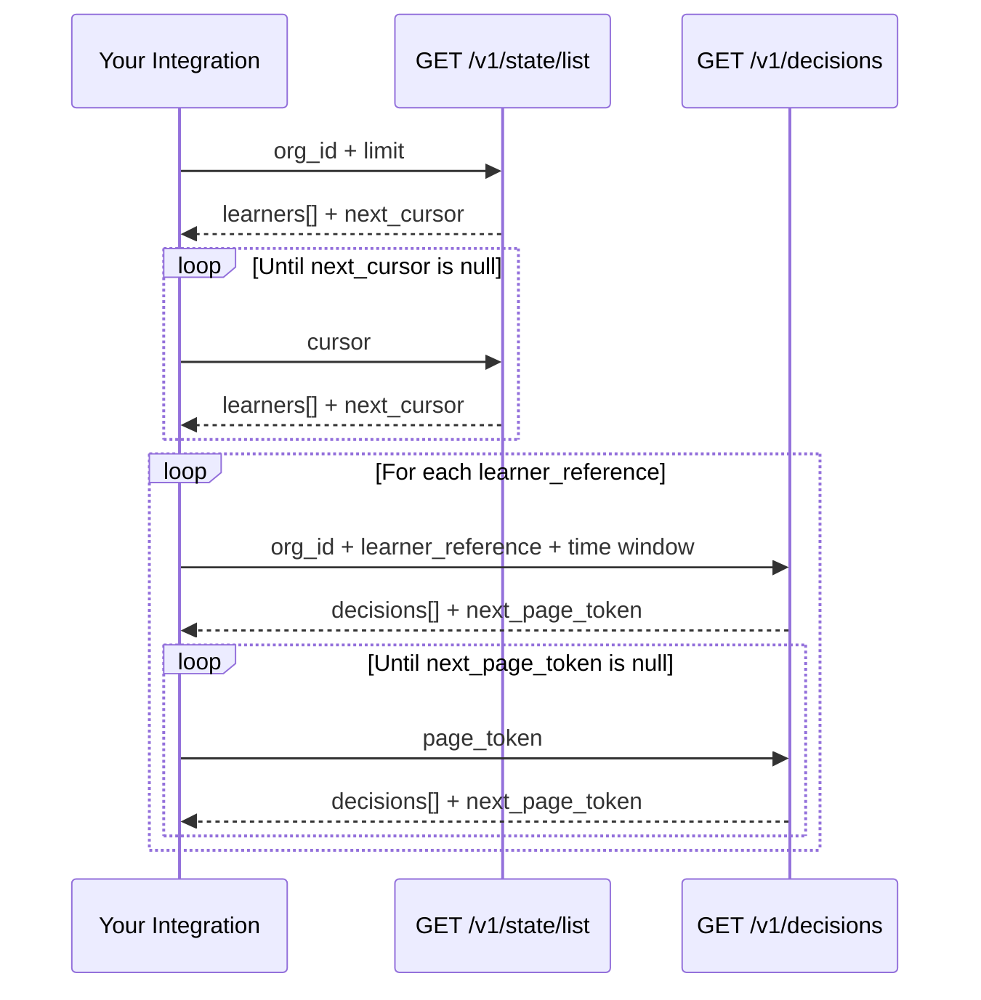

# Fetch all learner decisions for an org

Export or analyze every decision the control layer has generated for every learner in your organization within a time window.

---

## How it works

The Decision API is scoped per learner — `GET /v1/decisions` requires a `learner_reference`. To retrieve decisions org-wide, use a **two-step fan-out**:



This design preserves tenant isolation and keeps each response bounded and predictable.

---

## Before you begin

| Requirement | Details |
|-------------|---------|
| API key | Included on every request as `x-api-key: <your_key>` |
| Org ID | Your organization identifier (`org_id`). In single-tenant pilots with `API_KEY_ORG_ID` configured server-side, the server overrides this automatically — you can still pass a value as a placeholder. **Pilot deployments should not run without `API_KEY_ORG_ID` set** (see `docs/specs/api-key-middleware.md` and `docs/guides/deployment-checklist.md`). |
| Time window | A `from_time` and `to_time` in [RFC 3339](https://www.rfc-editor.org/rfc/rfc3339) format with timezone (e.g. `2026-03-01T00:00:00Z`). |

---

## Step 1: List all learners in your org

Page through `GET /v1/state/list` until `next_cursor` is `null`.

**Request**

```bash
curl -G "https://<host>/v1/state/list" \
  -H "x-api-key: <your_key>" \
  --data-urlencode "org_id=org_acme" \
  --data-urlencode "limit=200"
```

**Response**

```json
{
  "org_id": "org_acme",
  "learners": [
    {
      "learner_reference": "learner-123",
      "state_version": 7,
      "updated_at": "2026-03-01T10:05:00Z"
    }
  ],
  "next_cursor": "eyJsYXN0X2lkIjoibGVhcm5lci0xMjMifQ"
}
```

| Field | Type | Description |
|-------|------|-------------|
| `learners[].learner_reference` | string | Stable learner identifier — use this in Step 2 |
| `next_cursor` | string \| null | Pass as `cursor` on the next request; `null` means no more pages |

**Parameters**

| Parameter | Required | Default | Max |
|-----------|----------|---------|-----|
| `org_id` | Yes | — | — |
| `limit` | No | 50 | 500 |
| `cursor` | No | — | — |

---

## Step 2: Fetch decisions for each learner

For each `learner_reference` from Step 1, page through `GET /v1/decisions` until `next_page_token` is `null`.

**Request**

```bash
curl -G "https://<host>/v1/decisions" \
  -H "x-api-key: <your_key>" \
  --data-urlencode "org_id=org_acme" \
  --data-urlencode "learner_reference=learner-123" \
  --data-urlencode "from_time=2026-03-01T00:00:00Z" \
  --data-urlencode "to_time=2026-03-02T00:00:00Z" \
  --data-urlencode "page_size=250"
```

**Response**

```json
{
  "org_id": "org_acme",
  "learner_reference": "learner-123",
  "decisions": [
    {
      "decision_id": "dec-abc123",
      "decision_type": "reinforce",
      "decided_at": "2026-03-01T10:05:01Z",
      "decision_context": {},
      "trace": {
        "state_id": "state-xyz",
        "state_version": 7,
        "policy_version": "2.0.0",
        "matched_rule_id": "rule_reinforce_stability"
      }
    }
  ],
  "next_page_token": "eyJjdXJzb3IiOiJkZWMtYWJjMTIzIn0"
}
```

| Field | Type | Description |
|-------|------|-------------|
| `decisions[].decision_id` | string | Stable, unique decision identifier — use as your de-duplication key |
| `decisions[].decision_type` | string | One of `reinforce`, `advance`, `intervene`, `pause`, `escalate`, `recommend`, `reroute` |
| `decisions[].trace` | object | Full audit trail: state version, policy version, matched rule |
| `next_page_token` | string \| null | Pass as `page_token` on the next request; `null` means no more pages |

**Parameters**

| Parameter | Required | Default | Max |
|-----------|----------|---------|-----|
| `org_id` | Yes | — | — |
| `learner_reference` | Yes | — | — |
| `from_time` | Yes | — | — |
| `to_time` | Yes | — | — |
| `page_size` | No | 100 | 1000 |
| `page_token` | No | — | — |

---

## Complete example

The following Node.js implementation handles both pagination loops and bounded concurrency. Use `decision_id` as your idempotency key when writing to a data store.

```js
import pLimit from 'p-limit'; // npm install p-limit

const BASE_URL = process.env.CONTROL_LAYER_URL;   // e.g. https://api.example.com
const API_KEY  = process.env.API_KEY;
const ORG_ID   = process.env.ORG_ID;
const FROM     = '2026-03-01T00:00:00Z';
const TO       = '2026-03-02T00:00:00Z';

async function get(path, params) {
  const url = new URL(path, BASE_URL);
  for (const [k, v] of Object.entries(params)) {
    if (v != null) url.searchParams.set(k, v);
  }
  const res = await fetch(url, { headers: { 'x-api-key': API_KEY } });
  if (!res.ok) throw new Error(`${res.status} ${url}: ${await res.text()}`);
  return res.json();
}

async function* listLearners() {
  let cursor = null;
  do {
    const page = await get('/v1/state/list', { org_id: ORG_ID, limit: 200, cursor });
    for (const learner of page.learners) yield learner.learner_reference;
    cursor = page.next_cursor;
  } while (cursor);
}

async function* listDecisions(learnerRef) {
  let page_token = null;
  do {
    const page = await get('/v1/decisions', {
      org_id: ORG_ID,
      learner_reference: learnerRef,
      from_time: FROM,
      to_time: TO,
      page_size: 250,
      page_token,
    });
    for (const decision of page.decisions) yield decision;
    page_token = page.next_page_token;
  } while (page_token);
}

async function processDecision(decision) {
  // Write to your data store; de-dupe on decision.decision_id
  console.log(decision.decision_id, decision.decision_type, decision.decided_at);
}

async function run() {
  const limit = pLimit(10); // max 10 learners in-flight at once
  const tasks = [];

  for await (const learnerRef of listLearners()) {
    tasks.push(
      limit(async () => {
        for await (const decision of listDecisions(learnerRef)) {
          await processDecision(decision);
        }
      })
    );
  }

  await Promise.all(tasks);
}

run().catch(console.error);
```

---

## Production considerations

| Concern | Recommendation |
|---------|----------------|
| **Time window size** | Keep windows bounded (e.g. 24h). Larger windows increase response volume proportionally. |
| **Concurrency** | Cap parallel learner requests (10–25 is a safe starting point). Increase based on observed latency. |
| **Idempotency** | Use `decision_id` as the de-duplication key — safe to re-run the export without double-writing. |
| **Ordering** | Decisions within a response are not guaranteed to be globally ordered. Sort downstream by `decided_at` if strict ordering is required. |
| **Incremental exports** | Run this workflow on a rolling window (e.g. every hour) and advance `from_time` per run to avoid re-fetching the full history on each pass. |

---

## Errors

| Status | Code | Meaning |
|--------|------|---------|
| `401` | `api_key_required` | `x-api-key` header is missing |
| `401` | `api_key_invalid` | Key does not match the configured value |
| `400` | `missing_required_field` | A required query parameter is absent |
| `400` | `invalid_timestamp` | `from_time` or `to_time` is not a valid RFC 3339 timestamp with timezone |

---

## What's not supported (v1)

A single endpoint returning all decisions for all learners in one request does not exist in v1. If your use case requires a bulk async export (e.g. deliver a file to S3), that is a separate capability planned for a future release.

---

## Related

- [Pilot Integration Guide](pilot-integration-guide.md) — send signals and consume decisions for a single learner
- [OpenAPI Reference](../api/openapi.yaml) — served interactively at `/docs`
- [Decision Engine spec](../specs/decision-engine.md) — how decisions are generated and what each type means
