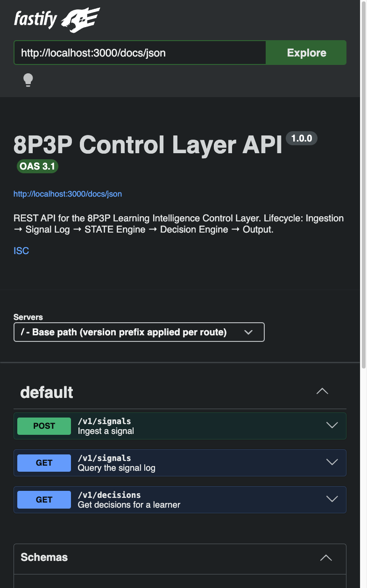
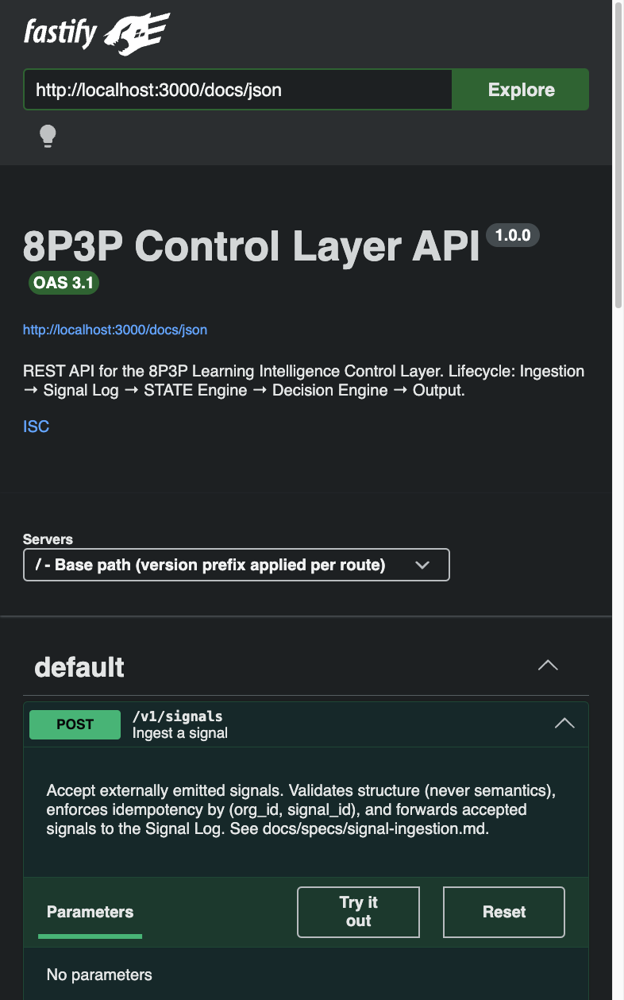
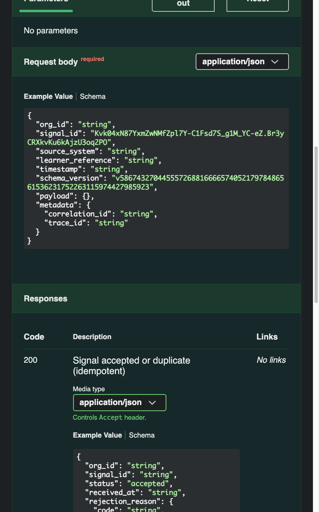
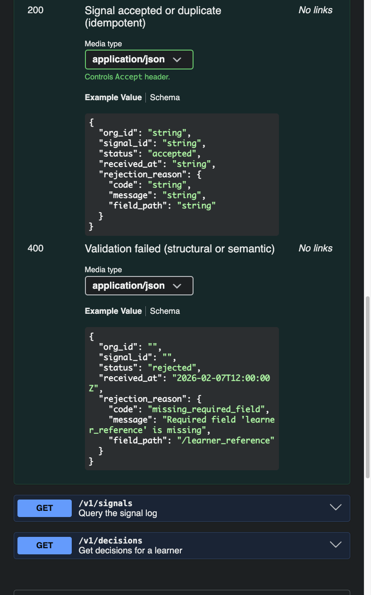
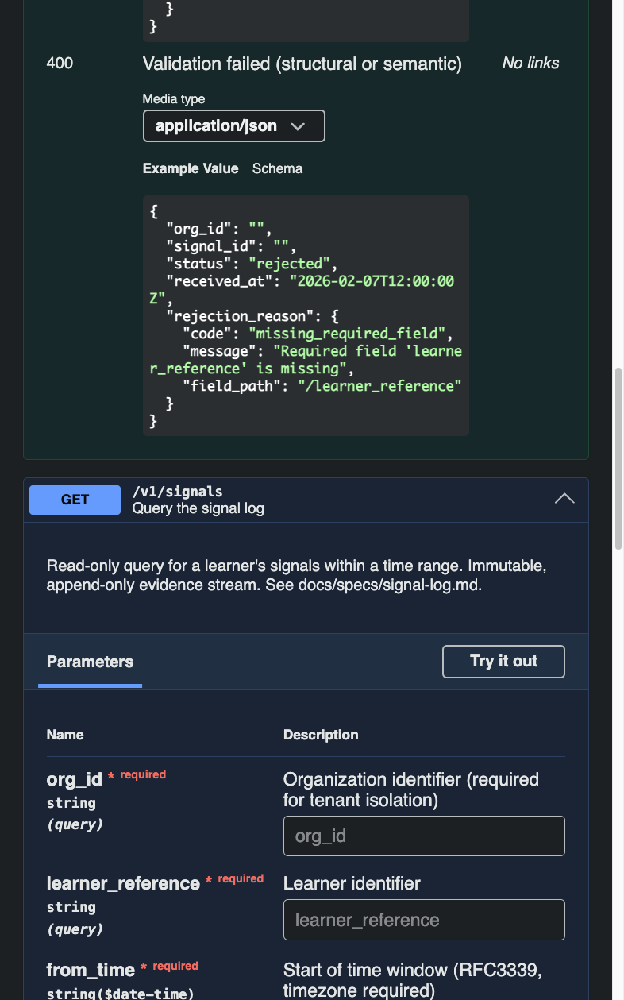
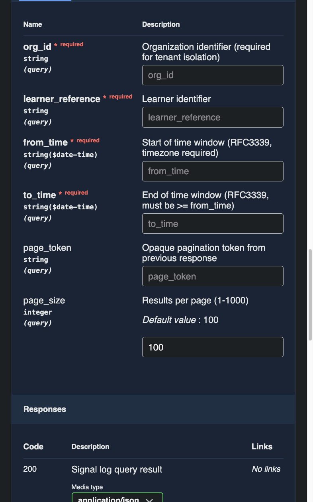
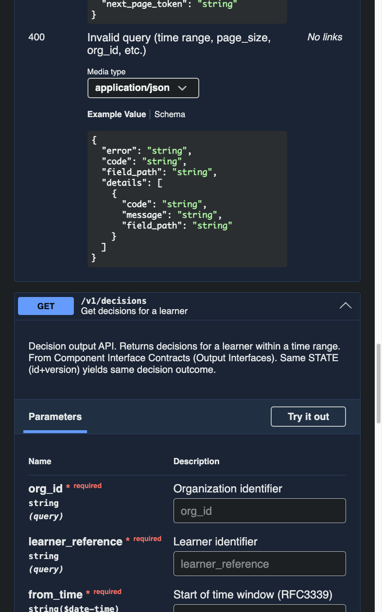
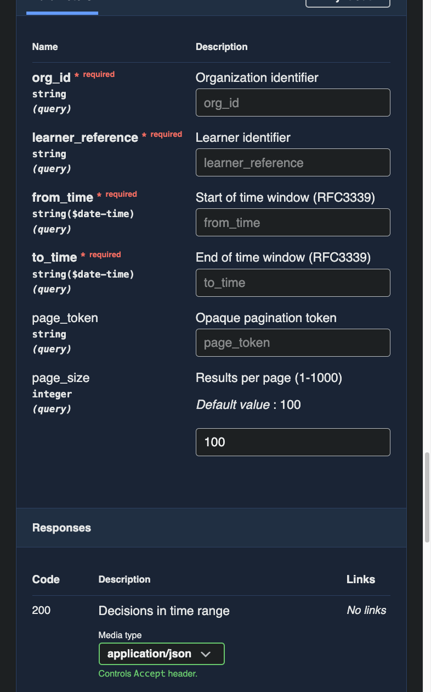
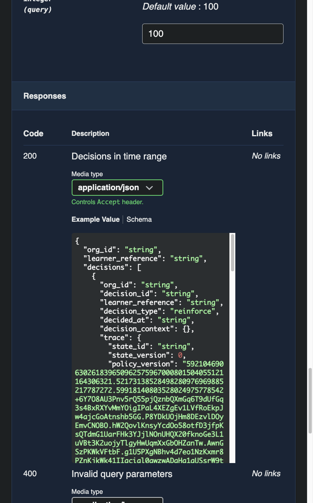

# 8P3P Control Layer — POC v1 Summary Report

**Date:** February 10, 2026
**Version:** 1.0.0
**Status:** Complete — all endpoints operational, all tests passing

---

## Executive Summary

The 8P3P Control Layer POC v1 is a **vendor-agnostic, contract-driven intelligence engine for adaptive learning systems**. It receives learning signals from external systems, evaluates them against deterministic policy rules, and produces fully-traceable decisions — decoupled from the systems that enforce them.

**What this proves:** A single signal in → a deterministic, auditable decision out. The entire pipeline — ingestion, validation, state accumulation, rule evaluation, and decision output — works end-to-end with full provenance tracing.

---

## System Architecture

```
External System → POST /v1/signals → Ingestion → Signal Log → STATE Engine → Decision Engine → GET /v1/decisions
```

| Stage | Component | What It Does |
|-------|-----------|-------------|
| 1 | **Signal Ingestion** | Receives and validates signals from external systems; enforces idempotency |
| 2 | **Signal Log** | Stores signals immutably (append-only) with full provenance |
| 3 | **STATE Engine** | Applies signals to evolving learner state; versioned snapshots |
| 4 | **Decision Engine** | Evaluates state against policy rules; deterministic output |
| 5 | **Output API** | Exposes decisions via REST API with trace metadata |

### Key Properties

- **Deterministic:** Same input state always produces the same decision
- **Immutable:** Signal log is append-only; state updates are versioned
- **Multi-tenant:** Isolated by `org_id` at every stage
- **Unidirectional:** Data flows left-to-right, no shortcuts

---

## Tech Stack

| Category | Technology |
|----------|-----------|
| Language | TypeScript 5.9 (strict mode) |
| Runtime | Node.js / ES Modules |
| Framework | Fastify 5 |
| Database | SQLite (better-sqlite3) |
| Testing | Vitest 4 |
| API Spec | OpenAPI 3.1 (Swagger UI) |

---

## API Endpoints

The API is fully documented via Swagger UI at `http://localhost:3000/docs`.

### Swagger UI Overview



The API exposes 5 endpoints:

| Method | Path | Purpose |
|--------|------|---------|
| `POST` | `/v1/signals` | Ingest a learning signal → triggers state update + decision |
| `GET` | `/v1/signals` | Query the immutable signal log |
| `GET` | `/v1/decisions` | Query decisions for a learner |
| `GET` | `/health` | Health check |
| `GET` | `/docs` | Swagger UI (interactive API docs) |

---

### Route 1: `POST /v1/signals` — Signal Ingestion

**Purpose:** Accept externally emitted learning signals. Validates structure (never semantics), enforces idempotency by `(org_id, signal_id)`, and forwards accepted signals through the full pipeline.







**Live Response (200 — Accepted):**

```json
{
    "org_id": "org_8p3p",
    "signal_id": "demo-sig-001",
    "status": "accepted",
    "received_at": "2026-02-10T05:41:58.670Z"
}
```

**Key behaviors:**
- Validates required fields: `org_id`, `signal_id`, `source_system`, `learner_reference`, `timestamp`, `schema_version`, `payload`
- Detects and rejects **forbidden semantic keys** (e.g., `ui`, `analytics`, `tracking`) in the payload
- Returns `"status": "duplicate"` for repeated `signal_id` within the same org (idempotent)
- Returns `400` with structured `rejection_reason` for validation failures

---

### Route 2: `GET /v1/signals` — Signal Log Query

**Purpose:** Read-only query for a learner's signals within a time range. The signal log is immutable and append-only — a complete evidence stream.





**Live Response (200):**

```json
{
    "org_id": "org_8p3p",
    "learner_reference": "maya-k",
    "signals": [
        {
            "org_id": "org_8p3p",
            "signal_id": "qa-sig-001",
            "source_system": "external-lms",
            "learner_reference": "maya-k",
            "timestamp": "2026-02-09T12:00:00Z",
            "schema_version": "v1",
            "payload": {
                "firstName": "Maya",
                "gradeLevel": "K",
                "age": 5,
                "stabilityScore": 0.28,
                "timeSinceReinforcement": 90000,
                "progress": {
                    "totalXp": 320,
                    "currentLevel": 3
                }
            },
            "accepted_at": "2026-02-10T05:30:36.063Z"
        }
    ],
    "next_page_token": null
}
```

**Parameters:** `org_id` (required), `learner_reference` (required), `from_time` (required), `to_time` (required), `page_token`, `page_size` (default: 100)

---

### Route 3: `GET /v1/decisions` — Decision Output

**Purpose:** Returns decisions for a learner within a time range. Each decision includes a **provenance trace** that links back to the exact state version and policy version that produced it.







**Live Response (200):**

```json
{
    "org_id": "org_8p3p",
    "learner_reference": "maya-k",
    "decisions": [
        {
            "org_id": "org_8p3p",
            "decision_id": "2f700108-8f09-484f-805f-5b23fb214ba9",
            "learner_reference": "maya-k",
            "decision_type": "reinforce",
            "decided_at": "2026-02-10T05:30:36.068Z",
            "decision_context": {},
            "trace": {
                "state_id": "org_8p3p:maya-k:v1",
                "state_version": 1,
                "policy_version": "1.0.0",
                "matched_rule_id": "rule-reinforce"
            }
        },
        {
            "org_id": "org_8p3p",
            "decision_id": "cb85dba5-8390-4762-8de9-895016f17924",
            "learner_reference": "maya-k",
            "decision_type": "reinforce",
            "decided_at": "2026-02-10T05:41:58.672Z",
            "decision_context": {},
            "trace": {
                "state_id": "org_8p3p:maya-k:v2",
                "state_version": 2,
                "policy_version": "1.0.0",
                "matched_rule_id": "rule-reinforce"
            }
        }
    ],
    "next_page_token": null
}
```

**The `trace` object is the key differentiator.** For any decision ever made, the system answers:
- What was the learner's exact state? → `state_id` + `state_version`
- Which policy was active? → `policy_version`
- Which rule fired? → `matched_rule_id` (or `null` for default path)

---

### Route 4: `GET /health` — Health Check

**Live Response:**

```json
{
    "status": "ok"
}
```

---

## Test Results

**337 tests passing across 17 test files.** Zero failures.

```
 ✓ tests/unit/idempotency.test.ts              (11 tests)
 ✓ tests/unit/decision-store.test.ts            (17 tests)
 ✓ tests/unit/signal-log-store.test.ts          (28 tests)
 ✓ tests/contracts/contract-drift.test.ts        (8 tests)
 ✓ tests/contracts/state-engine.test.ts         (17 tests)
 ✓ tests/unit/decision-engine.test.ts           (12 tests)
 ✓ tests/contracts/decision-engine.test.ts      (18 tests)
 ✓ tests/contracts/output-api.test.ts            (7 tests)
 ✓ tests/unit/state-store.test.ts               (21 tests)
 ✓ tests/unit/decision-validator.test.ts        (38 tests)
 ✓ tests/unit/policy-loader.test.ts             (44 tests)
 ✓ tests/unit/state-engine.test.ts              (19 tests)
 ✓ tests/unit/state-validator.test.ts           (18 tests)
 ✓ tests/unit/forbidden-keys.test.ts            (15 tests)
 ✓ tests/contracts/signal-ingestion.test.ts     (36 tests)
 ✓ tests/integration/e2e-signal-to-decision.test.ts (7 tests)
 ✓ tests/contracts/signal-log.test.ts           (21 tests)

 Test Files  17 passed (17)
      Tests  337 passed (337)
   Duration  458ms
```

### Test Coverage by Category

| Category | Files | Tests | What's Verified |
|----------|-------|-------|----------------|
| **Unit** | 10 | 243 | Individual components: validation, policy loading, state management, decision logic, idempotency, forbidden keys |
| **Contract** | 5 | 107 | Interface contracts between components: signal ingestion contracts, state engine contracts, decision engine contracts, output API contracts, drift detection |
| **Integration** | 1 | 7 | End-to-end: signal ingestion → state update → decision → output, including the full pipeline |
| **Contract Drift** | 1 | 8 | Ensures JSON schemas, OpenAPI spec, and AsyncAPI spec remain aligned |

---

## What the POC Proves

### 1. End-to-End Pipeline Works
A signal enters → gets validated → stored immutably → state updated → rule evaluated → decision produced with full trace. Verified by 7 integration tests.

### 2. Deterministic Decisions with Provenance
Maya (kindergartner, `stabilityScore: 0.28`, `timeSinceReinforcement: 90000`) triggers `rule-reinforce` because both conditions are met (`stabilityScore < 0.7` AND `timeSinceReinforcement > 86400`). The trace proves exactly which rule fired, against which state version, under which policy.

### 3. Policy-as-Data (Not Code)
The policy is a versioned JSON file, not hardcoded logic. Changing a threshold means updating a JSON file, not a code deploy. Non-engineers can read and reason about the decision logic.

### 4. Multi-Tenant Isolation
Decisions for `org_8p3p` are invisible to `org_other`. Enforced at the database query level.

### 5. Idempotent Signal Processing
Resubmitting the same `signal_id` returns `"status": "duplicate"` — no new decision, no side effects.

### 6. Contract-Driven Development
8 contract drift tests verify that JSON schemas, OpenAPI spec, and runtime behavior stay aligned. The system cannot accidentally diverge.

---

## What's Next (Phase 2 Roadmap)

| Feature | Description |
|---------|-------------|
| **Policy Expansion** | Multiple rules with priority ordering, nested AND/OR conditions, cross-field evaluation |
| **Tenant-Scoped Field Mappings** | Tenants declare field transformations (e.g., `mathMastery → stabilityScore`) without 8P3P owning domain logic |
| **Event Output** | Emit decisions via EventBridge/webhooks for downstream consumers |
| **Repository Extraction** | Extract reusable components into separate packages |
| **Dashboard** | Lightweight admin interface for viewing signals, state, and decisions |

---

*Report generated: February 10, 2026 | Source: Live API responses from `http://localhost:3000`*
